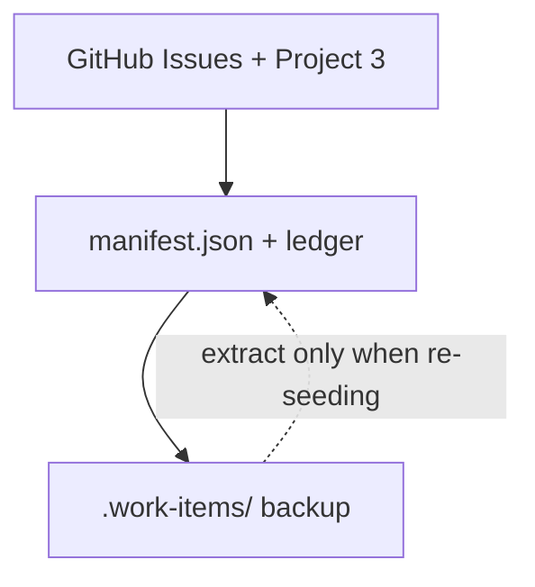

# `.work-items/` — backup and design archive

**GitHub Issues + [manifest.json](../scripts/work-registry/manifest.json) are the source of truth** for trackable work. This directory is a read-mostly backup and long-form design archive.

## When to edit here

| Situation | Action |
| --- | --- |
| Normal TDD / MVP work | Edit GitHub issue + project #3 fields only |
| Status change before board sync | Hand-edit `manifest.json` |
| GraphQL quota exhausted | Cache scope with `gh issue view`; optional header note in kept files |
| Design reviews, slice packets | Keep or add markdown here (not trackable duplicates) |

Do **not** create new epic/story trackable files for cloud-deploy work (#3–#14). Scope lives in GitHub and `docs/architecture/cloud-deploy-mvp/`.

## Source-of-truth hierarchy



Extract script: `node scripts/work-registry/extract-from-work-items.mjs --merge --write` — merge mode preserves hand-edited `issue` and `status` in manifest. Skips `_archive/`.

## Layout

```txt
.work-items/
├── README.md              # this file
├── _archive/              # closed/superseded trackable markdown
│   ├── adventure-nl/      # Steps 01–08 (issues #55–#62)
│   ├── adventure-v2-slices/ # completed slice *.plan.md
│   └── adventure-v3-stale/  # superseded v3/webclient trackable units
├── planning/              # cross-program queues (pointers → GitHub)
├── adventure-langgraph/   # design + reviews; deferred epics/stories
├── adventure-webclient/
├── agent-project-authoring/
├── nl-backend-nl-deprecation/
└── adventure-v2/          # task.md + design; active maintenance context
```

## GraphQL fallback

When `./scripts/work-registry/sync-github-project.sh` exits **42**:

1. Pick work from [issue-triage.md](../docs/developer/work-registry/issue-triage.md) + manifest.
2. Update manifest `status` / `projectStatus` locally.
3. Re-run sync with `--resume --auto-wait` when quota resets.

Full procedure: [work registry index](../docs/developer/work-registry/index.md#graphql-quota-fallback).

## Related

- [Work registry](../docs/developer/work-registry/index.md)
- [Issue triage catalog](../docs/developer/work-registry/issue-triage.md)
- [TDD + GitHub workflow](../docs/developer/tdd-and-github-workflow.md)
