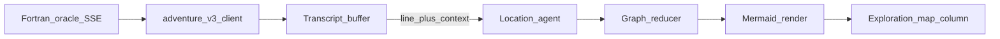

# Design — agentic MVP (exploration map + flagged legacy)

## 1. Objective

Define technical boundaries for the **default** exploration map (draft directed graph + Mermaid beside the CRT) and for **legacy** E4/E5 assist surfaces kept **feature-flagged**, without displacing the hero CRT or implying full autonomy, consistent with [guidelin../adventure-langgraph/orchestration-before-playability.md](../../guidelin../adventure-langgraph/orchestration-before-playability.md).

## 2. Technical design

**Authority:** The Fortran process and `adventure.dat` remain the **simulation of truth** for game state. Map and assist features consume **user-visible** streams and buffers (transcript text, command history, optional structured events from the existing wire) and produce **draft** outputs only. This aligns with [docs/architecture/adventure-fortran-engine.md](../../docs/architecture/adventure-fortran-engine.md) and [docs/architecture/adventure-engine.md](../../docs/architecture/adventure-engine.md).

**Data flow (default path):**

- **Location agent:** Optional assist HTTP call (or in-process merge) that turns **new transcript line(s) + bounded context** into a **schema-valid graph patch**; on failure or when `locationAgent` is off, **`mergeGraphFromTranscript`** in [`map-core`](../../adventure-langgraph/packages/map-core/src/kernel.ts) is the deterministic floor.
- **Graph reducer:** Applies patches to [`DirectedMapGraph`](../../adventure-langgraph/packages/map-core/src/directedGraph.ts); serializes to Mermaid via [`directedGraphToMermaidFlowchart`](../../adventure-langgraph/packages/map-core/src/mermaid.ts).
- **Legacy ancillary (flagged off by default):** session signal deriver, posture router, map probe (`advance: true`), JSON/Mermaid inspectors—see [deferred.md](deferred.md). Implementations remain in-repo; **do not delete** for slice regression.

**Feature flags:** Central [`featureFlags`](../../adventure-langgraph/apps/web/src/featureFlags.ts) module; build defaults via `VITE_V3_*`; optional dev overrides documented in [`adventure-v3/README.md`](../../adventure-langgraph/README.md). Assist server honors `ASSIST_PROBE_ENABLED` for automated probe steps.

**Where LangGraph / XState fit:** Server-side assist orchestration and optional panel logic only—**not** on the default hero surface. Visualization of cognition graphs remains deferred.

**Latency and failure:** Map updates are **non-blocking** for command input; show empty or last-good diagram on assist errors.

## 3. Key changes

### 3.1. API contracts

- **Existing:** adventure-v2 `GET /health`, run/SSE unchanged.
- **`POST /assist/step`:** `advance: false` merges transcript; `advance: true` runs navigator only when probe enabled server-side and client `mapProbe` flag is on.
- **`POST /assist/ingest`:** `runId`, `line`, `context`, optional `patch` — merge transcript and/or apply validated patch; returns `mapJson` + `mermaid`.

### 3.2. Data models

- **DirectedMapGraph** and **LocationGraphPatch** (place evidence, compass edge, `currentPlaceId`).
- **Session signals / posture:** unchanged models for flagged E4 UI.

### 3.3. Component responsibilities

- **v3 web client:** hero CRT; **exploration map column** when `explorationMap` is on; legacy Assist DOM when `assistPanels` is on.
- **assist-server:** graph state per `runId`; must not own game authority.
- **Tests:** map-core patch + merge; flag-matrix smoke; wire tests unchanged.

## 4. Alternatives considered

| Approach | Why not chosen for default |
| --- | --- |
| Delete slice-02–05 Assist UI | Loses regression surface; flags hide instead. |
| Full LangGraph-on-demo-surface | Repeats v2 failure mode. |
| Map from `adventure.dat` without provenance | Violates draft-from-play spirit of [US-5-1](stories/US-5-1-draft-location-diagram-reviewable.md). |

## 5. Out of scope

- Authoritative automapping tied to every Fortran internal flag.
- Mandatory cognition traces or raw SSE as primary UX.
- Per-node **action map** (separate roadmap item).
- Assistant-submitted game commands on the default surface without probe flags and consent UX.

## Navigation

[index.md](index.md) · [epics/index.md](epics/index.md)
