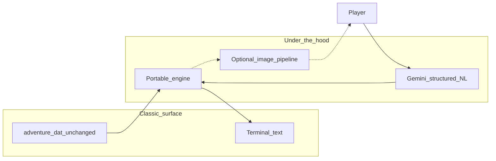

# adventure-lm: specs, TDD harness, and Gemini-enhanced UX

## Current baseline (repo facts)

- The playable game is a single Fortran 77 program: `[adventure.f](adventure.f)` opens `ADVENTURE.DAT` (same bytes as repo `[adventure.dat](adventure.dat)`), parses **section kinds** `IKIND` (0–6), builds linked text lines (`LLINE`), the travel table (`TRAVEL`), and vocabulary (`KTAB`/`ATAB`). Command input is two 5-character tokens via `GETIN` (`[adventure.f` lines 738–782](adventure.f)).
- `[dbparse](dbparse)` is an informal Awk probe of the same file (summarize/list/map); useful as **human-readable** documentation of sections, not a second source of truth.
- There is **no** root `docs/` tree or automated tests today; documentation and tests are net-new deliverables.

## Architectural stance (hot-rod, not a remake)

- **Immutable artifact**: `[adventure.dat](adventure.dat)` is read-only input; all behavior lives in code + tests.
- **UX goal**: Same exploratory loop and tone (teletype-style text, same puzzles), but **inputs** can be free-form English mapped to **verb/object** pairs the engine already understands.
- **LLM role**: A **translator** from NL → structured `{ primaryToken, secondaryToken?, confidence?, rationale? }` aligned to the game’s **5-character vocabulary** (see `GETIN` / `ATAB`), not a replacement for world simulation.

## Phase 1 — Specifications and documentation (before code)

Create a dedicated work item folder per project conventions, e.g. `[.work-items/adventure-lm/](.work-items/adventure-lm/)`, containing:

| Artifact                         | Purpose                                                                                                                                                                                                                                                                                                                                                                                                  |
| -------------------------------- | -------------------------------------------------------------------------------------------------------------------------------------------------------------------------------------------------------------------------------------------------------------------------------------------------------------------------------------------------------------------------------------------------------- |
| `user-story.md`                  | Persona + EARS acceptance criteria focused on player-visible outcomes (NL input works, classic feel preserved, optional images don’t change core rules).                                                                                                                                                                                                                                                 |
| `design.md`                      | Technical design: `.dat` grammar, engine state model, Gemini JSON schema contract, image prompt/cache strategy, failure modes (API down → fallback to typed parser or “I don’t understand”). Reference Fortran as legacy oracle for ambiguous cases.                                                                                                                                                     |
| `bugs.md` (or section in design) | **Curated list of known behaviors** in the current Fortran build (including intentional restorations, data quirks, and any remaining edge-case bugs). Each entry: observed behavior, reproduction or oracle reference (transcript/test), and whether it is **in-scope to preserve** in the TypeScript port. Purpose: parity is **behavioral match to today’s player experience**, not an idealized spec. |
| `task.md` + numbered step files  | ACID steps: parser → vocab → travel → full loop → LLM adapter → E2E.                                                                                                                                                                                                                                                                                                                                     |

Add `**docs/architecture/adventure-engine.md`** (project-level): logical view (loader, simulation, I/O boundary), process view (turn loop), and explicit **parity strategy** (below).

**Parity strategy (must be explicit in design):**

- **Oracle of record for behavior**: the existing Fortran binary under fixed invocation (same working directory, same `adventure.dat`, deterministic RNG where possible). The port **replicates the final, shipped behavior of that binary**—including known quirks and bugs—so players get what they expect from this codebase. **Fixing bugs or “modernizing” rules is explicitly out of scope** for `adventure-lm`; track those as a **separate future work item** (e.g. “adventure-extended” or “corrected edition”) with its own tests and ADR, and do not conflate it with NL/LLM UX work.
- **Bug documentation**: Maintain `[bugs.md](.work-items/adventure-lm/bugs.md)` (or an equivalent section in `design.md`) so the team does not “accidentally fix” undocumented behavior during refactors. Seed it from `[README.md](README.md)` (historical fixes, data notes, unimplemented chest, etc.) and grow it as oracle tests reveal divergences.
- **Testing implication**: When a behavior is classified as a bug but **in-scope for fidelity**, tests should assert the **buggy** outcome against the Fortran oracle until the separate “fixed edition” exists.
- For a full port, either (a) match transcripts with a **fixed RNG seed** hook in Fortran (future small opt-in patch *only if* you accept a one-line dev flag—not `adventure.dat`), or (b) define **semantic parity** tests (location transitions, inventory, win conditions) without byte-identical dwarf RNG. The plan recommends starting with (b) for throughput, and adding transcript fixtures where they pay off.

## Phase 2 — Test strategy from unit to E2E (TDD-first)

Introduce a **TypeScript** package (your choice) at repo root, e.g. `[adventure-lm/](adventure-lm/)` with `package.json`, TypeScript strict, Vitest (or Jest), and a single `npm test` / `npm run check` preflight.

### Unit tests (fast, pure)

- `**.dat` loader**: For each `IKIND` section, assert parsed structures match snapshots derived from Fortran semantics (line chains, `-1` terminators, motion rows).
- **Vocabulary**: `KTAB` encoding (`KQ = KTAB/1000+1` branching in Fortran) reproduced in typed functions; golden tests for sample words from section 4 of `[adventure.dat](adventure.dat)`.
- **Travel graph**: Encode `TRAVEL` as in Fortran comment: negative markers, `dest*1024 + motionKey` packing (`[adventure.f` lines 101–117, 127–128](adventure.f)).

### Integration tests (engine slices)

- **Turn reducer**: Given an initial state + one canonical command (two tokens), next state and output messages behave as expected for curated scenarios (movement, dark room, simple GET/DROP).
- **Scripted session**: A list of token pairs drives multiple turns; assert location, flags, and key messages.

### End-to-end tests

- **Fortran subprocess harness** (recommended for Phase 2 E2E *before* the port is complete): spawn `./adventure`, send the same token sequences the TS engine will use, capture stdout for **regression baselines** (normalize line endings). This validates your command encoding without reimplementing the whole world twice.
- **TS engine E2E** (once port exists): same scripts run against the native engine; compare normalized transcripts or semantic assertions.

### LLM tests (isolated)

- **Mocked HTTP**: Gemini client returns canned JSON matching your schema; tests verify mapping to tokens and guardrails (reject unknown verbs).
- **Optional live smoke**: one manual or CI-secret-gated test hitting the real API (not blocking PRs by default).

## Phase 3 — Implement the portable engine (minimal vertical slices)

Implement in TypeScript following **strict TDD**: failing test → minimal implementation → refactor (`[.cursor/rules/process-03-development.mdc](.cursor/rules/process-03-development.mdc)`).

Suggested module boundaries inside `adventure-lm/`:

- `dat-loader/` — parse `[adventure.dat](adventure.dat)` into immutable structures.
- `engine/` — game state + turn loop (port of the Fortran control flow in manageable chunks; reference `[adventure.f](adventure.f)` main loop from label `2` onward).
- `cli/` — classic REPL: read line → tokenize like `GETIN` (for non-LLM mode) → step engine → print.

Keep the **GETIN-compatible tokenizer** as the narrow waist so both classic typing and LLM output converge on the same two-token shape.

## Phase 4 — `adventure-lm` natural language layer (Gemini structured output)

- **Structured output**: Define a JSON schema (e.g. Zod → JSON Schema) for `InterpretedCommand` with fields constrained to known vocabulary IDs or 5-char strings validated against loaded `ATAB`.
- **Prompt context**: Pass compact vocabulary subsets (verbs, visible objects, motion words) to reduce hallucination—**do not** paste the entire `.dat` into the model; load from parsed structures.
- **Fallback**: If Gemini returns an invalid token or low confidence, echo classic “I don’t understand” style messages ([Fortran path around `3000` / `SPEAK` 60/61/13](adventure.f)) and optionally show safe suggestions.

## Phase 5 — Optional imagery (under the hood)

- Generate **static or cached** illustrations keyed by `LOC` (and maybe major state flags), driven by short prompts derived from **long location text** (section 1), not fan-fiction rewrites.
- Default **off** or behind a flag so the default experience remains text-first and authentic.

## Repository layout (proposed)

- Keep existing Fortran build untouched: `[Makefile](Makefile)`, `[adventure.f](adventure.f)`, `[adventure.dat](adventure.dat)`.
- Add `adventure-lm/` TypeScript project + CI job running `npm test` and typecheck.
- Link README sections: how to run classic `./adventure`, how to run `adventure-lm` CLI, env vars for `GEMINI_API_KEY`.

## Risk notes

- **Full logic port** from `[adventure.f](adventure.f)` is the largest cost; mitigate with the subprocess E2E oracle and slice-by-slice milestones in `task.md`.
- **Randomness**: align design doc on whether dwarf behavior must match Fortran RNG exactly or only statistically.
- **Bug fixes vs fidelity**: resist “drive-by fixes” in the port; document anomalies first. A **bug-fixed extended version** is a deliberate product decision for later, with its own parity baseline—not mixed into the classic-fidelity track.

## Success criteria (documentation + tests)

- Written specs in `[.work-items/adventure-lm/](.work-items/adventure-lm/)` + `[docs/architecture/adventure-engine.md](docs/architecture/adventure-engine.md)`, including **documented known behaviors** (`bugs.md` or equivalent) aligned with Fortran oracle tests.
- Automated tests at unit, integration, and E2E layers with a single preflight command.
- Clear boundary: `**adventure.dat` unchanged**; all new behavior in TypeScript and config.
- Clear **out-of-scope** line: “corrected / extended” gameplay rules are not part of `adventure-lm` unless/until a separate initiative explicitly defines a new baseline.

