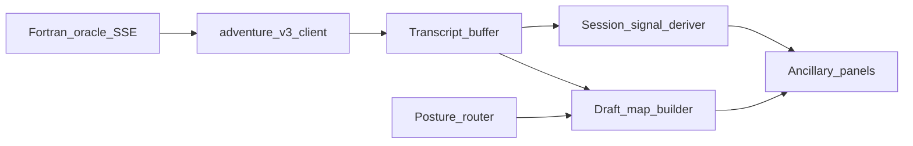

# Design — agentic MVP (E4 / E5)

## 1. Objective

Define technical boundaries and a minimal architecture for **session awareness**, **assistance posture**, and a **draft location picture** so that [E4](epics/E4-session-awareness-and-agent-surfacing.md) and [E5](epics/E5-draft-world-picture-map-assist.md) can be implemented without displacing the hero CRT or implying full autonomy, consistent with [guidelines/adventure-v3/orchestration-before-playability.md](../../guidelines/adventure-v3/orchestration-before-playability.md).

## 2. Technical design

**Authority:** The Fortran process and `adventure.dat` remain the **simulation of truth** for game state. Assistant features consume **user-visible** streams and buffers (transcript text, command history, optional structured events from the existing wire) and produce **ancillary** outputs only. This aligns with the engine split described in [docs/architecture/adventure-fortran-engine.md](../../docs/architecture/adventure-fortran-engine.md) and the broader package layout in [docs/architecture/adventure-engine.md](../../docs/architecture/adventure-engine.md).

**Data flow (high level):**

- **Session signal deriver:** Pure or side-effect-free extraction from the transcript buffer (and optionally last N wire frames) to populate [US-4-1](stories/US-4-1-session-signals-visible.md). No game commands are emitted here.
- **Posture router:** Maps user-selected **posture** (see glossary in [E4](epics/E4-session-awareness-and-agent-surfacing.md)) to policy: e.g. whether a map request requires confirmation, whether suggestions are shown, cap on assist frequency. Internally this can follow a Cynefin-style classification of “how we should behave” for each posture; that mapping stays in design and UX copy, not in user stories.
- **Draft map builder:** On user request, builds a **draft** graph from transcript-derived evidence. Optional text-model or rules-based step is an implementation choice; output is always labeled **draft** in the UI ([US-5-1](stories/US-5-1-draft-location-diagram-reviewable.md)). Diagram format may use **Mermaid** (or another renderable format) in code; the user story remains agnostic.

**Where LangGraph / XState fit:** Use only for **optional** panel logic or server-side assist orchestration if they reduce complexity—**not** on the default hero surface ([deferred.md](deferred.md)). Any graph or state-machine **visualization** is ancillary and gated by [US-4-2](stories/US-4-2-operating-posture-visible.md) / [US-4-3](stories/US-4-3-user-chooses-assistance-posture.md).

**Latency and failure:** Session signals should update on a bounded cadence (e.g. after each turn or line batch) with a **defined** “still processing” or **empty** state. Map generation may be slower; show **in progress** and **non-blocking** errors without freezing the game input path.

## 3. Key changes

### 3.1. API contracts

- **Proposed (to be fixed when implementing):** optional HTTP endpoints or in-process calls from the v3 app to a small assist service, for example:
  - `POST` body: session id, transcript excerpt or hash, requested posture, operation `signals` | `draft_map`.
  - Response: structured JSON for signals; for map, a **draft** graph description plus **provenance** (e.g. “from last K lines of transcript”).
- **Existing:** continue to use adventure-v2 `GET /health` and run/SSE as today; no requirement to change them for the first E4 slice if all logic is **client-side** on transcript data.

Final paths, auth, and payloads belong in the implementation task; this design only requires **clear** contracts and **no** silent reliance on engine internals for the draft map unless explicitly added later.

### 3.2. Data models

- **Transcript slice reference:** offset, line count, or time window for what the deriver and map builder may read.
- **Session signals model:** small structured record (e.g. mentioned place names, last command verbs)—exact fields TBD; must stay **bounded** and **serializable** for tests.
- **Posture enum / labels:** internal keys mapped to user-facing strings in one place (single source of truth for [US-4-2](stories/US-4-2-operating-posture-visible.md)).
- **Draft map model:** nodes and edges with **optional** confidence or “inferred” flags; never assert parity with `adventure.dat` graph.

### 3.3. Component responsibilities

- **v3 web client:** hero CRT unchanged; new **ancillary** regions for signals, posture selector, and draft diagram container; copy for **draft** and **not playing for you** ([E4](epics/E4-session-awareness-and-agent-surfacing.md), [E5](epics/E5-draft-world-picture-map-assist.md)).
- **Optional assist service (if not all client-side):** runs deriver / map builder; must not hold exclusive game state; may call an LLM with a strict schema and timeout.
- **Tests:** unit tests for deriver and posture policy; contract or smoke tests for any new HTTP surface; wire tests remain synthetic/Fortran as today ([adventure-v3/README.md](../../adventure-v3/README.md)).

## 4. Alternatives considered

| Approach | Why not chosen for MVP |
| --- | --- |
| Server-forward NL planner as default ([ADR0015](../../docs/decisions/ADR0015-deprecate-server-forward-nl-cognition.md) direction) | Heavier operational coupling; E4/E5 can start client-local on transcript data. |
| Full LangGraph-on-demo-surface | Repeats v2 failure mode (orchestration over game); conflicts with [deferred.md](deferred.md). |
| Map from direct `adventure.dat` parse without user-visible provenance | Violates “draft from what I saw” spirit of [US-5-1](stories/US-5-1-draft-location-diagram-reviewable.md); optional later as a **separate** expert mode. |

## 5. Out of scope

- Authoritative automapping or synchronizing assistant state with every Fortran internal flag.
- Mandatory cognition traces, reconcile UI, or raw SSE as primary UX ([deferred.md](deferred.md)).
- Letting the assistant submit game commands without a dedicated future story and explicit consent UX.

## Navigation

[index.md](index.md) · [epics/index.md](epics/index.md)
