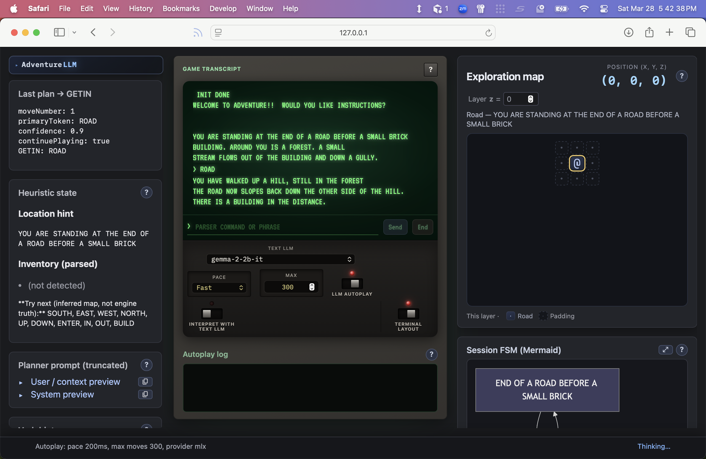

# adventure-llm

TypeScript tooling for Colossal Cave Adventure: parses unchanged `adventure.dat`, runs the Fortran game as a behavioral oracle, and adds optional Gemini-based natural language mapping plus optional location imagery hooks.



## Requirements

- Node 20+
- GNU Fortran build of `../adventure` (from repo root: `make`) for oracle tests and scripted play
- Optional: `GEMINI_API_KEY` for natural-language first line before scripted play

## Commands

```sh
npm install
npm run check
npm run build
```

### Autoplay web dashboard

After `make` at the repo root (so `../adventure` exists), from **`adventure-llm/`**:

```sh
npm run build && npm run web
```

Or from the repo root: **`make run-autoplay-web`**.

Open **http://127.0.0.1:8787/** (override port with **`ADVENTURE_LLM_WEB_PORT`**). Step-by-step demo script: **[`../DEMO.md`](../DEMO.md)**. REST and SSE reference: **[`../API_DOCUMENTATION.md`](../API_DOCUMENTATION.md)**. The page opens an **SSE** connection to **`/events`**, which starts one autoplay session: game text streams into the transcript panel, **Thinking…** shows while the planner runs, and the **inferred map** (wrapper grid), **parsed inventory**, and **truncated planner prompts** update each turn. Static files live under `adventure-llm/public/`.

The browser UI is split into small **ES modules** (see **Layout** below): `app.js` binds the DOM and wires listeners; **`dashboardApi.js`** centralizes `fetch` to `/api/*`; **`dashboardState.js`** holds session state; **`dashboardEventStream.js`** registers SSE handlers; **`transcriptView.js`**, **`mapView.js`**, and **`dashboardWidgets.js`** own transcript, map/mermaid, and shared widgets. **`defaultPorts()`** / **`resolveDashboardElements(doc)`** in **`dashboardEnv.js`** keep environment access in one place for tests. Pure helpers (**`autoplayPace.js`**, **`sseJson.js`**, **`transcriptLayoutLogic.js`**) are covered by **Node** Vitest; DOM-oriented pieces use **`src/**/\*.dom.test.ts`** (happy-dom). HTTP handlers for the same routes are also exercised from **`src/cli/webDashboard.test.ts`\*\*.

The **Text LLM** dropdown (when at least one backend is configured in env) hot-swaps between **local MLX**, **OpenAI-compatible HTTP** (`ADVENTURE_LLM_HTTP_*`), and **Google Gemini** (`GEMINI_API_KEY`) without restarting the server. API keys and base URLs stay server-side; the UI only sends **`POST /api/text-llm`** with `{ providerId, modelId }` from allowlisted presets. **`ADVENTURE_LLM_HTTP_WEB_PRESETS`** (comma-separated) adds extra HTTP model names for that dropdown alongside **`ADVENTURE_LLM_HTTP_MODEL`**.

## OWASP Dependency-Check (SCA)

Install the [official CLI](https://owasp.org/www-project-dependency-check/) on macOS:

```sh
brew install dependency-check
```

From the **repository root** (runs `npm install` in `adventure-llm`, then scans it):

```sh
make dependency-check
```

Or from **`adventure-llm/`** after `npm install`:

```sh
npm run dependency-check
```

Reports are written to `adventure-llm/reports/dependency-check/` (HTML + JSON; ignored by git).

The first run downloads NVD/CVE data and can take several minutes. Without an [NVD API key](https://nvd.nist.gov/developers/request-an-api-key), the public NVD API may return **HTTP 429** (rate limit) during the update. Use a key:

```sh
export NVD_API_KEY='…'
make dependency-check
```

After data exists locally—or to skip the slow update—use **`make dependency-check-quick`** or `npm run dependency-check:quick` (`--noupdate`).

Manual invocation with a key:

```sh
cd adventure-llm
dependency-check --nvdApiKey "$NVD_API_KEY" --project adventure-llm --scan . --out ./reports/dependency-check --format HTML --format JSON
```

## Environment

| Variable                                  | Purpose                                                                                                                                                                                                                                           |
| ----------------------------------------- | ------------------------------------------------------------------------------------------------------------------------------------------------------------------------------------------------------------------------------------------------- |
| `GEMINI_API_KEY`                          | Enables natural-language first line; omit or use `--classic` for Fortran-only                                                                                                                                                                     |
| `GEMINI_TEXT_MODEL`                       | Optional; defaults to `gemini-2.5-flash` for NL JSON mapping                                                                                                                                                                                      |
| `GEMINI_IMAGE_MODEL`                      | Optional; defaults to `gemini-3.1-flash-image-preview` for future location imagery                                                                                                                                                                |
| `ADVENTURE_LLM_DEBUG`                     | Set to `1` to append JSONL interaction logs to `.cache/llm-interactions.jsonl` (under cwd, usually `adventure-llm/`); includes full Gemini request prompts                                                                                        |
| `ADVENTURE_LLM_DEBUG_LOG`                 | Optional explicit path for that JSONL file (overrides default path when set)                                                                                                                                                                      |
| `ADVENTURE_LLM_CACHE_DIR`                 | If set, cache each `InterpretedCommand` by hash of model + user line (JSON files); avoids repeat API calls                                                                                                                                        |
| `ADVENTURE_LLM_INSTRUCTIONS`              | `y` or `n` for autoplay only: answer to “instructions?” without a prompt (default `n`)                                                                                                                                                            |
| `ADVENTURE_LLM_AUTOPLAY_PACE_MS`          | Autoplay: delay in ms after each screen before the next Gemini call (default `2000`; `0` disables)                                                                                                                                                |
| `ADVENTURE_LLM_AUTOPLAY_MAX_MOVES`        | Autoplay: stop after this many GETIN lines (default `300`)                                                                                                                                                                                        |
| `ADVENTURE_LLM_AUTOPLAY_CONTEXT_CHARS`    | Autoplay: approximate max size of the planner user prompt (default `6000`; use `4000`–`6000` for very small local models)                                                                                                                         |
| `ADVENTURE_LLM_WEB_PORT`                  | Autoplay dashboard (`npm run web`): HTTP listen port (default `8787`; binds `127.0.0.1` only)                                                                                                                                                     |
| `ADVENTURE_LLM_HTTP_WEB_PRESETS`          | Optional comma-separated extra HTTP model ids for the dashboard hot-swap list (merged with `ADVENTURE_LLM_HTTP_MODEL`; requires HTTP configured)                                                                                                  |
| `ADVENTURE_LLM_COMPACT_PROMPTS`           | `1` / `0`: force compact or full prompts for all providers. If **unset**, compact defaults **on** for MLX only (shorter rules, smaller vocab list, no HELP preamble in planner/interpret prompts).                                                |
| `ADVENTURE_LLM_VOCAB_HINT_MAX`            | Override word count in vocabulary hints (8–500). If unset: **48** when compact, **120** when full.                                                                                                                                                |
| `ADVENTURE_LLM_AUTOPLAY_TWO_STEP`         | Set to `1` **MLX only**: run a first LLM call to pick a subset of **situation candidates**, then the planner (doubles MLX calls per move). Default off.                                                                                           |
| `ADVENTURE_LLM_STRUCTURED_PROMPTS`        | `1` / `0`: Markdown `###` **state dashboard** (ADVENTURE STATE, TASK, …) for MLX. If **unset**, defaults **on** for MLX only (helps small Gemma-class models). Google/HTTP unchanged unless `=1`.                                                 |
| `ADVENTURE_LLM_INTERPRET_PROMPT_EXAMPLES` | `1` / `0`: append few-shot **EXAMPLES** to interpret prompts from `scripts/interpret-eval-fixtures.json`. If **unset**, defaults **on** for **MLX only**; use `=0` to match smoke runs without examples. Google/HTTP default **off** unless `=1`. |
| `ADVENTURE_LLM_MLX_TEMP`                  | Sampling temperature for `mlx_lm.generate` (default **0.75**). Use **0** for greedy (argmax).                                                                                                                                                     |
| `ADVENTURE_LLM_MLX_STOP`                  | Comma-separated substrings; model output is **truncated** before the first match (e.g. `<start_of_turn>,User:`) to reduce “model plays the user” junk.                                                                                            |
| `ADVENTURE_LLM_MLX_MODEL`                 | Hugging Face repo id for MLX (default **`mlx-community/gemma-2-2b-it`**). For more capacity on a capable Mac, try e.g. **`mlx-community/gemma-2-9b-it-4bit`**.                                                                                    |
| `NVD_API_KEY`                             | Optional; Dependency-Check reads it when set in the environment (see below)                                                                                                                                                                       |
| `HF_TOKEN`                                | Optional; [Hugging Face access token](https://huggingface.co/docs/hub/security-tokens) for higher Hub rate limits and more reliable model downloads (MLX / `mlx_lm`)                                                                              |

Logs and cache live under `adventure-llm/.cache/` by default; that directory is gitignored.

### Text LLM providers (reliability vs local MLX)

- **Gemma on MLX:** Instruction-tuned Gemma expects [control tokens and user/model turns only](https://ai.google.dev/gemma/docs/core/prompt-structure)—no separate system role. This project puts task and state text in the **first user turn** (the long `prompt` string), which matches Google’s recommended pattern.
- **Google Generative AI** and **OpenAI-compatible HTTP** with `ADVENTURE_LLM_HTTP_JSON_SCHEMA=1` (when supported) can attach **JSON schema / enum constraints** to parser tokens, which greatly improves valid vocabulary output.
- **MLX** (default **`mlx-community/gemma-2-2b-it`**) uses **unconstrained** text generation and parses JSON from the reply. The CLI defaults to **compact prompts**, **structured `###` dashboard sections** (state + task first, then evidence), **interpret few-shot EXAMPLES** (from `scripts/interpret-eval-fixtures.json` unless disabled), a **short HELP cue** plus **truncated in-game HELP** in interpret prompts, and a **6000**-character autoplay context. The Fortran game remains the source of truth; the dashboard repeats **heuristic** location/inventory from recent output. Autoplay also injects a **situation candidate** line (KTAB-based). Optionally set **`ADVENTURE_LLM_AUTOPLAY_TWO_STEP=1`** for a **first** JSON filter call. **`ADVENTURE_LLM_MLX_TEMP`** defaults to **0.75**; **`ADVENTURE_LLM_MLX_STOP`** can trim junk after tokens such as `<start_of_turn>`. Set **`ADVENTURE_LLM_MLX_MODEL`** to a larger checkpoint (e.g. **`gemma-2-9b-it-4bit`**) if you have unified memory to spare. For stricter JSON, prefer a hosted provider with schema support. For experiments, **`ADVENTURE_LLM_INTERPRET_PROMPT_EXAMPLES=0`** turns off few-shot interpret examples; **`ADVENTURE_LLM_COMPACT_PROMPTS=0`** on MLX restores full interpret prompts (full RTEXT HELP block, larger vocab hint), similar to the **`full_struct`** layout in `npm run experiment:mlx-interpret-prompts`. Use `ADVENTURE_LLM_DEBUG=1` and inspect `.cache/llm-interactions.jsonl`.

### Hugging Face token (`HF_TOKEN`)

Downloading MLX models (for example `mlx-community/gemma-2-2b-it` or `mlx-community/gemma-2-2b-it-4bit`) uses the [Hugging Face Hub](https://huggingface.co/). Without authentication, downloads use anonymous limits; with a token you get **higher rate limits** and generally smoother pulls.

**Do not commit the token.** Get one at [Settings → Access Tokens](https://huggingface.co/settings/tokens): create a token with at least **Read** permission (enough for public models). Set:

1. **Shell** (one session): `export HF_TOKEN='hf_…'`
2. **`adventure-llm/.env`**: add `HF_TOKEN=hf_…` next to your other secrets (see [`.env.example`](.env.example)). Load it the same way you load `NVD_API_KEY` for Dependency-Check, or use [direnv](https://direnv.net/).

The [`huggingface_hub`](https://huggingface.co/docs/huggingface_hub/package_reference/environment_variables) library also accepts `HUGGING_FACE_HUB_TOKEN` if you already use that name elsewhere.

### NVD API key (Dependency-Check)

Do **not** commit the key. Use any of:

1. **Export in your shell** (one session): `export NVD_API_KEY='your-key'`
2. **Put it in `adventure-llm/.env`** (file is gitignored): copy [`.env.example`](.env.example) to `.env`, set `NVD_API_KEY=...`, then run `set -a && source .env && set +a && make dependency-check` from repo root, or use [direnv](https://direnv.net/) to load `.env` automatically.
3. **Add to `~/.zshrc`** if you want it available in every terminal: `export NVD_API_KEY='...'`

Then run `make dependency-check` from the repository root; the Makefile passes `--nvdApiKey "$NVD_API_KEY"` when that variable is non-empty.

## Layout

| Path                 | Role                                                                                                                                                                                                                 |
| -------------------- | -------------------------------------------------------------------------------------------------------------------------------------------------------------------------------------------------------------------- |
| `src/dat/loadDat.ts` | Loader for `adventure.dat` (Fortran section order)                                                                                                                                                                   |
| `src/engine/`        | Fortran subprocess oracle + helpers                                                                                                                                                                                  |
| `src/cli/getin.ts`   | GETIN-compatible tokenizer                                                                                                                                                                                           |
| `src/nl/`            | Zod schema + Gemini JSON client                                                                                                                                                                                      |
| `src/images/`        | Cache keys + optional image file helpers                                                                                                                                                                             |
| `public/`            | Autoplay dashboard static assets: **`app.js`** (entry), modular **`dashboard*.js`** / **`transcriptView.js`** / **`mapView.js`**, plus **`terminalTyper.js`**, **`transcriptLayoutLogic.js`**, CSS, and `index.html` |

## CLI

From `adventure-llm/` after `npm run build`:

```sh
npm start
```

Or: `node dist/cli/main.js`

**With `GEMINI_API_KEY` set** (for example in `adventure-llm/.env`), `npm start` streams the opening through **“WOULD YOU LIKE INSTRUCTIONS?”**; on **stderr** you answer `y`/`n`, then **`> `** for the **first** line in natural language (Gemini maps it to parser tokens). After that, **`> `** accepts **classic game input** until you type **`.quit`** / **`:q`**, the game ends, or you interrupt. The wrapper only sends **SIGTERM** when ending the session so stdin is not closed mid-game (which would trigger a Fortran EOF error).

Use **`npm start -- --debug`** (or set `ADVENTURE_LLM_DEBUG=1`) to append structured JSON lines (requests, responses, intent shortcuts, cache hits) to the log file under `.cache/`. Set `ADVENTURE_LLM_CACHE_DIR` to reuse stored interpretations for the same line and model.

After the first NL-mapped move, further lines are sent as **classic typed commands** (GETIN). Type **`.quit`** or **`:q`** to end the session.

**Without the key**, or when you pass **`--classic`**, the CLI runs the original Fortran `./adventure` in full TTY (same idea as `make run` from repo root). A short notice is printed when the key is missing.

**Self-acting mode:** with `GEMINI_API_KEY` set, run **`npm start -- --autoplay`**. Gemini plans each move from session memory (event log, heuristic inventory/location hints) plus recent game output and vocabulary; the process streams like normal play, with a configurable pause between moves so you can read the screen. Use **`ADVENTURE_LLM_INSTRUCTIONS`**, **`ADVENTURE_LLM_AUTOPLAY_*`** in `.env` as needed (see table above). Not compatible with **`--classic`**.

You can still run `./adventure` directly from the repository root if you prefer.

## Credits

The CRT monitor styling in the autoplay web dashboard (scanlines, vignette, barrel distortion, and related effects) is credited to [CRT terminal in CSS/JS](https://codesandbox.io/p/sandbox/crt-terminal-in-css-js-tlijm?file=%2Findex.html) on CodeSandbox.
