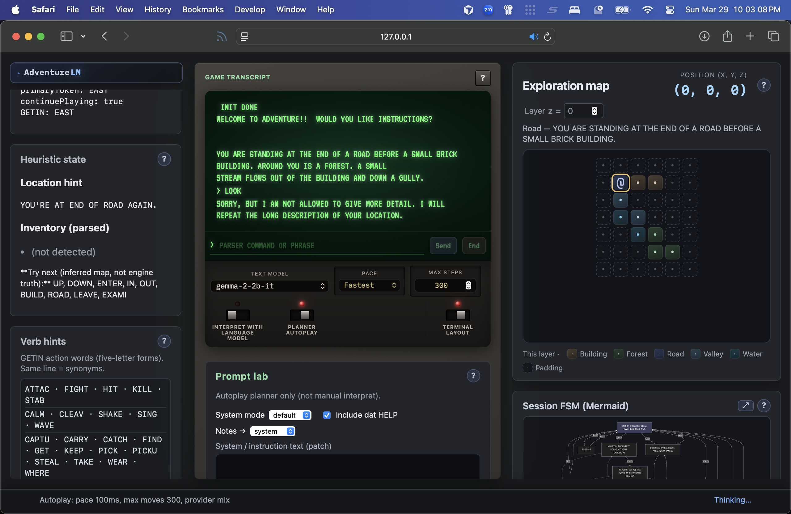

# adventure-nl

TypeScript tooling for Colossal Cave Adventure: parses unchanged `adventure.dat`, runs the Fortran game as a behavioral oracle, and adds optional **natural language** (NL) mapping—turning what you type at `>` into GETIN-safe tokens—with optional Gemini and other **text-model** backends, plus optional location imagery hooks.

**NL here means natural language**, not “netherlands” or a specific vendor. Shared interpret/planner/vocab glue ships as **`@adventure-nl/nl-glue`** (`packages/nl-glue/`). Runtime backends include hosted APIs and smaller local checkpoints (for example MLX); docs and UI say **text model** / **language model** when the distinction matters.



## Requirements

- Node 20+
- GNU Fortran build of `../adventure` (from repo root: `make`) for oracle tests and scripted play
- Optional: `GEMINI_API_KEY` for natural-language first line before scripted play

## Commands

```sh
npm install
npm run check
npm run build
```

`npm run build` also emits the **browser cognition** bundle (esbuild) to **`public/generated/`** (gitignored artifacts; see [`docs/decisions/ADR0005-browser-orchestrated-autoplay-cognition.md`](../docs/decisions/ADR0005-browser-orchestrated-autoplay-cognition.md)).

The **subsystem SQLite WAL store** ([ADR0006](../docs/decisions/ADR0006-client-sqlite-wal-subsystem-store.md), [ADR0007](../docs/decisions/ADR0007-subsystem-revision-control-and-replay.md)) lives under **`src/browser/`** (`subsystemWalStore*.ts`, `subsystemWalChannel.ts`): revisions, **`revision_tags`**, replay materialization, and non-destructive revert are implemented and covered by Vitest with **`better-sqlite3`** on a temp file. Browser WASM/OPFS integration and workspace UI for tags/history are forward work per those ADRs.

The **server subsystem replica** and **`POST /api/subsystem-sync`** batch apply ([ADR0008](../docs/decisions/ADR0008-server-subsystem-replica-and-sync.md)) live under **`src/cli/subsystemServerSync.ts`** and are wired in **`webDashboard.ts`**; see [`../API_DOCUMENTATION.md`](../API_DOCUMENTATION.md). **`dashboardApi.js`** exposes **`postSubsystemSync`**. Optional env **`ADVENTURE_NL_SUBSYSTEM_REPLICA_DIR`** overrides the directory for per-workspace replica files (default **`./.cache/subsystem-replica/`** under `adventure-nl/`). Calling sync from the browser after **`GET /api/session`** remains orchestration forward work (see ADR0008 **Implementation**).

### Autoplay web dashboard

After `make` at the repo root (so `../adventure` exists), from **`adventure-nl/`**:

1. One-time local TLS (OpenSSL 1.1.1+ on `PATH`): **`npm run web:tls-init`** — writes **`.cache/tls/dev-key.pem`** and **`dev-cert.pem`** (gitignored).
2. **`npm run build && npm run web`** — serves **HTTPS** on **`127.0.0.1`** (default port **`8787`**, override with **`ADVENTURE_NL_WEB_PORT`**).

**Browser warnings are normal.** The dev cert is **self-signed**, so it is not in your OS or browser trust store. The first load often shows something like “connection not private” or “potential security risk.” For **local development on localhost**, that is expected: use **Advanced** / **Show details** (or your browser’s equivalent) and **continue to the site** once per browser profile, or use **[mkcert](https://github.com/FiloSottile/mkcert)** to install a local CA and mint certs the browser trusts so the warning disappears. Do not use this generated cert for public servers. If you want zero TLS friction on a machine you fully trust, **`make run-autoplay-web-insecure`** uses HTTP instead; the session cookie is not **`Secure`** and traffic is not encrypted.

From the repo root: **`make run-autoplay-web`** runs **`web:tls-init`** if the dev cert is missing, then starts the dashboard. If you cannot generate certs, use **`make run-autoplay-web-insecure`** (sets **`ADVENTURE_NL_WEB_INSECURE_HTTP=1`**) for plain HTTP only; the session cookie will not use the **`Secure`** flag.

Open **https://127.0.0.1:8787/** (or **http://** when using insecure mode). Step-by-step demo script: **[`../DEMO.md`](../DEMO.md)**. REST and SSE reference: **[`../API_DOCUMENTATION.md`](../API_DOCUMENTATION.md)**. The page calls **`GET /api/session`** so the browser stores an **`HttpOnly`** session cookie. By default **`browserOrchestratedAutoplay`** is **`true`**: **NL interpretation and planner glue run in the browser** via **`@adventure-nl/nl-glue`**; the Node server stays **thin** (Fortran runtime, SSE, **forwarding** logical LLM calls). Use **`ADVENTURE_NL_BROWSER_ORCHESTRATED_AUTOPLAY=0`** only for the **legacy** path where that glue runs **in Node** (same class as the CLI self-acting runner). **SSE** to **`/events`** attaches **one dashboard session per browser client** (separate tabs get separate Fortran runs). Game text streams into the transcript panel, **Thinking…** shows while the model runs, and the **inferred map** (wrapper grid), **parsed inventory**, and **truncated planner prompts** update each turn. Static files live under `adventure-nl/public/`.

The browser UI is split into small **ES modules** (see **Layout** below): `app.js` binds the DOM and wires listeners; **`dashboardApi.js`** centralizes `fetch` to `/api/*`; **`dashboardState.js`** holds session state; **`dashboardEventStream.js`** registers SSE handlers; **`transcriptView.js`**, **`mapView.js`**, and **`dashboardWidgets.js`** own transcript, map/mermaid, and shared widgets. **`defaultPorts()`** / **`resolveDashboardElements(doc)`** in **`dashboardEnv.js`** keep environment access in one place for tests. Pure helpers (**`autoplayPace.js`**, **`sseJson.js`**, **`transcriptLayoutLogic.js`**) are covered by **Node** Vitest; DOM-oriented pieces use `src/**/*.dom.test.ts` (happy-dom). Pairings of `public/*.js` modules to those tests are listed in **[`docs/source-map.md`](docs/source-map.md)**. HTTP handlers for the same routes are also exercised from **`src/cli/webDashboard.test.ts`**.

The **Text model** dropdown (when at least one backend is configured in env) hot-swaps between **local MLX**, **OpenAI-compatible HTTP** (`ADVENTURE_NL_HTTP_*`), and **Google Gemini** (`GEMINI_API_KEY`) without restarting the server. Each **dashboard session** (browser cookie) stores its **own** chosen `{ providerId, modelId }` for the UI. **Sessions that choose the same preset share one loaded server-side client** (reference-counted); you do not get a second MLX worker or duplicate HTTP client for the same pair. The server keeps a **pool** of loaded clients for **distinct** presets only (default **2** presets; **`ADVENTURE_NL_WEB_MAX_LOADED_MODELS`**). LRU eviction drops idle presets (`refCount` zero) when space is needed; if every slot is held by active sessions and you request a new preset, the handler may error until you free a slot or pick an already-loaded preset. API keys and base URLs stay server-side; the UI only sends **`POST /api/text-llm`** with `{ providerId, modelId }` from allowlisted presets. **`ADVENTURE_NL_HTTP_WEB_PRESETS`** (comma-separated) adds extra HTTP model names for that dropdown alongside **`ADVENTURE_NL_HTTP_MODEL`**. **All** planner and interpret calls run through **one global FIFO queue**, so only one LLM request executes at a time process-wide, even if two presets are loaded in the pool.

**Sessions do not survive server restarts.** The **`adventure_session`** cookie is an opaque id for a row kept **only in the Node process’s memory**. Stopping **`npm run web`** (or crashing) drops every row. The browser may still send the old cookie, but the server **does not persist** session ids—after restart it mints a **new** id and a **new** autoplay/Fortran run. The adventure has **randomness** and the web UI does not save a restorable game checkpoint, so you **cannot “resume”** the same run across a reboot of the dashboard; you only start fresh. With **`ADVENTURE_NL_DEBUG=1`**, per-session **`./.cache/llm-sessions/<uuid>.jsonl`** files are **LLM interaction traces** for debugging, not a format for restoring gameplay.

## OWASP Dependency-Check (SCA)

Install the [official CLI](https://owasp.org/www-project-dependency-check/) on macOS:

```sh
brew install dependency-check
```

From the **repository root** (runs `npm install` in `adventure-nl`, then scans it):

```sh
make dependency-check
```

Or from **`adventure-nl/`** after `npm install`:

```sh
npm run dependency-check
```

Reports are written to `adventure-nl/reports/dependency-check/` (HTML + JSON; ignored by git).

The first run downloads NVD/CVE data and can take several minutes. Without an [NVD API key](https://nvd.nist.gov/developers/request-an-api-key), the public NVD API may return **HTTP 429** (rate limit) during the update. Use a key:

```sh
export NVD_API_KEY='…'
make dependency-check
```

After data exists locally—or to skip the slow update—use **`make dependency-check-quick`** or `npm run dependency-check:quick` (`--noupdate`).

Manual invocation with a key:

```sh
cd adventure-nl
dependency-check --nvdApiKey "$NVD_API_KEY" --project adventure-nl --scan . --out ./reports/dependency-check --format HTML --format JSON
```

## Environment

| Variable                                                 | Purpose                                                                                                                                                                                                                                                                                                                                                                                                                                                                                                                                                                                                                                           |
| -------------------------------------------------------- | ------------------------------------------------------------------------------------------------------------------------------------------------------------------------------------------------------------------------------------------------------------------------------------------------------------------------------------------------------------------------------------------------------------------------------------------------------------------------------------------------------------------------------------------------------------------------------------------------------------------------------------------------- |
| `GEMINI_API_KEY`                                         | Enables natural-language first line; omit or use `--classic` for Fortran-only                                                                                                                                                                                                                                                                                                                                                                                                                                                                                                                                                                     |
| `GEMINI_TEXT_MODEL`                                      | Optional; defaults to `gemini-2.5-flash` for NL JSON mapping                                                                                                                                                                                                                                                                                                                                                                                                                                                                                                                                                                                      |
| `GEMINI_IMAGE_MODEL`                                     | Optional; defaults to `gemini-3.1-flash-image-preview` for future location imagery                                                                                                                                                                                                                                                                                                                                                                                                                                                                                                                                                                |
| `ADVENTURE_NL_DEBUG`                                     | Set to `1` to append JSONL interaction logs: **CLI** uses `.cache/llm-interactions.jsonl`; **web dashboard** uses one file per session under `.cache/llm-sessions/<uuid>.jsonl` unless `ADVENTURE_NL_DEBUG_LOG` is set (single file for whole process)                                                                                                                                                                                                                                                                                                                                                                                            |
| `ADVENTURE_NL_DEBUG_LOG`                                 | Optional explicit path for that JSONL file (overrides default and per-session web paths when set)                                                                                                                                                                                                                                                                                                                                                                                                                                                                                                                                                 |
| `ADVENTURE_NL_WEB_TLS_KEY` / `ADVENTURE_NL_WEB_TLS_CERT` | Optional PEM paths for HTTPS (defaults: `.cache/tls/dev-key.pem` and `dev-cert.pem` under `adventure-nl/`)                                                                                                                                                                                                                                                                                                                                                                                                                                                                                                                                        |
| `ADVENTURE_NL_WEB_INSECURE_HTTP`                         | Set to `1` to listen with plain HTTP and omit **`Secure`** on the session cookie (not recommended except on trusted localhost)                                                                                                                                                                                                                                                                                                                                                                                                                                                                                                                    |
| `ADVENTURE_NL_CACHE_DIR`                                 | If set, cache each `InterpretedCommand` by hash of model + user line (JSON files); avoids repeat API calls                                                                                                                                                                                                                                                                                                                                                                                                                                                                                                                                        |
| `ADVENTURE_NL_INSTRUCTIONS`                              | `y` or `n` for autoplay only: answer to “instructions?” without a prompt (default `n`)                                                                                                                                                                                                                                                                                                                                                                                                                                                                                                                                                            |
| `ADVENTURE_NL_AUTOPLAY_PACE_MS`                          | Autoplay: delay in ms after each screen before the next Gemini call (default `2000`; `0` disables)                                                                                                                                                                                                                                                                                                                                                                                                                                                                                                                                                |
| `ADVENTURE_NL_AUTOPLAY_MAX_MOVES`                        | Autoplay: stop after this many GETIN lines (default **`120`**)                                                                                                                                                                                                                                                                                                                                                                                                                                                                                                                                                                                    |
| `ADVENTURE_NL_BROWSER_ORCHESTRATED_AUTOPLAY`             | **Default on** (unset): **client-side NL**—`@adventure-nl/nl-glue` in the browser builds planner prompts and applies guards; server routes **`/api/autoplay-plan`** / **`/api/autoplay-engine-input`** are **LLM forward + engine I/O** (names say “autoplay” for the self-acting loop, not “NL on the server”). SSE includes **`getin_prompt_ready`**. Set to **`0`** / **`false`** to run **NL glue in Node** instead (CLI-style). See [`../docs/decisions/ADR0005-browser-orchestrated-autoplay-cognition.md`](../docs/decisions/ADR0005-browser-orchestrated-autoplay-cognition.md) and [`../API_DOCUMENTATION.md`](../API_DOCUMENTATION.md). |
| `ADVENTURE_NL_BENCHMARK_RUNS`                            | Web dashboard: set to **`0`** to disable SQLite benchmark run recording (default: enabled; DB under `.cache/benchmark-runs.db` unless overridden)                                                                                                                                                                                                                                                                                                                                                                                                                                                                                                 |
| `ADVENTURE_NL_BENCHMARK_DB`                              | Optional path to the SQLite file for benchmark runs (WAL mode)                                                                                                                                                                                                                                                                                                                                                                                                                                                                                                                                                                                    |
| `ADVENTURE_NL_SUBSYSTEM_REPLICA_DIR`                     | Optional directory for **subsystem server replica** SQLite files (`<workspaceId>.db`) used by **`POST /api/subsystem-sync`** ([ADR0008](../docs/decisions/ADR0008-server-subsystem-replica-and-sync.md)); default **`adventure-nl/.cache/subsystem-replica/`**                                                                                                                                                                                                                                                                                                                                                                                    |
| `ADVENTURE_NL_BENCHMARK_EVENT_ID`                        | Optional string stored on each run; use `?eventId=` on the leaderboard API to filter game nights                                                                                                                                                                                                                                                                                                                                                                                                                                                                                                                                                  |
| `ADVENTURE_NL_AUTOPLAY_CONTEXT_CHARS`                    | Autoplay: approximate max size of the planner user prompt (default `6000`; use `4000`–`6000` for very small local models)                                                                                                                                                                                                                                                                                                                                                                                                                                                                                                                         |
| `ADVENTURE_NL_WEB_PORT`                                  | Autoplay dashboard (`npm run web`): listen port (default `8787`; binds `127.0.0.1` only; **HTTPS** unless insecure mode)                                                                                                                                                                                                                                                                                                                                                                                                                                                                                                                          |
| `ADVENTURE_NL_WEB_MAX_LOADED_MODELS`                     | Dashboard: max **distinct** `{ provider, modelId }` presets loaded at once (default **`2`**; **1–32**). Same preset **shares** one client across sessions; does not enable parallel MLX inference (global FIFO queue).                                                                                                                                                                                                                                                                                                                                                                                                                            |
| `ADVENTURE_NL_HTTP_WEB_PRESETS`                          | Optional comma-separated extra HTTP model ids for the dashboard hot-swap list (merged with `ADVENTURE_NL_HTTP_MODEL`; requires HTTP configured)                                                                                                                                                                                                                                                                                                                                                                                                                                                                                                   |
| `ADVENTURE_NL_COMPACT_PROMPTS`                           | `1` / `0`: force compact or full prompts for all providers. If **unset**, compact defaults **on** for MLX only (shorter rules, smaller vocab list, no HELP preamble in planner/interpret prompts).                                                                                                                                                                                                                                                                                                                                                                                                                                                |
| `ADVENTURE_NL_VOCAB_HINT_MAX`                            | Override word count in vocabulary hints (8–500). If unset: **48** when compact, **120** when full.                                                                                                                                                                                                                                                                                                                                                                                                                                                                                                                                                |
| `ADVENTURE_NL_AUTOPLAY_TWO_STEP`                         | Set to `1` **MLX only**: run a first language-model call to pick a subset of **situation candidates**, then the planner (doubles MLX calls per move). Default off.                                                                                                                                                                                                                                                                                                                                                                                                                                                                                |
| `ADVENTURE_NL_STRUCTURED_PROMPTS`                        | `1` / `0`: Markdown `###` **state dashboard** (ADVENTURE STATE, TASK, …) for MLX. If **unset**, defaults **on** for MLX only (helps small Gemma-class models). Google/HTTP unchanged unless `=1`.                                                                                                                                                                                                                                                                                                                                                                                                                                                 |
| `ADVENTURE_NL_INTERPRET_PROMPT_EXAMPLES`                 | `1` / `0`: append few-shot **EXAMPLES** to interpret prompts from `scripts/interpret-eval-fixtures.json`. If **unset**, defaults **on** for **MLX only**; use `=0` to match smoke runs without examples. Google/HTTP default **off** unless `=1`.                                                                                                                                                                                                                                                                                                                                                                                                 |
| `ADVENTURE_NL_MLX_TEMP`                                  | Sampling temperature for `mlx_lm.generate` (default **0.75**). Use **0** for greedy (argmax).                                                                                                                                                                                                                                                                                                                                                                                                                                                                                                                                                     |
| `ADVENTURE_NL_MLX_STOP`                                  | Comma-separated substrings; model output is **truncated** before the first match (e.g. `<start_of_turn>,User:`) to reduce “model plays the user” junk.                                                                                                                                                                                                                                                                                                                                                                                                                                                                                            |
| `ADVENTURE_NL_MLX_MODEL`                                 | Hugging Face repo id for MLX (default **`mlx-community/gemma-2-2b-it`**). For more capacity on a capable Mac, try e.g. **`mlx-community/gemma-2-9b-it-4bit`**.                                                                                                                                                                                                                                                                                                                                                                                                                                                                                    |
| `NVD_API_KEY`                                            | Optional; Dependency-Check reads it when set in the environment (see below)                                                                                                                                                                                                                                                                                                                                                                                                                                                                                                                                                                       |
| `HF_TOKEN`                                               | Optional; [Hugging Face access token](https://huggingface.co/docs/hub/security-tokens) for higher Hub rate limits and more reliable model downloads (MLX / `mlx_lm`)                                                                                                                                                                                                                                                                                                                                                                                                                                                                              |

Logs and cache live under `adventure-nl/.cache/` by default; that directory is gitignored.

### Text model providers (reliability vs local MLX)

- **Gemma on MLX:** Instruction-tuned Gemma expects [control tokens and user/model turns only](https://ai.google.dev/gemma/docs/core/prompt-structure)—no separate system role. This project puts task and state text in the **first user turn** (the long `prompt` string), which matches Google’s recommended pattern.
- **Google Generative AI** and **OpenAI-compatible HTTP** with `ADVENTURE_NL_HTTP_JSON_SCHEMA=1` (when supported) can attach **JSON schema / enum constraints** to parser tokens, which greatly improves valid vocabulary output.
- **MLX** (default **`mlx-community/gemma-2-2b-it`**) uses **unconstrained** text generation and parses JSON from the reply. The CLI defaults to **compact prompts**, **structured `###` dashboard sections** (state + task first, then evidence), **interpret few-shot EXAMPLES** (from `scripts/interpret-eval-fixtures.json` unless disabled), a **short HELP cue** plus **truncated in-game HELP** in interpret prompts, and a **6000**-character autoplay context. The Fortran game remains the source of truth; the dashboard repeats **heuristic** location/inventory from recent output. Autoplay also injects **situation candidates** (KTAB-based): **object nouns**, **loot funnel**, and **vertical-passage** motion hints are scoped to the **latest room-description block** in the transcript (same slice as **Loc:**), so stale prose from earlier rooms does not keep suggesting **TAKE** on scenery still present in the tail. See [`docs/decisions/ADR0003-scoped-object-hints-latest-room-block.md`](../docs/decisions/ADR0003-scoped-object-hints-latest-room-block.md) and [`docs/architecture/adventure-engine.md`](../docs/architecture/adventure-engine.md). Optionally set **`ADVENTURE_NL_AUTOPLAY_TWO_STEP=1`** for a **first** JSON filter call. **`ADVENTURE_NL_MLX_TEMP`** defaults to **0.75**; **`ADVENTURE_NL_MLX_STOP`** can trim junk after tokens such as `<start_of_turn>`. Set **`ADVENTURE_NL_MLX_MODEL`** to a larger checkpoint (e.g. **`gemma-2-9b-it-4bit`**) if you have unified memory to spare. For stricter JSON, prefer a hosted provider with schema support. For experiments, **`ADVENTURE_NL_INTERPRET_PROMPT_EXAMPLES=0`** turns off few-shot interpret examples; **`ADVENTURE_NL_COMPACT_PROMPTS=0`** on MLX restores full interpret prompts (full RTEXT HELP block, larger vocab hint), similar to the **`full_struct`** layout in `npm run experiment:mlx-interpret-prompts`. Use `ADVENTURE_NL_DEBUG=1` and inspect `.cache/llm-interactions.jsonl`.

### Hugging Face token (`HF_TOKEN`)

Downloading MLX models (for example `mlx-community/gemma-2-2b-it` or `mlx-community/gemma-2-2b-it-4bit`) uses the [Hugging Face Hub](https://huggingface.co/). Without authentication, downloads use anonymous limits; with a token you get **higher rate limits** and generally smoother pulls.

**Do not commit the token.** Get one at [Settings → Access Tokens](https://huggingface.co/settings/tokens): create a token with at least **Read** permission (enough for public models). Set:

1. **Shell** (one session): `export HF_TOKEN='hf_…'`
2. **`adventure-nl/.env`**: add `HF_TOKEN=hf_…` next to your other secrets (see [`.env.example`](.env.example)). Load it the same way you load `NVD_API_KEY` for Dependency-Check, or use [direnv](https://direnv.net/).

The [`huggingface_hub`](https://huggingface.co/docs/huggingface_hub/package_reference/environment_variables) library also accepts `HUGGING_FACE_HUB_TOKEN` if you already use that name elsewhere.

### NVD API key (Dependency-Check)

Do **not** commit the key. Use any of:

1. **Export in your shell** (one session): `export NVD_API_KEY='your-key'`
2. **Put it in `adventure-nl/.env`** (file is gitignored): copy [`.env.example`](.env.example) to `.env`, set `NVD_API_KEY=...`, then run `set -a && source .env && set +a && make dependency-check` from repo root, or use [direnv](https://direnv.net/) to load `.env` automatically.
3. **Add to `~/.zshrc`** if you want it available in every terminal: `export NVD_API_KEY='...'`

Then run `make dependency-check` from the repository root; the Makefile passes `--nvdApiKey "$NVD_API_KEY"` when that variable is non-empty.

## Layout

Full theme map, file kinds, and **browser module ↔ Vitest** pairing: **[`docs/source-map.md`](docs/source-map.md)**.

| Path                 | Role                                                                                                                                                                                                                 |
| -------------------- | -------------------------------------------------------------------------------------------------------------------------------------------------------------------------------------------------------------------- |
| `src/dat/loadDat.ts` | Loader for `adventure.dat` (Fortran section order)                                                                                                                                                                   |
| `src/engine/`        | Fortran subprocess oracle + helpers                                                                                                                                                                                  |
| `src/cli/getin.ts`   | GETIN-compatible tokenizer                                                                                                                                                                                           |
| `src/nl/`            | NL + LLM: schema, `TextLlm` providers, prompts, interpret/autoplay pipeline, cache, session memory, exploration map                                                                                                  |
| `src/images/`        | Cache keys + optional image file helpers                                                                                                                                                                             |
| `public/`            | Autoplay dashboard static assets: **`app.js`** (entry), modular **`dashboard*.js`** / **`transcriptView.js`** / **`mapView.js`**, plus **`terminalTyper.js`**, **`transcriptLayoutLogic.js`**, CSS, and `index.html` |

## CLI

From `adventure-nl/` after `npm run build`:

```sh
npm start
```

Or: `node dist/cli/main.js`

**With `GEMINI_API_KEY` set** (for example in `adventure-nl/.env`), `npm start` streams the opening through **“WOULD YOU LIKE INSTRUCTIONS?”**; on **stderr** you answer `y`/`n`, then **`> `** for the **first** line in natural language (Gemini maps it to parser tokens). After that, **`> `** accepts **classic game input** until you type **`.quit`** / **`:q`**, the game ends, or you interrupt. The wrapper only sends **SIGTERM** when ending the session so stdin is not closed mid-game (which would trigger a Fortran EOF error).

Use **`npm start -- --debug`** (or set `ADVENTURE_NL_DEBUG=1`) to append structured JSON lines (requests, responses, intent shortcuts, cache hits) to the log file under `.cache/`. Set `ADVENTURE_NL_CACHE_DIR` to reuse stored interpretations for the same line and model.

After the first NL-mapped move, further lines are sent as **classic typed commands** (GETIN). Type **`.quit`** or **`:q`** to end the session.

**Without the key**, or when you pass **`--classic`**, the CLI runs the original Fortran `./adventure` in full TTY (same idea as `make run` from repo root). A short notice is printed when the key is missing.

**Self-acting mode:** with `GEMINI_API_KEY` set, run **`npm start -- --autoplay`**. Gemini plans each move from session memory (event log, heuristic inventory/location hints) plus recent game output and vocabulary; the process streams like normal play, with a configurable pause between moves so you can read the screen. Use **`ADVENTURE_NL_INSTRUCTIONS`**, **`ADVENTURE_NL_AUTOPLAY_*`** in `.env` as needed (see table above). Not compatible with **`--classic`**.

You can still run `./adventure` directly from the repository root if you prefer.

## Credits

The CRT monitor styling in the autoplay web dashboard (scanlines, vignette, barrel distortion, and related effects) is credited to [CRT terminal in CSS/JS](https://codesandbox.io/p/sandbox/crt-terminal-in-css-js-tlijm?file=%2Findex.html) on CodeSandbox.
