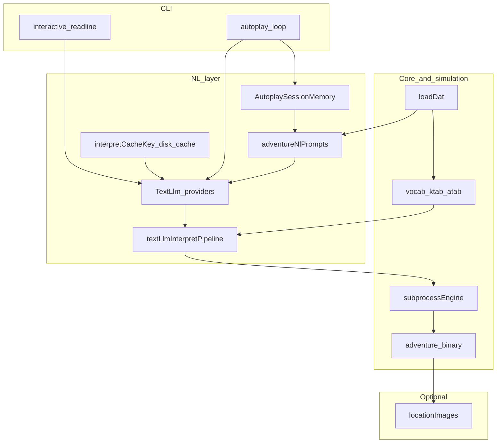

# Adventure engine architecture (adventure-llm)

## Introduction

This document describes the logical structure of the [`adventure-llm`](../../adventure-llm/) TypeScript package: loading the unchanged Crowther `adventure.dat`, driving the built Fortran [`adventure`](../../adventure) binary for subprocess parity, and optional layers for **natural-language interpretation** (multiple LLM backends), **autoplay**, and **imagery**. NL and imagery are **presentation and input** layers; they do not replace the simulation.

## Business and system context

- **Classic core**: Colossal Cave Adventure semantics as shipped in this repository.
- **Enhancement**: NL mapping turns free text into the same **GETIN** two-word, five-letter columns the Fortran game expects; optional images decorate output.

## Architectural drivers

- **Parity**: Behavior is anchored on the real `./adventure` binary and `adventure.dat` (see [adventure-fortran-engine.md](./adventure-fortran-engine.md)).
- **Provider neutrality**: One [`TextLlm`](../../adventure-llm/src/nl/textLlmContract.ts) contract backs interpret and autoplay for Google Generative AI, OpenAI-compatible HTTP, and local MLX (stdio worker).
- **Consistent post-conditions**: Parsed model JSON always passes through vocabulary snapping and repair (see [ADR0001: TextLlm providers](../decisions/ADR0001-adventure-llm-text-llm-providers.md)).

## Logical view

| Component | Role |
|-----------|------|
| **`loadDat` / types** | Parses `IKIND` sections into runtime structures mirroring Fortran tables (`LLINE`, `TRAVEL`, `KTAB`/`ATAB`, …). |
| **`subprocessEngine`** | Spawns `./adventure`, streams transcript, sends GETIN lines (including scripted retry on rejection). |
| **`TextLlm`** | `interpretPlayerInput`, `planAutoplay`, `generateUnstructured`; implemented by Google SDK, HTTP chat completions, MLX worker. |
| **`textLlmInterpretPipeline`** | After JSON parse + `coerceLlmJson`: `coerceToVocab` (ATAB + synthetic `QUIT`) then `repairInterpretedCommand` — **all providers**. |
| **`interpretCacheKey` / `interpretDiskCache`** | Disk cache keys include schema version, model, provider, user text, compact/structured flags, and the **same recent-game tail** as the interpret prompt. |
| **`AutoplaySessionMemory`** | Turn log, heuristic location/inventory, situational parser-token candidates; used heavily in autoplay and (by default) prepended for **interactive** NL. |
| **`adventureNlPrompts`** | Shared interpret/autoplay prompt text, compact/structured layouts, vocab hints, optional interpret few-shots. |
| **`locationImages`** | Optional imagery from Gemini; does not alter `adventure.dat` text. |

## Process view

### Fortran turn (LLM-assisted CLI)

1. Welcome stream → instructions question → first `>` prompt.
2. **Interactive mode (default)**: Before each interpret call, the CLI may prepend `buildInteractiveInterpretPrefix` (session state + situational tokens) to recent game text; see `ADVENTURE_LLM_INTERACTIVE_SESSION`.
3. User line → help-intent shortcuts or **`interpretPlayerInput`** → finalize pipeline → GETIN line (+ optional swap retry).
4. Engine runs; new transcript chunk feeds the next interpret context (capped in the prompt per compact/full).

### Autoplay

1. `AutoplaySessionMemory` records each command and outcome; builds rich planner user prompt (state, candidates, transcript budget).
2. **`planAutoplay`** → same finalize path for tokens; MLX may use an optional two-step candidate filter (`ADVENTURE_LLM_AUTOPLAY_TWO_STEP`).

### NL provider differences (pre-pipeline)

| Provider | Typical constraint | Notes |
|----------|-------------------|--------|
| **Google** | Native JSON `responseSchema` + full vocab enum | Structured output from API. |
| **HTTP** | Optional `json_schema` strict mode (`ADVENTURE_LLM_HTTP_JSON_SCHEMA`); retries on transient HTTP errors (`ADVENTURE_LLM_HTTP_RETRY_ATTEMPTS`). |
| **MLX** | Freeform text → `parseJsonObjectFromLlmText`; serialized requests via stdio worker | Temperature/stop strings via env; compact prompts default on. |

After generation, **post-processing is identical** (`finalizeInterpretedCommand` / `finalizeAutoplayPlannerResponse`).

## Data view

- **World truth**: [`adventure.dat`](../../adventure.dat) on disk; loader mirrors Fortran layout.
- **NL outputs**: `InterpretedCommand` / `AutoplayPlannerResponse` (Zod schemas) before GETIN normalization.
- **Cache** (optional): Per-interpret JSON files under `ADVENTURE_LLM_CACHE_DIR`; key material documented in [`adventure-llm/.env.example`](../../adventure-llm/.env.example) and ADR0001.

## Operational and security considerations

- **Secrets**: `GEMINI_API_KEY`, optional HTTP bearer token, `HF_TOKEN` for MLX model download — via environment only; never committed.
- **Observability**: `ADVENTURE_LLM_DEBUG` / `ADVENTURE_LLM_DEBUG_LOG` append JSONL; large `prompt` / `rawJson` fields truncated per `ADVENTURE_LLM_DEBUG_MAX_PROMPT_CHARS`.
- **Latency**: `ADVENTURE_LLM_FAST_INTERPRET` skips interpret few-shots; MLX interpret defaults favor compact prompts.

## Parity strategy

- **Oracle**: the built `./adventure` binary for subprocess tests and baselines.
- **Bugs and quirks**: documented in [`.work-items/adventure-llm/bugs.md`](../../.work-items/adventure-llm/bugs.md) when present.

## References

- [`adventure.f`](../../adventure.f) — reference engine implementation.
- [adventure-fortran-engine.md](./adventure-fortran-engine.md) — `adventure.dat` schema and Fortran loop.
- [ADR0001: adventure-llm TextLlm providers](../decisions/ADR0001-adventure-llm-text-llm-providers.md) — NL pipeline and cache decisions.
- [`.work-items/adventure-llm/design.md`](../../.work-items/adventure-llm/design.md) — feature design (if maintained).
- Key code: [`adventure-llm/src/index.ts`](../../adventure-llm/src/index.ts) (public exports), [`adventure-llm/src/cli/main.ts`](../../adventure-llm/src/cli/main.ts), [`adventure-llm/src/nl/`](../../adventure-llm/src/nl/).
