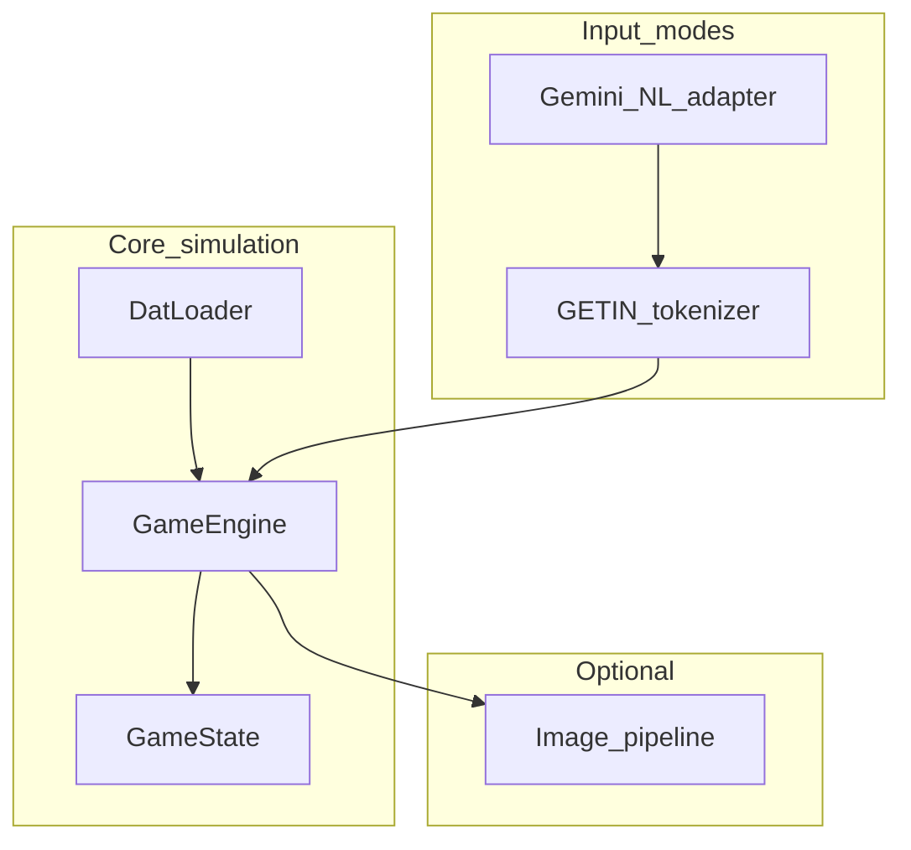

# Adventure engine architecture (adventure-llm)

## Introduction

This document describes the logical structure of the `adventure-llm` TypeScript package: loading the unchanged Crowther `adventure.dat`, simulating the Fortran game loop for parity with [`adventure.f`](../../adventure.f), and optional layers for natural-language interpretation (Gemini structured output) and imagery.

## Business and system context

- **Classic core**: Colossal Cave Adventure semantics as shipped in this repository.  
- **Enhancement**: NL mapping and optional images are **presentation and input** layers; they do not replace the simulation.

## Logical view

- **`DatLoader`**: Parses `IKIND` sections into `LLINE` chains, `TRAVEL` entries, `KTAB`/`ATAB` vocabulary.  
- **`GameEngine`**: Turn loop, motion resolution (`KEY`/`TRAVEL`), verb dispatch, `SPEAK`, dwarves, lamp/darkness — ported from Fortran.  
- **`getin`**: Character-level compatibility with Fortran `GETIN`.  
- **`Gemini`**: Maps NL → `{ primaryToken, secondaryToken?, ... }` validated against loaded vocabulary.  
- **`Image pipeline`**: Optional; keyed by location and flags; does not alter `adventure.dat` text.

## Process view (turn loop)

1. Describe current location (short/long per `ABB`, `COND`, lamp).  
2. List visible objects (`IOBJ`/`ICHAIN`).  
3. Read command (typed or from NL adapter).  
4. Resolve vocabulary → `JVERB` / `JOBJ` / motion `K`.  
5. Apply motion or verb semantics; update state; append transcript lines.

## Data view

- **Single source of truth for world data**: bytes of `adventure.dat` on disk.  
- **Runtime structures**: mirror Fortran arrays (`IPLACE`, `IOBJ`, `TRAVEL`, `LLINE`, etc.).

## Parity strategy

- **Oracle**: the built `./adventure` binary for subprocess tests and baselines.  
- **Bugs and quirks**: documented in [`.work-items/adventure-llm/bugs.md`](../../.work-items/adventure-llm/bugs.md); fixes belong to a future initiative, not this track.

## Security and operations

- **Gemini**: API keys via environment variables; no secrets in repo.  
- **Telemetry**: none required for core; optional logging off by default.

## References

- [`adventure.f`](../../adventure.f) — reference implementation.  
- [`.work-items/adventure-llm/design.md`](../../.work-items/adventure-llm/design.md) — feature design.
