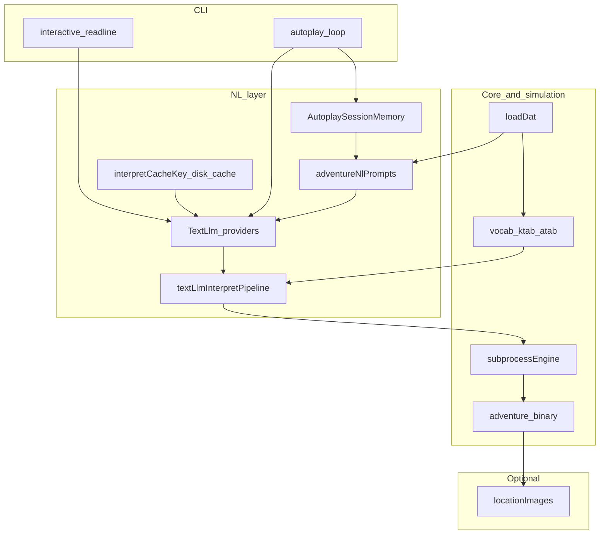

# Adventure engine architecture (adventure-llm)

## Introduction

This document describes the logical structure of the [`adventure-llm`](../../adventure-llm/) TypeScript package: loading the unchanged Crowther `adventure.dat`, driving the built Fortran [`adventure`](../../adventure) binary for subprocess parity, and optional layers for **natural-language interpretation** (multiple LLM backends), **autoplay**, and **imagery**. NL and imagery are **presentation and input** layers; they do not replace the simulation.

### Direction of travel (target architecture)

The repository is moving toward **browser-orchestrated cognition** for the web dashboard: **client-side glue** (inferred map, inventory/mode heuristics, policy over streamed text — see [ADR0005](../decisions/ADR0005-browser-orchestrated-autoplay-cognition.md)), coordinated by an **XState-style orchestration hub** that will absorb **sync / promote / workspace** events as they land ([adventure-llm-cognition-and-workspace.md](./adventure-llm-cognition-and-workspace.md)). The **[ADR0006](../decisions/ADR0006-client-sqlite-wal-subsystem-store.md) subsystem SQLite store** (schema + API under [`adventure-llm/src/browser/`](../../adventure-llm/src/browser/)) is **implemented**; browser WASM/OPFS wiring and orchestration **hooks** are still integration work. The stack also uses a **thin Node layer** for Fortran + `adventure.dat` beside the binary + model pooling + **LLM packaging**, and a **versioned subsystem workspace** (see [ADR0004–ADR0012](../decisions/adventure-llm-cognition-adr-index.md)). **This document** remains the reference for **how the package is structured today** (Node-driven autoplay loop, current dashboard behavior, CLI) until those changes fully land in the dashboard; when they do, sections here should be updated to avoid drift.

## Business and system context

- **Classic core**: Colossal Cave Adventure semantics as shipped in this repository.
- **Enhancement**: NL mapping turns free text into the same **GETIN** two-word, five-letter columns the Fortran game expects; optional images decorate output.

## Architectural drivers

- **Parity**: Behavior is anchored on the real `./adventure` binary and `adventure.dat` (see [adventure-fortran-engine.md](./adventure-fortran-engine.md)).
- **Provider neutrality**: One [`TextLlm`](../../adventure-llm/src/nl/textLlmContract.ts) contract backs interpret and autoplay for Google Generative AI, OpenAI-compatible HTTP, and local MLX (stdio worker).
- **Consistent post-conditions**: Parsed model JSON always passes through vocabulary snapping and repair (see [ADR0001: TextLlm providers](../decisions/ADR0001-adventure-llm-text-llm-providers.md)).

## Logical view

| Component                                      | Role                                                                                                                                                                                                                                                                                                                                                                                                                                                                             |
| ---------------------------------------------- | -------------------------------------------------------------------------------------------------------------------------------------------------------------------------------------------------------------------------------------------------------------------------------------------------------------------------------------------------------------------------------------------------------------------------------------------------------------------------------- |
| **`loadDat` / types**                          | Parses `IKIND` sections into runtime structures mirroring Fortran tables (`LLINE`, `TRAVEL`, `KTAB`/`ATAB`, …).                                                                                                                                                                                                                                                                                                                                                                  |
| **`subprocessEngine`**                         | Spawns `./adventure`, streams transcript, sends GETIN lines (including scripted retry on rejection).                                                                                                                                                                                                                                                                                                                                                                             |
| **`TextLlm`**                                  | `interpretPlayerInput`, `planAutoplay`, `generateUnstructured`; implemented by Google SDK, HTTP chat completions, MLX worker.                                                                                                                                                                                                                                                                                                                                                    |
| **`textLlmInterpretPipeline`**                 | After JSON parse + `coerceLlmJson`: `coerceToVocab` (ATAB + synthetic `QUIT`) then `repairInterpretedCommand` — **all providers**.                                                                                                                                                                                                                                                                                                                                               |
| **`interpretCacheKey` / `interpretDiskCache`** | Disk cache keys include schema version, model, provider, user text, compact/structured flags, and the **same recent-game tail** as the interpret prompt.                                                                                                                                                                                                                                                                                                                         |
| **`AutoplaySessionMemory`**                    | Turn log, heuristic location/inventory, inferred exploration map, situational parser-token candidates, **`getObjectHintScopeText()`** (latest room block for **Items** / **Cand_Obj** / loot funnel; see [ADR0003](../decisions/ADR0003-scoped-object-hints-latest-room-block.md)), planner **guards** (rejected GETIN, oscillation, stagnation, redundant take-when-carrying, repeated LOOK/EXAMI); used heavily in autoplay and (by default) prepended for **interactive** NL. |
| **`adventureNlPrompts`**                       | Shared interpret/autoplay prompt text, compact/structured layouts, vocab hints, optional interpret few-shots; **`resolveAutoplayPromptMode()`** selects **`explore`** (default) vs **`full`** autoplay planner copy (`ADVENTURE_LLM_AUTOPLAY_PROMPT_MODE`).                                                                                                                                                                                                                      |
| **`locationImages`**                           | Optional imagery from Gemini; does not alter `adventure.dat` text.                                                                                                                                                                                                                                                                                                                                                                                                               |

## Process view

### Fortran turn (LLM-assisted CLI)

1. Welcome stream → instructions question → first `>` prompt.
2. **Interactive mode (default)**: Before each interpret call, the CLI may prepend `buildInteractiveInterpretPrefix` (session state + situational tokens) to recent game text; see `ADVENTURE_LLM_INTERACTIVE_SESSION`.
3. User line → help-intent shortcuts or **`interpretPlayerInput`** → finalize pipeline → GETIN line (+ optional swap retry).
4. Engine runs; new transcript chunk feeds the next interpret context (capped in the prompt per compact/full).

### Autoplay

1. `AutoplaySessionMemory` records each command and outcome and maintains an inferred exploration map (heuristic, not engine truth).
2. **Planner user message** — Depends on **`ADVENTURE_LLM_AUTOPLAY_PROMPT_MODE`**:
   - **`explore` (default)** — Short **CURRENT SESSION** framing; **`### AT THIS NODE`** first (place, carrying, dead primaries, try-next list, optional **Known exits** from session FSM edges); **`### EXPLORATION MAP`** (compact lines + optional alerts); **`### CANDIDATES`**; **`### RECENT MOVES`**; smaller **LOCAL SESSION MAP** Graphviz DOT. Indoor “loot then exit” object-notes and a long indoor alert are suppressed unless mode is **`full`**.
   - **`full`** — Prior layout: **GAME ENGINE STATE** with location + inventory lines plus full exploration lines and alerts; larger local DOT neighborhood.
3. **System prompt** — `mlxAutoplaySystemPrompt` / variants incorporate the same mode (explore uses shorter preamble and exploration-first JSON instructions).
4. **`buildSituationalCandidateTokens`** — Uses **`objectHintScopeText`** from **`getObjectHintScopeText()`** so object matching, vertical-passage ordering, and visible-object counts follow the **latest room-description block** (aligned with **Loc:**), not stale nouns elsewhere in the tail; still strips `> …` lines; subtracts objects already matched in parsed inventory text; with **`exploreFirst`** (explore mode), orders motion before TAKE / visible object nouns when objects are present. Full **recentRawTail** remains available for other prompt sections.
5. **`planAutoplay`** → same finalize path for tokens; MLX may use an optional two-step candidate filter (`ADVENTURE_LLM_AUTOPLAY_TWO_STEP`).
6. **`planAfterAutoplayGuards`** — Ordered substitutions before sending GETIN: parser-rejection escape → **redundant TAKE/GET when already carrying** → oscillation → stagnation → repeated LOOK/EXAMI in same cell.
7. **Pacing and length** — `ADVENTURE_LLM_AUTOPLAY_PACE_MS`, `ADVENTURE_LLM_AUTOPLAY_MAX_MOVES`, `ADVENTURE_LLM_AUTOPLAY_CONTEXT_CHARS`; the **autoplay web dashboard** passes **`AutoplayRunOverrides`** with **`getPaceMs` / `getMaxMoves`** so **`POST /api/autoplay-settings`** updates apply **between moves** without restarting the session; the UI auto-saves on change and the server broadcasts **`autoplay_settings`** over SSE.

### Autoplay web dashboard (browser)

The dashboard is served as static ES modules under [`adventure-llm/public/`](../../adventure-llm/public/). The entry script [`app.js`](../../adventure-llm/public/app.js) calls **`bindDashboardElements(resolveDashboardElements(document))`**, builds **`createDashboardApi(defaultPorts())`**, and registers SSE via **`registerDashboardEventHandlers`** in [`dashboardEventStream.js`](../../adventure-llm/public/dashboardEventStream.js). Mutable session fields live in the exported **`state`** object from [`dashboardState.js`](../../adventure-llm/public/dashboardState.js) (tests can use **`createDashboardState()`** for an isolated bag). **Ports** (`fetch`, `EventSource`, `localStorage`, `location`, `requestAnimationFrame`) are taken from **`defaultPorts()`** in [`dashboardEnv.js`](../../adventure-llm/public/dashboardEnv.js) so harnesses can substitute fakes.

| Module                                                                  | Responsibility                                                    |
| ----------------------------------------------------------------------- | ----------------------------------------------------------------- |
| **`dashboardApi.js`**                                                   | All `fetch` calls to `/api/*`                                     |
| **`transcriptView.js`**                                                 | Transcript layout, chunks, terminal echo queue                    |
| **`mapView.js`**                                                        | Map slice, Mermaid/DOT panel, snapshot application                |
| **`dashboardWidgets.js`**                                               | Copy buttons, help dialogs, map scroll chrome, mermaid fullscreen |
| **`autoplayPace.js`**, **`sseJson.js`**, **`transcriptLayoutLogic.js`** | Pure or mostly pure logic; tested from Node Vitest                |

**Verification:** `npm run check` in `adventure-llm` runs TypeScript and Vitest (including **`src/**/\*.dom.test.ts`** with happy-dom where the DOM is required). Server-side dashboard HTTP behavior remains covered by [`webDashboard.test.ts`](../../adventure-llm/src/cli/webDashboard.test.ts).

### NL provider differences (pre-pipeline)

| Provider   | Typical constraint                                                                                                                             | Notes                                                         |
| ---------- | ---------------------------------------------------------------------------------------------------------------------------------------------- | ------------------------------------------------------------- |
| **Google** | Native JSON `responseSchema` + full vocab enum                                                                                                 | Structured output from API.                                   |
| **HTTP**   | Optional `json_schema` strict mode (`ADVENTURE_LLM_HTTP_JSON_SCHEMA`); retries on transient HTTP errors (`ADVENTURE_LLM_HTTP_RETRY_ATTEMPTS`). |
| **MLX**    | Freeform text → `parseJsonObjectFromLlmText`; serialized requests via stdio worker                                                             | Temperature/stop strings via env; compact prompts default on. |

After generation, **post-processing is identical** (`finalizeInterpretedCommand` / `finalizeAutoplayPlannerResponse`).

## Data view

- **World truth**: [`adventure.dat`](../../adventure.dat) on disk; loader mirrors Fortran layout.
- **NL outputs**: `InterpretedCommand` / `AutoplayPlannerResponse` (Zod schemas) before GETIN normalization.
- **Cache** (optional): Per-interpret JSON files under `ADVENTURE_LLM_CACHE_DIR`; key material documented in [`adventure-llm/.env.example`](../../adventure-llm/.env.example) and ADR0001.

## Operational and security considerations

- **Secrets**: `GEMINI_API_KEY`, optional HTTP bearer token, `HF_TOKEN` for MLX model download — via environment only; never committed.
- **Observability**: `ADVENTURE_LLM_DEBUG` / `ADVENTURE_LLM_DEBUG_LOG` append JSONL; large `prompt` / `rawJson` fields truncated per `ADVENTURE_LLM_DEBUG_MAX_PROMPT_CHARS`.
- **Latency**: `ADVENTURE_LLM_FAST_INTERPRET` skips interpret few-shots; MLX interpret defaults favor compact prompts.

## Parity strategy

- **Oracle**: the built `./adventure` binary for subprocess tests and baselines.
- **Bugs and quirks**: documented in [`.work-items/adventure-llm/bugs.md`](../../.work-items/adventure-llm/bugs.md) when present.

## References

- [adventure-llm-cognition-and-workspace.md](./adventure-llm-cognition-and-workspace.md) — target architecture for browser cognition and subsystem workspace (see ADR index).
- [`adventure.f`](../../adventure.f) — reference engine implementation.
- [adventure-fortran-engine.md](./adventure-fortran-engine.md) — `adventure.dat` schema and Fortran loop.
- [ADR0001: adventure-llm TextLlm providers](../decisions/ADR0001-adventure-llm-text-llm-providers.md) — NL pipeline and cache decisions.
- [ADR0003: scoped object hints to latest room block](../decisions/ADR0003-scoped-object-hints-latest-room-block.md) — **Items**, **Cand_Obj**, loot funnel, and vertical cues use **`getObjectHintScopeText()`**.
- Guideline: [autoplay-planner-context](../../guidelines/adventure-llm/autoplay-planner-context.md) — prompt modes, candidate hygiene, object scope, guards, web pace overrides.
- [`.work-items/adventure-llm/design.md`](../../.work-items/adventure-llm/design.md) — feature design (if maintained).
- Key code: [`adventure-llm/src/index.ts`](../../adventure-llm/src/index.ts) (public exports), [`adventure-llm/src/cli/main.ts`](../../adventure-llm/src/cli/main.ts), [`adventure-llm/src/cli/webDashboard.ts`](../../adventure-llm/src/cli/webDashboard.ts) (HTTP + SSE server for the dashboard), [`adventure-llm/src/nl/`](../../adventure-llm/src/nl/), [`adventure-llm/public/`](../../adventure-llm/public/) (browser dashboard modules).
- Source layout map: [`adventure-llm/docs/source-map.md`](../../adventure-llm/docs/source-map.md) — themes, file kinds, **`public/`** ↔ Vitest pairing, future reorg tiers.
