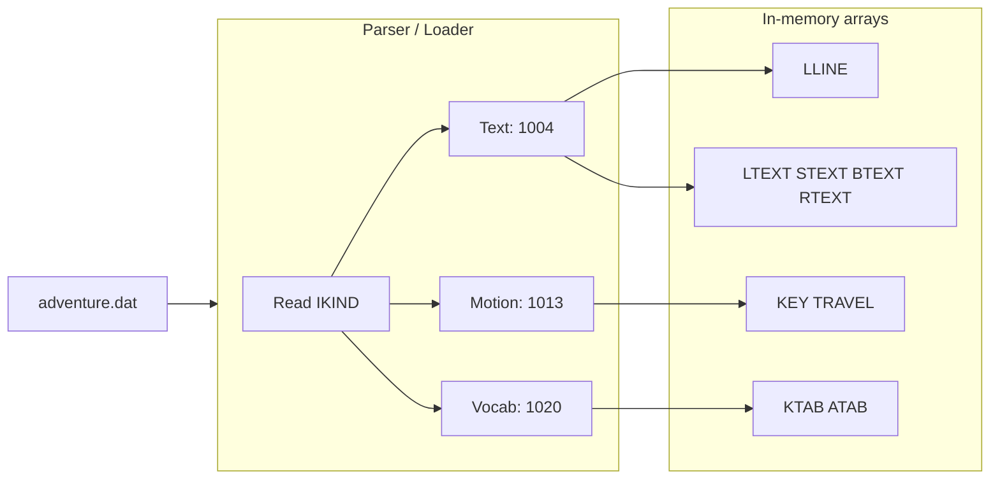
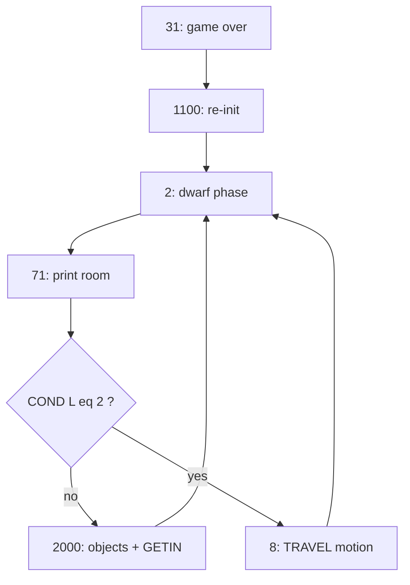

# Architecture: `adventure.f` and `adventure.dat`

This document is a technical deep dive into **two artifacts only**: [`adventure.f`](../../adventure.f) (the **engine**—control flow, turn logic, verb semantics) and [`adventure.dat`](../../adventure.dat) (the **data schema**—text, motion graph, vocabulary). It separates **how the file is parsed** (the loader) from **how the game runs** (the interpreter loop after load).

---

## I. Historical context and constraints

### Why Fortran? Why parallel arrays?

Will Crowther’s original Adventure (mid-1970s) modeled Mammoth Cave; Don Woods extended it into the widely copied “Colossal Cave” text adventure. Implementations targeted **mainframes and minicomputers** whose address spaces were measured in **tens of kilowords**, not gigabytes.

That environment explains the shape of [`adventure.f`](../../adventure.f):

- **`DIMENSION` everywhere** — fixed upper bounds, no heap of arbitrary strings or graphs.
- **Integer codes** for rooms, objects, and words; prose lives **once** in [`adventure.dat`](../../adventure.dat) and is printed through small routines (`SPEAK`).
- **Linear scan** of `ATAB` for vocabulary (~1000 entries)—no hash table; simple and predictable.

> **Undergraduate takeaway:** Memory pressure **forced** a data layout (parallel arrays + linked indices) that looks “unobjectlike” today. Treating it as bad OOP misses the historical constraint.

> **Graduate takeaway:** The program is an early **domain-specific virtual machine**: [`adventure.dat`](../../adventure.dat) is the “program,” [`adventure.f`](../../adventure.f) is the interpreter—same separation as bytecode + VM or JSON rules + engine, with 1970s technology.

Adventure predates mass-market PC games and helped establish **interactive fiction** as a genre; the architecture is a concrete case study in **content-as-data** and **explicit control flow** (`GOTO`, labels).

---

## II. The data schema (`adventure.dat`)

[`adventure.dat`](../../adventure.dat) is a **single sequential file** of sections. Each **outer** section begins with an integer **`IKIND`** (`FORMAT(I9)`). Inner blocks end with **`JKIND = -1`** (text/motion rows) or **`KTAB = -1`** (vocabulary), after which the **next line** is the next **`IKIND`**.

### Section index (`IKIND`)

| Order in file | **`IKIND`** | Fills | Role |
|----------------|------------|-------|------|
| 1 | **`1`** | `LTEXT`, `LLINE` | Long room descriptions |
| After **`-1`** | **`2`** | `STEXT`, `LLINE` | Short room descriptions |
| After **`-1`** | **`3`** | `KEY`, `TRAVEL` | Motion graph |
| After **`-1`** | **`4`** | `KTAB`, `ATAB` | Vocabulary |
| After **`-1`** | **`5`** | `BTEXT`, `LLINE` | Object / conditional visible text |
| After **`-1`** | **`6`** | `RTEXT`, `LLINE` | Canned `SPEAK` messages |
| After **`-1`** | **`0`** | *(none—triggers init)* | Not a data section: dispatch to label **`1100`** |

Text lines share one shape: **`JKIND`** plus twenty 4-character fields (`FORMAT(I9,20A4)`), stored into **`LLINE`**.

### The loader (parser): `GOTO` branch on `IKIND`

The loader loop reads **`IKIND`** at label **`1002`** and dispatches with a **computed `GOTO`**:

```text
GOTO (1100, 1004, 1004, 1013, 1020, 1004, 1004)(IKIND + 1)
```

| `IKIND + 1` | Label | Action |
|-------------|-------|--------|
| 1 | **`1100`** | Runtime init (after all sections loaded—also used on restart) |
| 2–3 | **`1004`** | Read **`LLINE`** text; chain into `LTEXT` / `STEXT` / `BTEXT` / `RTEXT` by **`IKIND`** |
| 4 | **`1013`** | Read motion rows → **`TRAVEL`** / **`KEY`** |
| 5 | **`1020`** | Read **`KTAB`**, **`ATAB`** pairs |

So **the parser** is not a recursive-descent grammar; it is a **state machine driven by `IKIND`** and **`-1` sentinels**.

### Data flow: file → loader → memory



After **`IKIND = 0`**, label **`1100`** runs: it does **not** re-read the file; it seeds **`IPLACE`**, **`IFIXED`**, **`COND`**, builds **`IOBJ`** / **`ICHAIN`** from **`DATA`** and loaded tables, prints **`INIT DONE`**, then transfers to the **engine** entry (`1` → `2`).

The Fortran source uses `FILE='ADVENTURE.DAT'`. On **case-sensitive** filesystems, the repository file [`adventure.dat`](../../adventure.dat) may need a matching name or symlink so `OPEN` succeeds.

---

## III. The in-memory world model

This is **runtime state** in [`adventure.f`](../../adventure.f)—what the **engine** reads and writes each turn.

### Primary tables

| Variable | Role |
|----------|------|
| `IPLACE(100)` | Object id → room id, or **`-1`** if **carried** (implicit inventory). |
| `IFIXED(100)` | Nonzero ⇒ object cannot be taken from its room. |
| `PROP(100)` | Per-object flags (lamp on/off, grate state, food/water consumed, etc.). |
| `IOBJ(300)` | Head of a **singly linked list** of object ids per room. |
| `ICHAIN(100)` | **Next** pointer in that list. |
| `COND(300)` | Room flags: source comments tie **`COND = 1`** to lit, **`COND = 2`** to “don’t ask question” / movement-only behavior; parity also feeds **dark** logic with the lamp. |
| `ABB(300)` | Visit counter mod 5—picks **short** vs **long** room description. |
| `KEY(300)` | For a location, start index into **`TRAVEL`** for outgoing moves. |
| `TRAVEL(1000)` | Encoded edges; **sign** marks end of a variant group (see comment: *TRAVEL = NEG IF LAST THIS SOURCE + DEST×1024 + KEYWORD*). |

Compiled-in symbolic object ids (`KEYS`, `LAMP`, `GRATE`, `SNAKE`, `BIRD`, …) are **`PARAMETER`-style assignments** in the main program; they index these tables.

### The text engine: `LLINE` chains

`LLINE(1000,22)` holds **rows** of text:

- Columns **3–22** are twenty **4-character** chunks (print band).
- `LLINE(I,2)` stores the **last used column** bound for printing.
- `LLINE(I,1)` links to the **next** row (continuation) or **0** for end of chain.

`LTEXT`, `STEXT`, `BTEXT`, and `RTEXT` store only **head indices** into `LLINE`. Printing walks the chain (e.g. room description at labels **`4`–`6`**, `SPEAK` in subroutine **`SPEAK`**).

> **Undergraduate takeaway:** “Strings” are **rows + links**, not Fortran `CHARACTER` arrays of arbitrary length—another memory tradeoff.

---

## IV. The execution loop (the engine)

There is **no GUI timer thread**. The **game loop** is a **turn-based** cycle: optional **autonomous** updates → **describe** → **fork** (motion-only vs full input).

### Phase 1: Autonomous events (dwarves)

From label **`2`**, before room text: if **`IDWARF`** is active, control may enter **`60`–`69`** (movement, knives, death **`GOTO 31`**). When **`LOC.EQ.15`** and dwarves were inactive, **`IDWARF`** becomes **`1`**. This logic is **Fortran**, not table-driven from [`adventure.dat`](../../adventure.dat).

### Phase 2: Description

Label **`71`** prints **`STEXT(L)`** vs **`LTEXT(L)`** using **`ABB(L)`**, walks **`LLINE`**, optional random line at **`LOC.EQ.33`**.

### Phase 3: The fork — movement vs interaction

| `COND(L)` | Next | Meaning |
|-----------|------|---------|
| **`≠ 2`** | **`GOTO 2000`** | Full **interaction**: set **`LOC`**, **`ABB`**, darkness, list objects via **`BTEXT`** / **`IOBJ`**, **`CALL GETIN`**, resolve command. |
| **`= 2`** | **`GOTO 8`** | **Motion-only** “halt”: resolve move with last motion keyword **`K`** against **`KEY(LOC)`** and **`TRAVEL`**—no object listing / full prompt for that stop pattern. |

State variables: **`L`** = working location this iteration; **`LOC`** = player location for **`KEY(LOC)`** at **`8`**; **`J`** = room index in block **`2000`** for **`IOBJ(J)`**, etc.



Special destinations **`L ≥ 300`** use **`L - 300 + 1`** into a **computed `GOTO`** (grate, snake, random bridges, death)—**procedural** code paths, not extra rows in [`adventure.dat`](../../adventure.dat).

> **Graduate takeaway:** Mode (explore vs corridor) is **implicit** in **`COND`** and the next label—no explicit `enum GameMode`.

---

## V. Command resolution and verb dispatch

### Vocabulary lookup: `ATAB` / `KTAB`

`GETIN` fills the first **5-character** token (and optional second word). The engine **linearly scans** `ATAB` for a match, then decodes **`KTAB`**:

- **`K = MOD(KTAB(I), 1000)`**
- **`KQ = KTAB(I)/1000 + 1`** → branch: motion (**`5014`**), noun/object (**`5000`**), verb (**`2026`**), or canned **`SPEAK`** (**`2010`**)

Motion matches **`K`** against **`TRAVEL`** entries for **`KEY(LOC)`**. Verbs set **`JVERB`** and optionally **`JOBJ`** after a second word.

### The verb switch: 16-way `GOTO` at `2027`

After **`JVERB`** is set (`2026`), execution uses **`GOTO (9000,5066,…)(JVERB)`** at label **`2027`**—a **dispatch table** via **computed `GOTO`** (Fortran’s dense `switch`).

| `JVERB` | Label | Role | Typical pre-conditions (engine checks) |
|--------|-------|------|----------------------------------------|
| 1 | `9000` | Take / carry | Target object **`JOBJ`** must be in room **`J`** (or special cases); **`IFIXED`** blocks take; bird/rod/snake rules in code |
| 2 | `5066` | Drop | **`IPLACE(JOBJ)=-1`** (carrying); bird in Hall of Mt King can trigger snake logic |
| 3 | `3000` | Confused / hints | After repeated unknown input; may **`YES`** prompts in specific **`J`** / object situations |
| 4 | `5031` | Lock | Keys **`IPLACE(KEYS)`** is **`J`** or **`-1`**; **`JOBJ`** selects grate vs keys |
| 5 | `2009` | Inventory | Uses fixed **`K=54`** / **`SPEAK`** path |
| 6 | `5031` | Unlock | Same entry as 4; **`5107`** branches on **`JVERB.EQ.4`** vs lock path |
| 7 | `9404` | Lamp on | Lamp object at **`J`** or carried (**`-1`**) |
| 8 | `9406` | Lamp off | Same presence as lamp on |
| 9 | `5081` | Strike | **`JOBJ`** must be object **12** (matches) |
| 10 | `5200` | Speak stub | **`JSPK`** from **`JSPKT(JVERB)`** |
| 11 | `5200` | Speak stub | Same |
| 12 | `5300` | Attack | If dwarves **`DSEEN`**: knife fight; else **`JOBJ`** snake/bird/object rules |
| 13 | `5506` | Pour | Water object; updates **`PROP(WATER)`** |
| 14 | `5502` | Eat | Food present/carried, not already eaten |
| 15 | `5504` | Drink | Water present/carried, not already drunk |
| 16 | `5505` | Rub | Lamp vs default line **`76`** |

Failed checks often **`GOTO 5200`** → **`SPEAK(JSPK)`** (generic “don’t understand” / rejection). Motion while **`IDARK`** can **`GOTO 5014`** → fatal stumble (**`5017`**) with probability.

Two-word commands set **`TWOWDS`**; the parser commonly resolves **verb** then **noun** into **`JVERB`** / **`JOBJ`**. Missing object → **“`VERB` WHAT?”** (`5062`–`5063`).

> **Undergraduate exercise:** Trace **`TAKE LAMP`** from **`GETIN`** through **`ATAB`** match to **`JVERB=1`**, **`JOBJ=LAMP`**, then label **`9000`** and list removal.

> **Graduate exercise:** Contrast with **LL(1)** or **Earley**: there is no single grammar; **`ENTER`**, **`WEST`** (easter egg **`IWEST`**), and noun/verb ordering are **special cases**.

### Randomness

**`RAN(QZ)`** gates dark movement, dwarf knives, maze-like exits. Seeds were historically **compiler-dependent**—treat runs as **Monte Carlo narration**.

### Comparison hooks (graduate)

| Topic | This engine | Typical modern engine |
|-------|-------------|------------------------|
| Loop | `GOTO` + labels | `while` / event queue |
| World | Parallel arrays + index-linked lists | ECS, scene graphs |
| Text | `LLINE` chains | String tables, localization IDs |
| NPCs | Dwarf block + object specials | AI director, behavior trees |
| Parsing | Linear scan + ad hoc rules | Generated parsers |

The abstract pattern is unchanged: **world state + input → transition → output text**.

---

## Related repository components

This document is limited to **`adventure.f`** and **`adventure.dat`**. The [`adventure-llm`](../../adventure-llm/) package loads the same dat file, spawns the built **`./adventure`** binary for GETIN-compatible play, and optionally maps natural language to the two five-letter columns described under **Vocabulary lookup** above. For that wrapper architecture (LLM providers, caching, CLI), see [adventure-engine.md](./adventure-engine.md) and [ADR0001: adventure-llm TextLlm providers](../decisions/ADR0001-adventure-llm-text-llm-providers.md).

## References

- [`adventure.f`](../../adventure.f)
- [`adventure.dat`](../../adventure.dat)
