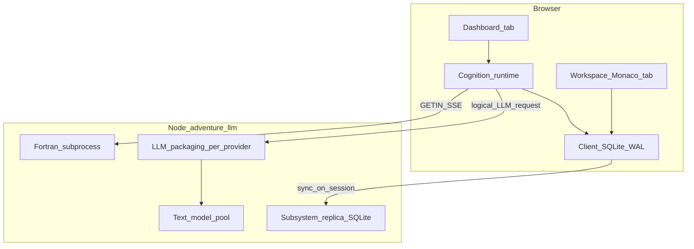

# Adventure-llm: browser cognition, subsystem workspace, and thin backend (direction of travel)

## Introduction

This document describes the **target architecture** for evolving [`adventure-llm`](../../adventure-llm/): moving **semantic** autoplay and interpret **policy** (prompt structures, session memory strategy, subsystem hooks) to the **browser**, while the **Node** layer focuses on **Fortran session I/O**, **pooled connections** to local and remote **text models**, and **LLM request packaging** (vendor-specific wire formats). Authors gain a **workspace** (Monaco, optional second tab) with **versioned subsystems**, **TDD with a promote-to-live gate**, and **client-authoritative SQLite** synced to a **server replica** on connect.

**Scope:** Strategic direction and boundaries. **As-built** behavior of the package today remains documented in [adventure-engine.md](./adventure-engine.md) until each migration lands.

**Related decisions:** [ADR0004](../decisions/ADR0004-backend-llm-packaging-and-discovery.md) through [ADR0013](../decisions/ADR0013-dashboard-xstate-cognition-panel.md), indexed under [adventure-llm-cognition-adr-index.md](../decisions/adventure-llm-cognition-adr-index.md).

## Business and system context

- **Classic core** (unchanged): Crowther `adventure.dat` and the built `./adventure` binary drive ground-truth simulation ([adventure-fortran-engine.md](./adventure-fortran-engine.md)).
- **Enhancement (direction):** Experimenters iterate **how** NL and autoplay behave—prompt layout, memory heuristics, subsystem code—**without** redeploying Node or duplicating vendor API rules in the client. The backend stays responsible for **correct** mapping from **logical** LLM requests to each provider’s API ([ADR0004](../decisions/ADR0004-backend-llm-packaging-and-discovery.md)).
- **Users** of the web dashboard edit subsystems in a **workspace** tab; **promotion** to the live runtime requires **tests** to pass ([ADR0009](../decisions/ADR0009-tdd-promote-gate-subsystems.md)).

## Architectural drivers

| Driver                     | Implication                                                                                                                                                                                                                                                                                                                                                                                                                                                                                     |
| -------------------------- | ----------------------------------------------------------------------------------------------------------------------------------------------------------------------------------------------------------------------------------------------------------------------------------------------------------------------------------------------------------------------------------------------------------------------------------------------------------------------------------------------- |
| **Iteration speed**        | **Glue** (map/inventory/modes/heuristics over streamed text) moves to the browser ([ADR0005](../decisions/ADR0005-browser-orchestrated-autoplay-cognition.md)); Fortran + pool stay on the server.                                                                                                                                                                                                                                                                                              |
| **Correctness vs vendors** | Packaging stays centralized in Node; discovery API for authoring UI ([ADR0004](../decisions/ADR0004-backend-llm-packaging-and-discovery.md)).                                                                                                                                                                                                                                                                                                                                                   |
| **Audit and replay**       | Subsystem history in **SQLite WAL** on the client; **revisions**, **tags**, **replay materialization**, and **revert** ([ADR0006](../decisions/ADR0006-client-sqlite-wal-subsystem-store.md), [ADR0007](../decisions/ADR0007-subsystem-revision-control-and-replay.md)). The **subsystem store** implements these under [`adventure-llm/src/browser/`](../../adventure-llm/src/browser/) (see ADR0006 and ADR0007 **Implementation**); **dashboard UX** (history, diffs, tag UI) and orchestration-only flows (tests-as-of-R, then promote) remain forward work. |
| **Backup**                 | **Client-authoritative** data; **server replica** + **sync on connect** ([ADR0008](../decisions/ADR0008-server-subsystem-replica-and-sync.md)).                                                                                                                                                                                                                                                                                                                                                 |
| **Safety**                 | **Promote** only after green tests; sandboxed **dynamic ES modules** ([ADR0009](../decisions/ADR0009-tdd-promote-gate-subsystems.md), [ADR0011](../decisions/ADR0011-subsystem-module-contract-dynamic-js.md)).                                                                                                                                                                                                                                                                                 |
| **Editor UX**              | Monaco in a **second tab**; **BroadcastChannel** for live notifications ([ADR0010](../decisions/ADR0010-monaco-workspace-second-tab-cross-tab-sync.md)).                                                                                                                                                                                                                                                                                                                                        |

## Architectural decisions (summary)

Decisions are recorded in ADRs (not duplicated here). Dependency order for implementation: see [adventure-llm-cognition-adr-index.md](../decisions/adventure-llm-cognition-adr-index.md).

- **ADR0004** — Backend **packaging** + **discovery** API for logical requests.
- **ADR0005** — **Browser-orchestrated** autoplay: client-owned glue state and loop; not “ship `adventure.dat` to the browser” as the primary goal.
- **ADR0006–ADR0008** — Client **SQLite WAL** (store module **implemented** — [ADR0006](../decisions/ADR0006-client-sqlite-wal-subsystem-store.md) **Implementation**), **revision control / tags / replay / revert** ([ADR0007](../decisions/ADR0007-subsystem-revision-control-and-replay.md) store **implemented**; UI forward work), **server replica + sync**.
- **ADR0009** — **TDD** and **promote-to-live** gate.
- **ADR0010** — **Monaco** second tab + **cross-tab** sync.
- **ADR0011** — **Subsystem module contract** (dynamic JS, sandbox).
- **ADR0012** — **Optional** in-browser TypeScript for authoring.
- **ADR0013** — **Third** map-column panel for **XState cognition** display (orchestration), separate from Session FSM Mermaid and exploration grid.

## Logical view

- **Glue** assembly (inferred map, inventory/mode heuristics, planner-facing memory, subsystem hooks) over **streamed text** is a **browser** concern once migration is complete for the dashboard path — distinct from loading the full parsed game database in the client as the simulation authority.
- **Packaging** (OpenAI chat + `json_schema`, Gemini `responseSchema`, MLX stdio merge rules) remains **Node** ([ADR0004](../decisions/ADR0004-backend-llm-packaging-and-discovery.md)).

## Orchestration model (XState / actors)

The **target** integration point for the dashboard path is a **single orchestration hub**—implemented with **XState v5** (`adventure-llm/src/browser/autoplayCognitionMachine.ts`, bundled for the browser) and **converging** with the imperative client loop in `public/browserAutoplayOrchestrator.js`—that sequences:

- **Engine** inputs from **SSE** (for example `getin_prompt_ready`, `transcript_delta`, `plan_applied`).
- **Logical LLM** steps via **`POST /api/autoplay-plan`** and the existing packaging layer ([ADR0004](../decisions/ADR0004-backend-llm-packaging-and-discovery.md)).
- **GETIN / queue** submission when **browser-orchestrated** autoplay is enabled ([ADR0005](../decisions/ADR0005-browser-orchestrated-autoplay-cognition.md)).
- **Future / integration:** **Glue** checkpoints persisted through the same store as subsystems ([ADR0006](../decisions/ADR0006-client-sqlite-wal-subsystem-store.md); optional tables not yet added), **sync** lifecycle events ([ADR0008](../decisions/ADR0008-server-subsystem-replica-and-sync.md)), **promote** transitions ([ADR0009](../decisions/ADR0009-tdd-promote-gate-subsystems.md)), and **`BroadcastChannel`** from the workspace tab ([ADR0010](../decisions/ADR0010-monaco-workspace-second-tab-cross-tab-sync.md)) as **typed machine events**, keeping one locus of control instead of scattered booleans.

**Sandboxed subsystems** remain **message-passing** peers ([ADR0011](../decisions/ADR0011-subsystem-module-contract-dynamic-js.md)). Development builds may attach **Stately Inspector** or structured `actor.subscribe` logging for legibility ([ADR0005](../decisions/ADR0005-browser-orchestrated-autoplay-cognition.md) risk C). The **production dashboard** should still expose a **dedicated cognition panel** in the map column ([ADR0013](../decisions/ADR0013-dashboard-xstate-cognition-panel.md)) so orchestration state is visible without DevTools.

## Process view (target dashboard path)

1. Browser opens SSE for game text; maintains **client-authoritative glue state** (directed/inferred map, inventory model, move/search/act (or similar) modes, heuristics) in JavaScript — today partly embodied server-side by types such as `AutoplaySessionMemory` and related NL modules, to be ported or replaced behind a stable client module boundary. The **orchestration sequence** (when to plan, when GETIN is allowed, when to checkpoint) should stay in one **actor-shaped** flow ([ADR0005](../decisions/ADR0005-browser-orchestrated-autoplay-cognition.md)) so SLM/LLM phases and engine I/O stay ordered and **observable**.
2. Browser builds **logical** interpret/planner payloads; POSTs to Node; Node **packages** and calls pooled `TextLlm`.
3. Browser sends GETIN via existing session APIs; Fortran stream returns new text.
4. Subsystem edits **commit** to client SQLite; **tests** run; **promote** updates live hooks; **BroadcastChannel** notifies the dashboard tab ([ADR0009](../decisions/ADR0009-tdd-promote-gate-subsystems.md), [ADR0010](../decisions/ADR0010-monaco-workspace-second-tab-cross-tab-sync.md)).
5. On session connect, **subsystem sync** updates server **replica** ([ADR0008](../decisions/ADR0008-server-subsystem-replica-and-sync.md)).

**Reconnect / refresh (glue vs engine):** Tab refresh or reconnect must not assume glue state can be rebuilt by replaying the full transcript (token and latency limits). **Checkpoint inferred glue state** (map, inventory model, modes) to the same **durable client store** (SQLite + OPFS / IndexedDB) as subsystems on each turn, then **hydrate** on load and fetch only a **bounded transcript tail or diff** from the server. Do not use `sessionStorage` as the durable store for that glue — see [ADR0005](../decisions/ADR0005-browser-orchestrated-autoplay-cognition.md) risks and mitigations.

**CLI:** May retain the **legacy** full pipeline in Node ([`cli/main.ts`](../../adventure-llm/src/cli/main.ts)) until explicitly aligned with the shared client library.

## Deployment view

- **Single-machine / local dev:** Node serves static `adventure-llm/public/`, Fortran binary beside `adventure.dat`, env-based LLM keys; browser holds SQLite WASM + OPFS (or chosen persistence).
- **Secrets:** Unchanged principle—keys on server/env for cloud models; browser does not embed production secrets ([adventure-engine.md](./adventure-engine.md) operational section remains relevant).

## Data view

- **World truth:** `adventure.dat` + binary (unchanged).
- **Subsystem authority:** Client SQLite (files, revisions, test/promotion rows, **`revision_tags`** — schema v2; see [ADR0007](../decisions/ADR0007-subsystem-revision-control-and-replay.md)) ([ADR0006](../decisions/ADR0006-client-sqlite-wal-subsystem-store.md)). **Inferred glue state** (map, modes, heuristics) for the dashboard path should live in the same durable persistence story — not `sessionStorage` — so multi-tab workspace and reconnect stay consistent ([ADR0005](../decisions/ADR0005-browser-orchestrated-autoplay-cognition.md)).
- **Replica:** Server SQLite for backup and inspection ([ADR0008](../decisions/ADR0008-server-subsystem-replica-and-sync.md)).
- **Logical LLM payloads:** Not persisted as full vendor HTTP bodies in the client; optional debug logs remain governed by existing env ([adventure-engine.md](./adventure-engine.md)).

## Security considerations

- **User-authored JS** in subsystems must not run with same-origin access to storage or the dashboard DOM; use a **Worker** or **strictly sandboxed iframe** and **message-passing only** ([ADR0011](../decisions/ADR0011-subsystem-module-contract-dynamic-js.md)).
- **OPFS SQLite:** a **single connection owner** (`SharedWorker` or exclusive writer tab) avoids lock contention across tabs ([ADR0006](../decisions/ADR0006-client-sqlite-wal-subsystem-store.md), [ADR0010](../decisions/ADR0010-monaco-workspace-second-tab-cross-tab-sync.md)).
- **Sync** must be **authenticated** to session; replica is not a public write surface without authorization. **Fork** and **restore** flows prevent silent data loss ([ADR0008](../decisions/ADR0008-server-subsystem-replica-and-sync.md)).

## Operational considerations

- **Observability:** Existing JSONL debug paths apply to Node packaging and Fortran I/O; client may add structured logs for promote/test events (future).
- **Orchestration UX:** Sequential LLM steps should surface **explicit progress** in the dashboard (e.g. planning vs map update) so latency is legible ([ADR0005](../decisions/ADR0005-browser-orchestrated-autoplay-cognition.md)).
- **Offline:** Queue subsystem sync when disconnected ([ADR0008](../decisions/ADR0008-server-subsystem-replica-and-sync.md)).

## References

- [adventure-engine.md](./adventure-engine.md) — **current** package architecture (today’s Node-orchestrated dashboard and CLI).
- [adventure-fortran-engine.md](./adventure-fortran-engine.md) — Fortran and `adventure.dat`.
- [adventure-llm-cognition-adr-index.md](../decisions/adventure-llm-cognition-adr-index.md) — ADR list and implementation order.
- Cursor plan: `thin_backend_vs_code_prompts_074321ee` (`.cursor/plans/`) — detailed narrative; this arch doc is the stable entry point in-repo.
