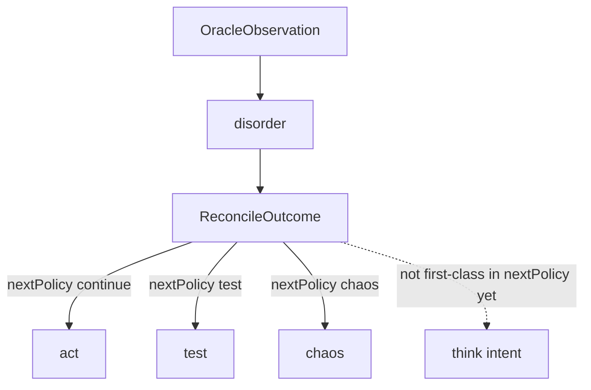

# Game-grounded control phases

## Purpose

Connect the abstract **XState control phases** (`act`, `think`, `test`, `chaos`, `disorder`) and their [Cynefin mapping](./contracts-and-actors.md) to **what is happening in the actual game** at a given turn: location, inventory, parser feedback, and transcript. The canonical **wire and reconcile contracts** remain in [`contracts-and-actors.md`](./contracts-and-actors.md).

Runtime flows are still illustrated in [`process-view.md`](./process-view.md).

## Two layers

Phases are **not** read from a dedicated variable inside the Fortran engine. The vintage game exposes **world truth** through oracle I/O; the agent maintains **epistemic state** separately.

| Layer | What it describes |
|-------|-------------------|
| **World surface** | [`adventure.f`](../../../adventure.f) and [`adventure.dat`](../../../adventure.dat): rooms (`KEY` / `TRAVEL`), objects, vocabulary, parser behavior—authoritative for what the engine accepts and prints. See [Adventure Fortran engine](../adventure-fortran-engine.md). |
| **Epistemic / control layer** | Inferred belief, confidence, drift classification, and phase telemetry—produced by cognition, [`ReconcileOutcome`](./contracts-and-actors.md#reconcile-contract-reconcileoutcome), and the control machine. Phases classify **how well beliefs align with oracle feedback** for the current sequence, not a single integer stored in `adventure.f`. |

## Epistemic ladder (intent)

These describe **intent** at a game situation. Order mirrors the usual escalation from “no bearings” to “stabilize without orderly probes.”

| Phase | Intent in adventure terms |
|-------|---------------------------|
| **`disorder`** | No stable classification yet for this sequence: oracle output just arrived and reconcile is pending, or the situation is still **unclassified** (“no idea what to do yet”). |
| **`act`** | Bearings sufficient for a **single** reasonable next command—cause and effect feel clear (Obvious-style): issue a verb/noun the parser should accept. |
| **`think`** | Not enough **symbolic context** to commit—need to relate transcript, inventory, exits, or goals before typing the next command (“look at additional data”). |
| **`test`** | Multiple plausible moves, or **probe-first** learning: try one formulation, learn from oracle text, try the next (safe-to-fail tries). Includes parser rejection and many drift cases. |
| **`chaos`** | Orderly probing is **not** viable—per [Cynefin](https://en.wikipedia.org/wiki/Cynefin_framework) **Chaotic**, act to **stabilize** the situation (narrow commands, recovery), then re-sense. |

## Concrete examples (Colossal Cave–style)

| Situation (game) | Phase (intent) |
|------------------|----------------|
| First response after a move; engine echoed room text; reconcile not finished | **`disorder`** |
| Room description lists one obvious exit; player issues `north` | **`act`** |
| New room; exits unclear from last line; agent issues `look` or gathers inventory before committing to a direction | **`think`** |
| Parser returns “I don’t understand”; agent tries synonym or shorter verb | **`test`** |
| Harness/oracle repeatedly fails; loop must narrow surface or reset strategy before more probes | **`chaos`** |

Examples for **`think`** describe **target semantics**; see the wiring table below for what the runtime does today.

## Runtime path (today vs intended `think`)

After each oracle observation, the control machine enters **`disorder`** until it consumes **`ReconcileOutcome`**. Reconcile then drives **`nextPolicy`** (`continue` \| `test` \| `chaos`), which selects **`act`**, **`test`**, or **`chaos`**. There is **no** reconcile branch that lands in **`think`** yet; cognition may still *behave* as if analyzing before proposing—the phase graph does not expose that as a distinct **`think`** transition from **`disorder`** today.

## Current wiring vs intent

| Situation (game) | Phase (intent) | Mechanism today | Gap |
|------------------|----------------|-----------------|-----|
| Clean oracle accept; belief stable | **`act`** | `nextPolicy: continue` → reconcile moves **`disorder` → `act`** | None for nominal path |
| Need inventory/map/read transcript before next command | **`think`** | No **`RECONCILE`** transition targets **`think`** | **`think`** not selected by `nextPolicy`; needs future **`PhaseRequest`** / policy extension |
| Parser rejects or transport error | **`test`** | `classifyReconcile` sets `nextPolicy: test` → **`test`** | Belief-rich branches (e.g. inventory ambiguity without rejection) still **`continue`** |
| Repeated invalid proposals escalate | **`test`** or **`chaos`** | Invalid routing in control machine → **`test`** or **`chaos`** | Distinct from reconcile-driven **`chaos`** |
| Stabilize-first when probes fail | **`chaos`** | `nextPolicy: chaos` exists; **`classifyReconcile`** rarely emits **`chaos`** | Reconcile does not yet map “cannot test meaningfully” to **`chaos`** |

For implementation references: reconciliation rules live under `packages/cognition` (e.g. `classifyReconcile`); phase guards under `packages/control` (`createControlMachineLogic`).

## Related documents

- [`contracts-and-actors.md`](./contracts-and-actors.md) — Cynefin ↔ phases, contracts, ownership.
- [`../adventure-fortran-engine.md`](../adventure-fortran-engine.md) — engine and data schema (`adventure.f` / `adventure.dat`).
- [`logical-view.md`](./logical-view.md) — components and boundaries.
