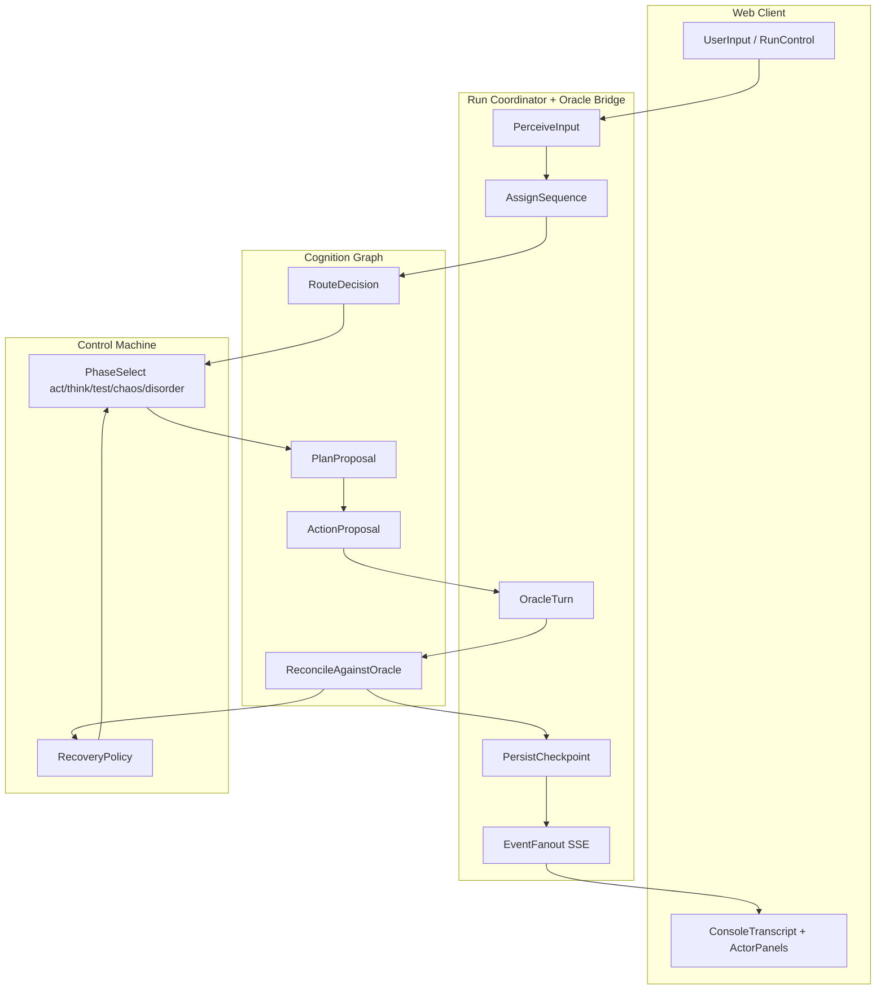
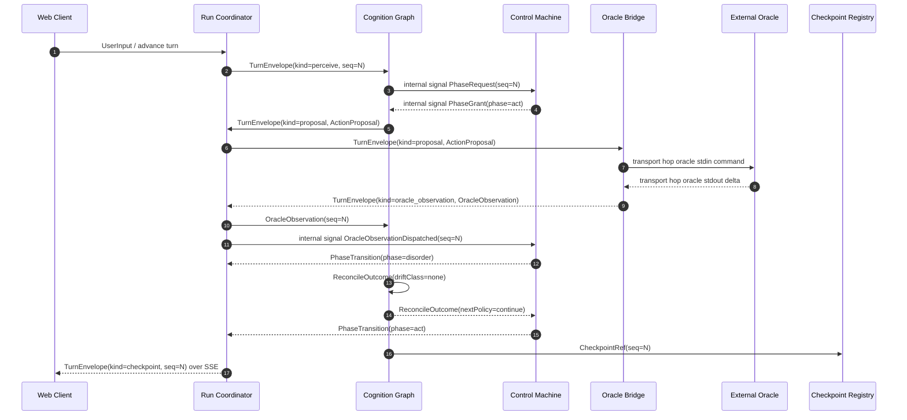
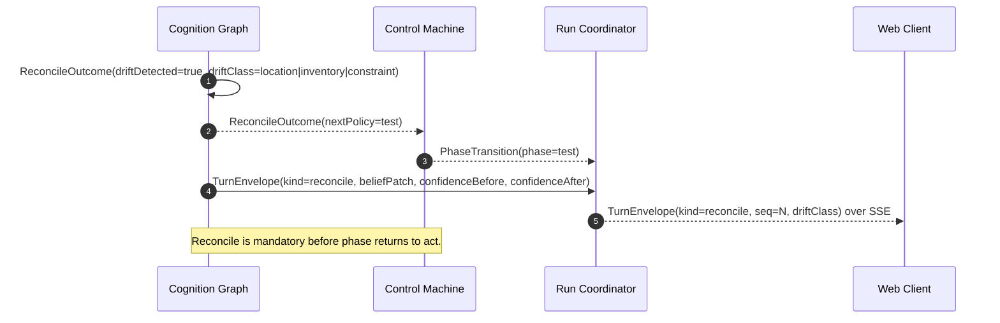
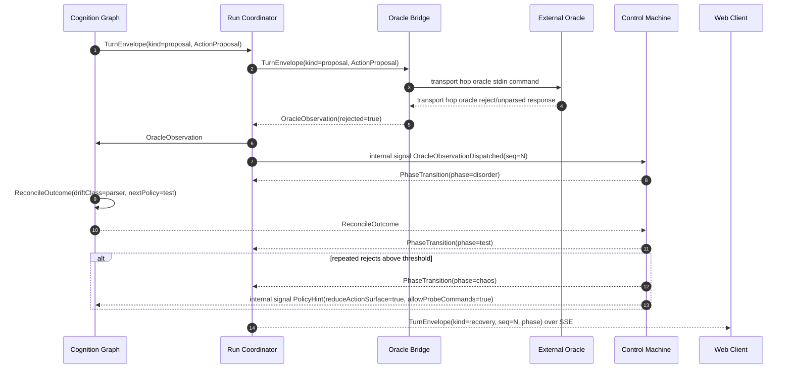
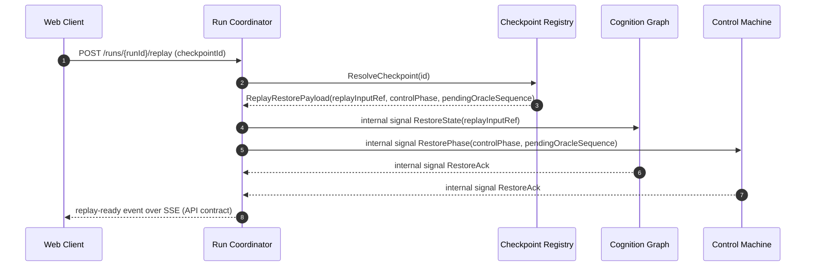
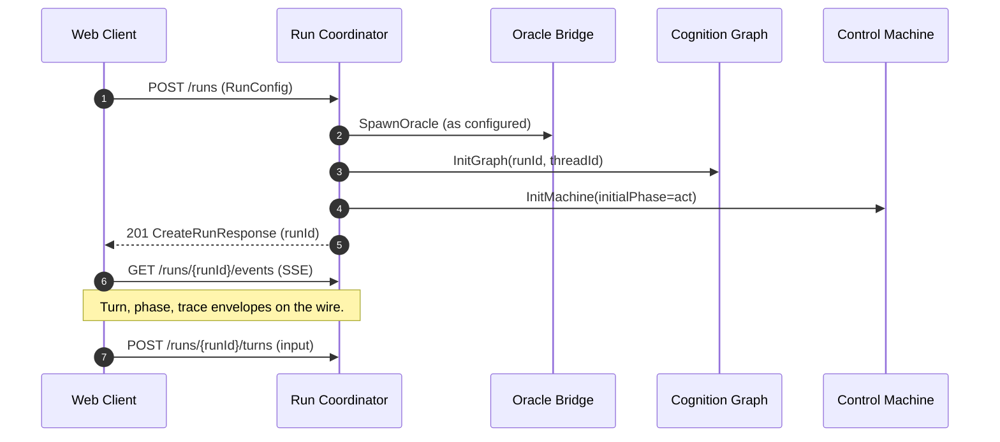

# Adventure V2 Process View

This view describes runtime behavior in terms of actors and the message flows
between them. Each scenario below names the producing actor, the consuming
actor, and the contract on the wire (see
[`contracts-and-actors.md`](./contracts-and-actors.md) for schema definitions
and ownership rules).

## Actor inventory

| Actor | Package / location | Role in runtime |
|-------|--------------------|-----------------|
| Web Client | `apps/web` | Renders console transcript and actor/state panels; sends user input; consumes ordered event stream. |
| Run Coordinator | `apps/server` (`src/run/`) | Owns turn ordering, sequence assignment, and SSE fanout to clients. |
| Oracle Bridge | `apps/server` (`src/oracle/`) | Adapts proposals to the external `adventure` process; returns `OracleObservation`. |
| Checkpoint Registry | `apps/server` (`src/replay/`) | Persists `CheckpointRef` and serves replay restore. |
| Cognition Graph | `packages/cognition` | LangGraph nodes: `Perceive → Route → Plan → Act → Reconcile`. Produces `ActionProposal` and `ReconcileOutcome`. |
| Control Machine | `packages/control` | XState phase machine governing `act`, `think`, `test`, `chaos`, and `disorder` transitions and recovery policy. |
| External Oracle | Fortran `adventure` process | Authoritative world truth; out of repo control surface. |

Boundary rule: the External Oracle is the only authoritative source of world
truth. All other actors operate on inferred state that may drift and must be
reconciled.

## Actor-attributed turn flow

The runtime turn flow grouped by owning actor. Each node belongs to exactly one
lane; arrows are explicit producer-to-consumer transitions.

## Scenario flows

Each scenario is shown as a sequence of messages between actors. Message names
map either to wire contracts or to explicitly named internal control signals in
[`contracts-and-actors.md`](./contracts-and-actors.md). Diagram entries marked
"transport hop" are adapter-local I/O hops, not shared runtime contracts.

### Nominal turn (act phase)

Happy path: cognition proposes an action, the oracle accepts it, reconcile
finds no drift, the run advances.

### Drift detected and reconciled

Cognition's belief disagrees with the oracle observation. Reconcile classifies
drift, emits a belief patch, and the control machine may shift phase. (As in
the nominal turn, the coordinator moves control into `disorder` when it
dispatches the oracle observation; that step is omitted here for brevity.)

### Invalid action and recovery

The oracle rejects a proposal (parse failure or unusable action). The control
machine routes the loop into `test` and, on repeated rejects, escalates to
`chaos`.

### Replay from checkpoint

A client requests replay of a prior turn boundary. Replay must restore both
cognition state and control phase.

### Run bootstrap (implemented HTTP)

This matches [`adventure-v2/apps/server/src/http/createServer.ts`](../../../adventure-v2/apps/server/src/http/createServer.ts): create a run, open SSE, issue turns. CORS preflight uses `OPTIONS` as needed.

**Planned / not on current wire:** separate session resources (`POST …/sessions`), client-settings, or an explicit stop route—the **Session model** section below describes principals as a target; benchmark flows today use the routes above.

## Actor ownership summary

- Web Client: input intent and observability rendering only; never mutates run
  state directly.
- Run Coordinator: sole owner of sequence numbers and SSE fanout; rejects any
  out-of-order or cross-session mutation.
- Oracle Bridge: only actor permitted to talk to the external oracle process.
- Checkpoint Registry: append-only on commit; replay reads only.
- Cognition Graph: produces `ActionProposal` and `ReconcileOutcome`; never
  bypasses Coordinator sequencing.
- Control Machine: governs phase transitions (including `disorder` between
  oracle dispatch and reconcile consumption) and recovery policy; does not
  declare world truth.

See [`contracts-and-actors.md`](./contracts-and-actors.md) for the wire-level
contract definitions and guardrails.

## Session model

- **HTTP gap:** dedicated session bootstrap, client-settings, and explicit stop resources are **not** on the current [`createServer`](../../../adventure-v2/apps/server/src/http/createServer.ts) surface; use **Run bootstrap (implemented HTTP)** above and [`adventure-v2/README.md`](../../../adventure-v2/README.md) until those routes exist.
- v2 baseline uses a no-user-account design for benchmark workflows.
- Each active session maps 1:1 to one effective user principal (session principal).
- A session principal can mutate only its own runs/checkpoints; cross-session access is rejected by the Run Coordinator.
- Multi-tab clients for the same session share that same principal and must preserve ordered mutation semantics.

## Drift and reconcile behavior

- Drift is observed only by the Cognition Graph after it consumes an
  `OracleObservation`; the External Oracle never emits drift events.
- **Disorder phase:** After the Run Coordinator delivers `OracleObservation` to
  the Cognition Graph for a sequence, it notifies the Control Machine
  (`OracleObservationDispatched` in scenario diagrams). The machine emits
  `PhaseTransition(phase=disorder)` until it consumes `ReconcileOutcome` for
  that sequence; this makes the Cynefin Disorder context visible in telemetry
  and replay.
- Reconcile output, produced by the Cognition Graph, includes:
  - belief updates (`beliefPatch`),
  - drift classification (`driftClass`),
  - confidence adjustment (`confidenceBefore` and `confidenceAfter`),
  - recovery directive (`nextPolicy`: continue / test / chaos).
- The Control Machine consumes `nextPolicy` to leave `disorder` and enter
  `act`, `think`, `test`, or `chaos`; the Run Coordinator consumes the reconcile
  envelope to fan out drift telemetry to the Web Client.

## Failure and recovery

- Parse failure or invalid proposal: Cognition emits a `parser`-class reconcile
  outcome and the Control Machine routes to `test`.
- Repeated oracle rejects: the Control Machine escalates to `chaos` and emits a
  policy hint that reduces the action surface for Cognition.
- Recovery actions are recorded by the Run Coordinator for replay and benchmark
  attribution; the Checkpoint Registry stores the matching `CheckpointRef`.

## Transaction semantics

- Turn processing is transactional at the session boundary, owned by the Run
  Coordinator:
  - begin mutation for `(sessionId, turnSeq)`,
  - apply oracle observation, reconcile, and checkpoint write as one unit,
  - commit once all required artifacts are durable.
- On failure, the turn is not partially committed; recovery retries from the
  last committed sequence.
- Retries must be idempotent for the same `(sessionId, turnSeq, idempotencyKey)`.
- Checkpoint write is the commit boundary: the Cognition Graph emits the
  `CheckpointRef` and the Checkpoint Registry persists it before the
  Run Coordinator fans out the SSE turn event.
