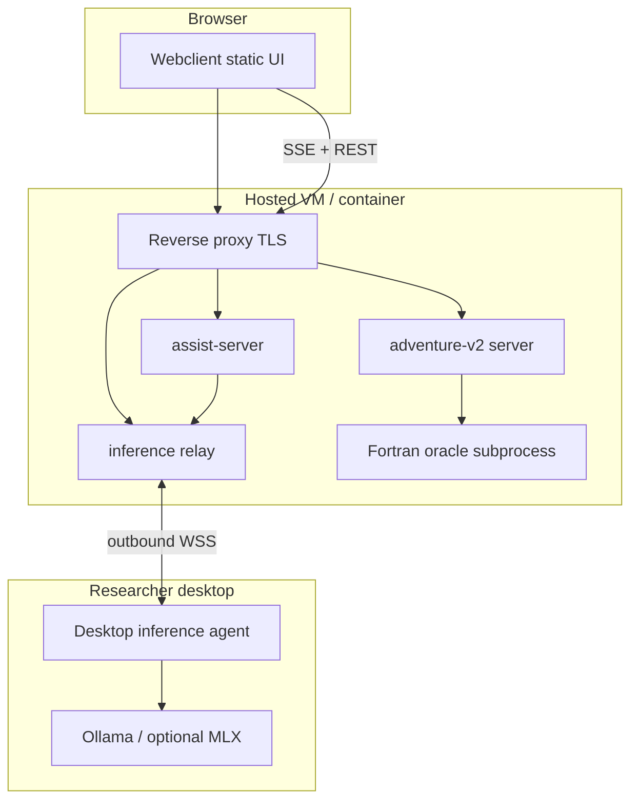

# Cloud deploy MVP — overview

## Introduction

Document the **smallest hosted deployment** of Adventure backend services plus a **desktop inference bridge** so a public webclient can play Colossal Cave with cloud game execution while optionally using **local SLM** (Ollama) on a paired machine.

This directory is the architecture entry point. Implementation is tracked in GitHub Issues — see [work graph](./work-graph.md).

## Business and system context

| Actor | Need |
| --- | --- |
| Player / researcher | Open a URL, play in the CRT, optional draft map and SLM hints |
| Operator | One container (or VM) running game API, assist, static UI, TLS |
| Local researcher | Keep Ollama/MLX on laptop; no open ports on home network |

Related architecture:

- [adventure-v2 overview](../adventure-v2/overview.md) — HTTP+SSE game API, XState control
- [adventure-nl cognition and workspace](../adventure-nl-cognition-and-workspace.md) — NL glue direction (full NL cloud path post-MVP)
- [ADR0017: cloud deploy and desktop inference bridge](../../decisions/ADR0017-cloud-deploy-and-desktop-inference-bridge.md)

## Target topology (MVP)

## Architectural drivers

- **Session-scoped security** — game and inference delegation authorized per session principal ([v2 security](../adventure-v2/security-and-ops.md)).
- **Stateless inference** — models receive assembled prompts only; no Fortran authority in the model layer ([inference contract](./inference-contract.md)).
- **Orchestration outside the model** — XState / nl-glue / LangGraph graph decide *when* to infer; providers supply context ([layers](./layers-and-boundaries.md)).
- **Small batch MVP** — langgraph play path first; NL dashboard and AG2 follow documented out-of-scope list ([mvp scope](./mvp-scope.md)).

## Shard index

| Shard | Contents |
| --- | --- |
| [layers-and-boundaries.md](./layers-and-boundaries.md) | Execution, orchestration, inference, agent systems |
| [inference-contract.md](./inference-contract.md) | Unified `system` + `user` API shape |
| [desktop-inference-bridge.md](./desktop-inference-bridge.md) | Pairing, WSS relay, desktop agent responsibilities |
| [mvp-scope.md](./mvp-scope.md) | In / out of first ship |
| [work-graph.md](./work-graph.md) | GitHub Issues DAG and next steps |
| [github-issues.md](./github-issues.md) | Issue titles, bodies, dependency placeholders |
| **Project board** | [Cloud deploy MVP (project #3)](https://github.com/users/betsalel-williamson/projects/3) |

Maintainer deploy notes (commands TBD as issues land): [Developer — cloud deploy MVP](../../developer/cloud-deploy-mvp/index.md).

## References

- Decision: [ADR0017](../../decisions/ADR0017-cloud-deploy-and-desktop-inference-bridge.md)
- Features: [Cloud deploy MVP (product)](../../features/cloud-deploy-mvp.md)
- Glossary: [Desktop inference agent](../../glossary/desktop-inference-agent.md)
