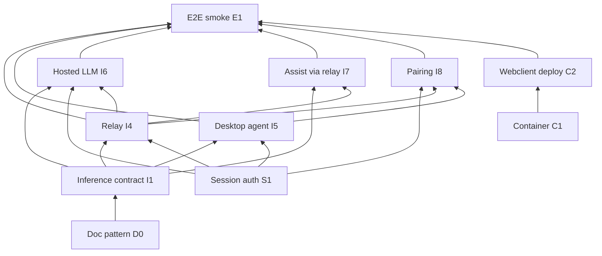

# Cloud deploy MVP — GitHub work graph

Directed acyclic graph of implementation issues. **Update issue numbers below when issues are created or renumbered.**

Tracker host: [betsalel-williamson/adventure](https://github.com/betsalel-williamson/adventure) — see [Agent work-item tracking](../../developer/agent-work-item-tracking.md).

## Epic

| Issue | Title |
| --- | --- |
| **[#3](https://github.com/betsalel-williamson/adventure/issues/3)** | **cloud-deploy-mvp: hosted backend + webclient + desktop SLM bridge** |

## Issue table

| ID | Issue | Depends on | Unblocks |
| --- | --- | --- | --- |
| D0 | Document pattern (ADR + architecture shards) | — | all implementation |
| I1 | Unified inference OpenAPI + shared types | — | I4, I5, I6, I7 |
| S1 | Session auth + pairing token foundation | — | I4, I5, I6, I8 |
| C1 | Container image — v2 + Fortran + assist | — | C2 |
| C2 | Reverse proxy + static webclient deploy | C1 | E1 |
| I4 | Server inference relay (HTTP + desktop WSS) | I1, S1 | I6, I7, I8, E1 |
| I5 | Desktop inference agent (Ollama, outbound WSS) | I1, S1 | I8, E1 |
| I6 | Hosted cloud LLM path (server-held keys) | I1, S1, I4 | E1 |
| I7 | Assist navigator via inference relay | I1, I4 | E1 |
| I8 | Pairing flow (API + web + desktop UX) | S1, I4, I5 | E1 |
| E1 | E2E smoke — cloud play + paired or hosted SLM | C2, I4, I8 | — |

## Mermaid (dependency graph)

## Recommended execution order

1. **D0** — documentation (this PR)
2. **I1**, **S1**, **C1** — parallel foundations
3. **C2**, **I4**, **I5** — deploy shell + relay + desktop
4. **I6**, **I7**, **I8** — hosted LLM, assist wiring, pairing UX
5. **E1** — integration smoke on target VM

## Issue bodies (templates)

Each implementation issue should link:

- [ADR0017](../../decisions/ADR0017-cloud-deploy-and-desktop-inference-bridge.md)
- Relevant shard under `docs/architecture/cloud-deploy-mvp/`
- **Blocked by:** `#nnn` · **Blocks:** `#nnn`

## GitHub Project

**Board:** [Cloud deploy MVP](https://github.com/users/betsalel-williamson/projects/3) (user project #3, linked to `adventure`)

**Milestone:** [Cloud deploy MVP](https://github.com/betsalel-williamson/adventure/milestone/1) (issues #3–#14)

Also visible from the repo **Projects** tab once linked. Setup guide: [GitHub Project management](../../developer/cloud-deploy-mvp/github-project.md).

### Recommended views (if not added yet)

| View | Layout | Group / sort |
| --- | --- | --- |
| **Board** | Board | Status → Todo / In progress / Done / Blocked |
| **Work graph** | Table | Sort by Work key (D0 → E1) |
| **Phase** | Board | Phase → Foundation / Deploy / Relay / Integration |

## GitHub Project (setup reference)

Initial setup notes (project already created)

Project URL: https://github.com/users/betsalel-williamson/projects/3

To sync via CLI: [`scripts/setup-cloud-deploy-project.sh`](../../../scripts/setup-cloud-deploy-project.sh) or full registry [`scripts/work-registry/sync-github-project.sh`](../../../scripts/work-registry/sync-github-project.sh). Catalog: [`scripts/work-registry/manifest.json`](../../../scripts/work-registry/manifest.json).

## Live GitHub links

GitHub issue templates: [`.github/ISSUE_TEMPLATE/`](../../../.github/ISSUE_TEMPLATE/config.yml) · Bulk recreate: [`scripts/create-cloud-deploy-issues.sh`](../../../scripts/create-cloud-deploy-issues.sh) (idempotent guard if epic exists)

| Key | GitHub |
| --- | --- |
| EPIC | [#3](https://github.com/betsalel-williamson/adventure/issues/3) |
| D0 | [#4](https://github.com/betsalel-williamson/adventure/issues/4) |
| I1 | [#5](https://github.com/betsalel-williamson/adventure/issues/5) |
| S1 | [#6](https://github.com/betsalel-williamson/adventure/issues/6) |
| C1 | [#7](https://github.com/betsalel-williamson/adventure/issues/7) |
| C2 | [#8](https://github.com/betsalel-williamson/adventure/issues/8) |
| I4 | [#9](https://github.com/betsalel-williamson/adventure/issues/9) |
| I5 | [#10](https://github.com/betsalel-williamson/adventure/issues/10) |
| I6 | [#11](https://github.com/betsalel-williamson/adventure/issues/11) |
| I7 | [#12](https://github.com/betsalel-williamson/adventure/issues/12) |
| I8 | [#13](https://github.com/betsalel-williamson/adventure/issues/13) |
| E1 | [#14](https://github.com/betsalel-williamson/adventure/issues/14) |

Issue bodies and dependency comments: [github-issues.md](./github-issues.md)

## Previous / next

- Previous: [MVP scope](./mvp-scope.md)
- Next: [overview](./overview.md)
