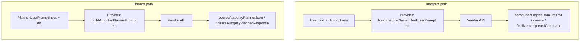

# NL glue (`@adventure-lm/lm-glue`) and `adventure-lm` backend — dependency view

## Introduction

This note records a **static view** of how the shared **NL/SLM glue** package interacts with the **`adventure-lm` backend** (CLI, HTTP dashboard, LLM providers, disk cache, packaging). It supports the **next phase** (glue running in the client): the target is a **thin, explicit boundary** so that **prompt shaping and response interpretation** can move client-side without scattering logic across the server.

## Target interaction (single backend choke point)

**Ideal (interim) shape:**

1. The backend exposes **one** orchestration surface per major flow (e.g. one path for “interpret” and one for “planner/autoplay”) that:
   - accepts the **frontend request** (or CLI equivalent),
   - runs **glue** to build what the model sees,
   - calls the **ML / `TextLlm`** implementation,
   - runs **glue** on the model output,
   - returns the **client-facing** result.

2. **Phase B (client glue)** aligns with the same seams:
   - **Before** the request leaves the client: **glue** builds prompts / structured payloads.
   - **After** the response returns: **glue** is the **first** code that parses, repairs, and maps model output to game/parser concepts.

This document’s **gap** section names where the codebase **already** approaches that model and where **multiple** call sites still embed glue-adjacent behavior.

## Logical view — dependency direction

| Direction | Summary |
| --------- | ------- |
| **Backend → `@adventure-lm/lm-glue`** | **Many** `adventure-lm/src/**/*.ts` modules import the package (types, prompts, session memory, schema, coercion, planner guards, etc.). The root [`adventure-lm/src/index.ts`](../../adventure-lm/src/index.ts) re-exports a large **library surface** from the package for consumers outside this repo. |
| **`@adventure-lm/lm-glue` → backend** | **No** production dependency: the glue package does not import `adventure-lm` runtime code. **Tests** under `packages/lm-glue/src/**/*.test.ts` may import [`adventure-lm/src/dat/loadDat.js`](../../adventure-lm/src/dat/loadDat.js) and fixture paths for integration tests only. |
| **Backend-only “pipe” concerns (not in the package)** | Examples: [`interpretCacheKey.ts`](../../adventure-lm/src/nl/interpretCacheKey.ts) / [`interpretCacheKeyMaterial.ts`](../../adventure-lm/src/nl/interpretCacheKeyMaterial.ts) (disk cache keys), [`interpretDiskCache.ts`](../../adventure-lm/src/nl/interpretDiskCache.ts), [`llmDebug.ts`](../../adventure-lm/src/nl/llmDebug.ts). |

## Backend modules that import `@adventure-lm/lm-glue` (grouped)

Rough clustering by role — useful when planning a **facade** or **single orchestrator**:

| Area | Representative files |
| ---- | -------------------- |
| **Public API / types** | [`src/index.ts`](../../adventure-lm/src/index.ts), [`src/dat/types.ts`](../../adventure-lm/src/dat/types.ts) |
| **HTTP dashboard** | [`src/cli/webDashboard.ts`](../../adventure-lm/src/cli/webDashboard.ts), [`webDashboardLlmQueue.ts`](../../adventure-lm/src/cli/webDashboardLlmQueue.ts), [`webDashboardTextLlmPool.ts`](../../adventure-lm/src/cli/webDashboardTextLlmPool.ts), [`webDashboardGeneration.ts`](../../adventure-lm/src/cli/webDashboardGeneration.ts) |
| **Autoplay orchestration** | [`src/cli/autoplayRunner.ts`](../../adventure-lm/src/cli/autoplayRunner.ts), [`src/cli/browserEngineBridge.ts`](../../adventure-lm/src/cli/browserEngineBridge.ts), [`src/cli/main.ts`](../../adventure-lm/src/cli/main.ts) |
| **Thin server “reactions”** | [`src/cognition/dashboardServerLlmReactions.ts`](../../adventure-lm/src/cognition/dashboardServerLlmReactions.ts) — calls [`adventureTextLlm`](../../adventure-lm/src/nl/adventureTextLlm.ts) and glue for GETIN mapping |
| **LLM providers (vendor I/O)** | [`src/nl/providers/httpOpenAiCompatibleTextLlm.ts`](../../adventure-lm/src/nl/providers/httpOpenAiCompatibleTextLlm.ts), [`googleGenerativeAiTextLlm.ts`](../../adventure-lm/src/nl/providers/googleGenerativeAiTextLlm.ts), [`mlxLmStdioTextLlm.ts`](../../adventure-lm/src/nl/providers/mlxLmStdioTextLlm.ts) — **heavy** use of glue for prompts, JSON coercion, finalize/repair |
| **Facade over providers** | [`src/nl/adventureTextLlm.ts`](../../adventure-lm/src/nl/adventureTextLlm.ts) — `interpretWithTextLlm` / `planAutoplayWithTextLlm` delegate to `TextLlm` |
| **Packaging / discovery** | [`src/nl/llmPackagingProfile.ts`](../../adventure-lm/src/nl/llmPackagingProfile.ts) |
| **Disk cache + interpret post-parse** | [`src/nl/interpretDiskCache.ts`](../../adventure-lm/src/nl/interpretDiskCache.ts) |
| **Cache keys (pipe)** | [`src/nl/interpretCacheKey.ts`](../../adventure-lm/src/nl/interpretCacheKey.ts) imports **only** `recentGameTextSliceForInterpretPrompt` and `TextLlmProviderId` from glue |
| **Engine types** | [`src/engine/subprocessEngine.ts`](../../adventure-lm/src/engine/subprocessEngine.ts) — `ScriptedGetinLine` type from glue |
| **Browser bundle entry** | [`src/browser/cognitionBundle.ts`](../../adventure-lm/src/browser/cognitionBundle.ts) — re-exports selected glue for ADR0005 bundle |
| **Misc** | [`gemini.ts`](../../adventure-lm/src/nl/gemini.ts) re-exports `buildVocabHint`; [`llmErrors.ts`](../../adventure-lm/src/nl/llmErrors.ts) uses `TextLlmProviderId`; strategy/registry and prompt project store use glue **types** |

## Process view — two ML pipelines (today)

Both paths **embed glue inside the provider** today (prompt build, parse, repair, cache key), not behind one backend class:

**Autoplay session loop** ([`autoplayRunner.ts`](../../adventure-lm/src/cli/autoplayRunner.ts)) combines **glue** (memory, `buildAutoplayPlannerInvocation`, guards, `plannerToScriptedGetin`) with **engine** (Fortran subprocess) and **`planAutoplayWithTextLlm`** — another natural “seam” for a future **single orchestrator** per mode.

## Gap vs “one minimal interaction spot”

| Observation | Implication |
| ------------- | ----------- |
| **Providers** import **dozens** of glue symbols each | The **ML boundary** is currently **the provider class**, not one backend router. Consolidating to “one spot” means **lifting** prompt + response handling **above** duplicated provider code or introducing a **shared pipeline** object used by all providers. |
| **`webDashboard` + `autoplayRunner` + `browserEngineBridge`** all touch glue | Dashboard and browser-orchestrated paths are **parallel**; a future client-side glue layer should mirror **one** of these flows, not all three ad hoc. |
| **`src/index.ts` re-exports** most of the package | External consumers see a **wide** API; internal refactor toward a facade does not require breaking that surface immediately, but new code should prefer **narrow** imports for clarity. |
| **Pipe-only code** already split out | `interpretCacheKey*`, `interpretDiskCache`, `llmDebug` are **not** in the package — good alignment with “glue = semantic transforms; backend = I/O and caching.” |

## Suggested next steps (for Phase B planning)

1. **Name the canonical seams**: e.g. “**InterpretPipeline**” (in → prompt → raw text → `InterpretedCommand`) and “**PlannerPipeline**” (in → prompt → raw text → `AutoplayPlannerResponse`), each callable from Node or browser with the same **TextLlm**-shaped port.
2. **Reduce provider duplication**: today each provider repeats similar **glue** imports; extracting **shared pre/post** around `interpretPlayerInput` / `planAutoplay` moves you toward **one** backend adapter that “feeds glue then ML then glue.”
3. **Keep pipe concerns in the backend** (or eventually in a thin client-side cache layer): keys, JSONL, disk paths — already mostly **outside** `@adventure-lm/lm-glue`.

## Verification (Phase A — mechanical)

From [`adventure-lm/`](../../adventure-lm/) (after `npm install`):

| Command | Purpose |
| ------- | ------- |
| `npm run deps:phase-a` | Runs [**dependency-cruiser**](https://github.com/sverweij/dependency-cruiser) with [`.dependency-cruiser.cjs`](../../adventure-lm/.dependency-cruiser.cjs) on `packages/lm-glue/src` and `src/browser`. **Rules:** (1) **Glue → app:** nothing under `packages/lm-glue/src` may import `^src/` or `^scripts/`. (2) **Browser → glue:** only [`cognitionBundle.ts`](../../adventure-lm/src/browser/cognitionBundle.ts) may import `packages/lm-glue` (ADR0005 bundle entry); other `src/browser/**` must not. Default interpret-eval fixtures live in **`packages/lm-glue/fixtures/`**; `scripts/interpret-eval-fixtures.json` is a **symlink**. **Exit code 0** means both hold. Also runs as part of **`npm run check`**. |
| `npm run deps:graph` | Writes **`reports/depcruise/lm-glue.html`** (interactive graph + validation), **`lm-glue.dot`** (Graphviz), and **`app-glue-slice.html`** (glue + selected `src/` trees). Open the HTML in a browser to explore edges. |

**Integration tests** that need `loadDatFile`, `adventure.dat`, or other app resources live under [`adventure-lm/src/test/lm-glue/`](../../adventure-lm/src/test/lm-glue/) and import `@adventure-lm/lm-glue` like any other backend test — they are **not** part of the package.

**Note:** `depcruise` uses `packages/lm-glue/tsconfig.json`, which excludes `*.test.ts` from the TypeScript program, so **unit** tests in the package are not always modeled as graph nodes; the **rule** itself still forbids any analyzed `packages/lm-glue/src` file from reaching `src/` or `scripts/`. Dat-heavy suites belong in `src/test/lm-glue/` so they are always visible to Vitest and never imply a package→app import.

## References

- [ADR0005: Browser-orchestrated autoplay cognition](../decisions/ADR0005-browser-orchestrated-autoplay-cognition.md)
- [ADR0014: NL glue package migration](../decisions/ADR0014-two-step-lm-glue-package-then-browser.md)
- [ADR0001: Text LLM providers](../decisions/ADR0001-adventure-lm-text-llm-providers.md)
- [adventure-lm source map](../../adventure-lm/docs/source-map.md)
