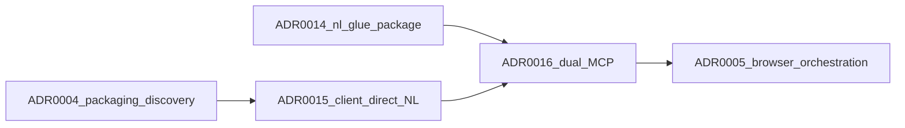

# adventure-nl cognition redesign — ADR index

This index links the split decisions for the thin-backend + browser cognition + subsystem workspace program. Each ADR is a single decision or feature extension.

**Phase 0 (first):** Update and extend **architecture documentation** so the target direction is clear alongside the as-built docs—see [`docs/architecture/adventure-nl-cognition-and-workspace.md`](../architecture/adventure-nl-cognition-and-workspace.md), [`docs/architecture/overview.md`](../architecture/overview.md), and the **Direction of travel** note in [`docs/architecture/adventure-engine.md`](../architecture/adventure-engine.md). Then implement ADRs below.

**ADR evidence baseline (2026-04):** Cognition ADR `## Status` lines and **Implementation** notes were reconciled against the `adventure-nl/` tree; see [ADR0016](ADR0016-cognition-glue-mcp-and-execution-mcp-surfaces.md) **Context** / linked ADRs for the Mind vs Body MCP split and documentation chain.

**ADR reading order (MCP / glue slice):** ADR0004 → ADR0015 → ADR0014 → **ADR0016** → ADR0005 (then ADR0006–0013 as persistence and UI attach).

**Suggested implementation order** (dependencies first):

1. [ADR0004](ADR0004-backend-llm-packaging-and-discovery.md) — Backend natural language (text) model packaging and discovery API
2. [ADR0005](ADR0005-browser-orchestrated-autoplay-cognition.md) — Browser-orchestrated autoplay: **glue** (map, inventory, modes, heuristics) and client state; engine + dat stay server-side
3. [ADR0014](ADR0014-two-step-nl-glue-package-then-browser.md) — **Two-step** migration of **NL/SLM glue** (interpret/situational/vocab/mode policy—not DAT authority): consolidate into **`@adventure-nl/nl-glue`** on Node, then **esbuild** bundle for the **browser** (**accepted**; see ADR **Implementation**)
4. [ADR0015](ADR0015-deprecate-server-forward-nl-cognition.md) — **Deprecate server-forward** NL (`POST /api/nl/planner` / interpret) for **dashboard default**; **client-direct** cognition (**accepted**); phased removal: [`.work-items/nl-backend-nl-deprecation/task.md`](../../.work-items/nl-backend-nl-deprecation/task.md)
5. [ADR0016](ADR0016-cognition-glue-mcp-and-execution-mcp-surfaces.md) — **Cognition (Glue) MCP** vs **Execution (Game) MCP** surfaces; MCP **2025-11-25** pin; **Glue MCP code C1–C3 shipped** (registry, Worker bundle, stdio); Execution MCP **C4 deferred** (**proposed** until team promotes; see ADR **Implementation**)
6. [ADR0006](ADR0006-client-sqlite-wal-subsystem-store.md) — Client-authoritative SQLite WAL subsystem store (**accepted**; core schema + store module in `adventure-nl/src/browser/`; browser WASM/OPFS wiring forward work — see ADR **Implementation** table)
7. [ADR0007](ADR0007-subsystem-revision-control-and-replay.md) — Subsystem revision control, tags, and replay (**accepted**; tags, replay materialization, revert API + migration v2 in `adventure-nl/src/browser/` — see ADR **Implementation**; dashboard UX forward work)
8. [ADR0008](ADR0008-server-subsystem-replica-and-sync.md) — Server subsystem replica and sync on connect (**accepted**; **`POST /api/subsystem-sync`** + `subsystemServerSync.ts` — see ADR **Implementation**; browser orchestration / restore-from-server forward work)
9. [ADR0009](ADR0009-tdd-promote-gate-subsystems.md) — TDD and promote-to-live gate for subsystems
10. [ADR0010](ADR0010-monaco-workspace-second-tab-cross-tab-sync.md) — Monaco workspace second tab and cross-tab sync
11. [ADR0011](ADR0011-subsystem-module-contract-dynamic-js.md) — Subsystem ES module contract and dynamic loading
12. [ADR0012](ADR0012-optional-ts-transpile-subsystem-authoring.md) — Optional in-browser TypeScript for subsystem authoring
13. [ADR0013](ADR0013-dashboard-xstate-cognition-panel.md) — Third map-column panel for **XState cognition** (orchestration) display, distinct from Session FSM Mermaid

Parent planning context: Cursor plan `thin_backend_vs_code_prompts_074321ee` (see `.cursor/plans/` or linked PRs).

**Map from plan workstreams (informal):**

| Plan theme                                      | ADRs                                                                                |
| ----------------------------------------------- | ----------------------------------------------------------------------------------- |
| Natural language model API + packaging registry | ADR0004                                                                             |
| Browser autoplay / glue + client cognition loop | ADR0005, **ADR0014** (**accepted** — NL glue **package** + **browser** bundle), **ADR0015** (**accepted** — deprecate server-forward NL for dashboard default), **ADR0016** (**proposed** — Glue MCP **shipped** C1–C3; Execution MCP C4 **deferred**) |
| SQLite WAL + VC + replay + sync                 | ADR0006 (**store landed**), ADR0007 (**tags / replay / revert landed** in store; UI + orchestration glue forward work), ADR0008 (**server replica + HTTP sync landed**; client loop + restore UX forward work) |
| TDD + promote gate                              | ADR0009                                                                             |
| Monaco second tab + BroadcastChannel            | ADR0010                                                                             |
| Subsystem JS contract + sandbox                 | ADR0011                                                                             |
| Optional TS in browser                          | ADR0012                                                                             |
| Dashboard cognition XState panel (map column)   | ADR0013                                                                             |

Related prior ADRs: [ADR0001](ADR0001-adventure-nl-text-llm-providers.md), [ADR0002](ADR0002-constructive-llm-prompt-phrasing.md), [ADR0003](ADR0003-scoped-object-hints-latest-room-block.md).

**Cross-cutting (ADR0006 onward):** [ADR0005](ADR0005-browser-orchestrated-autoplay-cognition.md) describes an **XState / actor-centric** orchestration hub that ties together SSE, **client-direct** cognition steps ([ADR0015](ADR0015-deprecate-server-forward-nl-cognition.md)), GETIN submission, and—**where not yet wired**—glue checkpoints to SQLite, **sync lifecycle UI**, promote, workspace notifications, and subsystem sandboxes. [ADR0016](ADR0016-cognition-glue-mcp-and-execution-mcp-surfaces.md) names **Glue MCP** (mind) vs optional **Execution MCP** (body façade) capability surfaces and the documentation→code **Implementation** chain. The **subsystem SQLite store** from [ADR0006](ADR0006-client-sqlite-wal-subsystem-store.md) and revision/tag/replay APIs from [ADR0007](ADR0007-subsystem-revision-control-and-replay.md) are implemented as modules (see those ADRs’ **Implementation** sections). **[ADR0008](ADR0008-server-subsystem-replica-and-sync.md)** server-side **apply** and **`POST /api/subsystem-sync`** are implemented (see ADR0008 **Implementation**); the **browser** still needs to **call** sync after session and surface **sync pending / complete / fork** as typed machine events. Read ADR0005’s **Forward work** table before completing remaining ADR0006–0012 integration so persistence and cross-tab events **compose** as **typed events** on the same machine rather than ad-hoc parallel state. **Dashboard UX** for that machine is [ADR0013](ADR0013-dashboard-xstate-cognition-panel.md) (third map-column panel; not the Session FSM Mermaid card).
