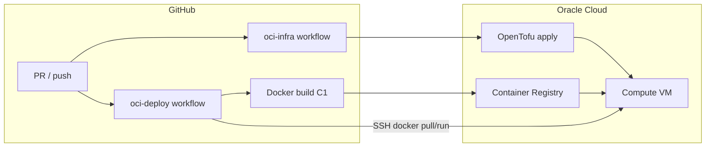

# Infrastructure as code — GitHub ↔ Oracle Cloud

Automate OCI provisioning and Adventure deploys with **OpenTofu** (recommended) or Terraform, plus **GitHub Actions** for plan/apply and container delivery.

Manual console steps remain documented in [Oracle Cloud setup](./oracle-cloud-setup.md) for first-time orientation.

## Recommendation: OpenTofu + GitHub Actions

| Tool | Role | Why |
| --- | --- | --- |
| **[OpenTofu](https://opentofu.org/)** | IaC for VCN, subnet, security list, VM | MPL-licensed; HCL-compatible with Terraform; works with `oracle/oci` provider |
| **Terraform** | Same as OpenTofu | Fine if your team already standardizes on HashiCorp CLI |
| **GitHub Actions** | `tofu plan` / `tofu apply`, Docker build, OCIR push, SSH deploy | Already hosts CI; secrets for OCI API key |
| **OCI Resource Manager** | Alternative: run stack from GitHub URL | Oracle-native; good if you prefer console-managed stacks over Actions |

We do **not** recommend OKE (Kubernetes) on Always Free — cost and complexity. Single VM + Docker matches [ADR0017](../../decisions/ADR0017-cloud-deploy-and-desktop-inference-bridge.md) and C1/C2.

### OpenTofu vs Terraform

Both use the same `.tf` files in [`infra/oci/`](../../../infra/oci/). OpenTofu is the default in docs and workflows because it is fully open source (MPL 2.0). Replace `tofu` with `terraform` in commands if you prefer.

### Alternatives (when to use)

| Tool | Use when |
| --- | --- |
| **Pulumi** | Team wants TypeScript/Python IaC instead of HCL |
| **Ansible** | VM exists; you only need config management (Docker, env files) — pair with OpenTofu |
| **Crossplane** | Multi-cloud control plane already in place — overkill for MVP |
| **Console-only** | One-off lab before trusting automation |

## Architecture



**Two pipelines:**

1. **Infra (infrequent)** — OpenTofu creates/updates VCN + VM; cloud-init installs Docker.
2. **App (every release)** — Actions builds `Dockerfile`, pushes to OCIR, SSHs to VM to `docker pull` and restart.

Infra and app are separate on purpose: destroy/recreate VM without losing registry images; deploy new app versions without touching the VCN.

## Repository layout

```text
infra/oci/                    # OpenTofu stack
├── main.tf                   # VCN, subnet, security list, instance
├── limits.tf                 # Auto-select AD with Always Free quota
├── variables.tf
├── outputs.tf
├── cloud-init.yaml           # Docker install on first boot
├── terraform.tfvars.example  # copy → terraform.tfvars (gitignored)
└── README.md

.github/workflows/
├── adventure.yml             # existing CI (unit tests, C1 image build)
├── oci-infra.yml             # tofu plan / apply
└── oci-deploy.yml            # build, push OCIR, SSH deploy (optional)
```

## Getting started — install OpenTofu (macOS)

Install the CLI on your Mac before running `tofu init` in [`infra/oci/`](../../../infra/oci/).

### Homebrew (recommended)

Requires [Homebrew](https://brew.sh/):

```bash
brew install opentofu
tofu version
```

Expect **OpenTofu v1.8+** (this repo’s GitHub workflow pins 1.9.x; any recent 1.x is fine for local use).

### Without Homebrew

Official install script (places `tofu` under `/usr/local/bin` or `~/.local/bin` depending on permissions):

```bash
curl --proto '=https' --tlsv1.2 -fsSL https://get.opentofu.org/install-opentofu.sh | sh
tofu version
```

See [OpenTofu install docs](https://opentofu.org/docs/intro/install/) for pkg downloads and other platforms.

### Quick sanity check

From the repo root after install:

```bash
cd infra/oci
tofu init -backend=false   # downloads oracle/oci provider; no apply yet
```

If `tofu init` succeeds, you are ready for [one-time setup](#one-time-setup) (OCI API key + `terraform.tfvars`).

**Terraform instead of OpenTofu:** `brew install hashicorp/tap/terraform` — same HCL files; use `terraform` in place of `tofu` in all commands.

## One-time setup

### 1. OCI API key (deploy user)

1. OCI Console → **Profile → API keys → Add API key**.
2. Save PEM as `~/.oci/oci_api_key.pem` (never commit).
3. Note **fingerprint**, **tenancy OCID**, **user OCID**, **region**.

### 2. Compartment

Create compartment `adventure-mvp` (or use an existing one). Copy **compartment OCID** into `terraform.tfvars`.

### 3. Local tfvars and apply

```bash
cd infra/oci
cp terraform.tfvars.example terraform.tfvars
# Edit: OCIDs, admin_cidr (curl -s ifconfig.me/32), ssh_public_key
tofu init
tofu plan    # review shape, AD (e.g. PHX-AD-2), subnet changes
tofu apply
```

**Example that succeeded on `us-phoenix-1` (2026-06):**

| Variable | Value |
| --- | --- |
| `shape` | `VM.Standard.E2.1.Micro` |
| `auto_select_availability_domain` | `true` → selected **PHX-AD-2** |
| `region` | `us-phoenix-1` |

Ampere (`VM.Standard.A1.Flex`) is preferred when capacity exists (more RAM for Docker builds). If apply fails with **Out of host capacity**, use Micro or retry with `flex_ocpus = 1`.

### 4. After infra succeeds — deploy C1

```bash
tofu output instance_public_ip   # set OCI_DEPLOY_HOST for GitHub
tofu output ssh_command
```

Wait ~2 min for cloud-init (Docker). Sync secrets and deploy via CI — see [GitHub Actions setup](./github-actions-setup.md):

1. `cp -r infra/oci/secrets.example infra/oci/secrets` — fill local files (no secrets on CLI)
2. `./scripts/cloud-deploy/sync-github-secrets.sh`
3. **Actions → oci-deploy → Run workflow**

**Do not rsync or `git clone` the repo onto the VM for deploy** — that can copy `terraform.tfvars` and other local secrets. CI builds from a clean checkout and pushes an image to OCIR.

Optional **one-time bootstrap** before OCIR (image tarball only, gated):

```bash
ADVENTURE_ALLOW_LOCAL_DEPLOY=1 ./scripts/cloud-deploy/deploy-c1-to-vm.sh
```

Set GitHub secret **`OCI_DEPLOY_HOST`** to the public IP for [oci-deploy.yml](../../../.github/workflows/oci-deploy.yml).

Next: [#8 C2](https://github.com/betsalel-williamson/adventure/issues/8) (HTTPS + webclient) on the same VM.

### 5. GitHub repository secrets

| Secret | Purpose |
| --- | --- |
| `OCI_TENANCY_OCID` | Provider auth |
| `OCI_USER_OCID` | Provider auth |
| `OCI_FINGERPRINT` | API key fingerprint |
| `OCI_PRIVATE_KEY` | Full PEM contents (multiline secret) |
| `OCI_REGION` | e.g. `us-phoenix-1` |
| `OCI_COMPARTMENT_OCID` | Target compartment |
| `OCI_ADMIN_CIDR` | Your IP/32 for security list |
| `OCI_SSH_PUBLIC_KEY` | Instance SSH (can match deploy key) |
| `OCI_SSH_PRIVATE_KEY` | For deploy workflow SSH to VM |
| `OCIR_NAMESPACE` | Tenancy namespace for registry path |
| `OCIR_USERNAME` | `<namespace>/<oci-username>` |
| `OCIR_AUTH_TOKEN` | Auth token (not API key password) |
| `OCI_DEPLOY_HOST` | VM public IP (from `tofu output instance_public_ip`) |

Optional **GitHub Environment** `production` with required reviewers before `tofu apply`.

### 6. OCIR repository

Console → **Developer → Container registry → Create repository** (`adventure-cloud`). Deploy workflow pushes `region.ocir.io/<namespace>/adventure-cloud:<git-sha>`.

## Workflows

### `oci-infra.yml`

- **Pull request** (paths `infra/oci/**`): `tofu init` + `tofu plan` — validates HCL; apply does not run.
- **`workflow_dispatch`** with input `apply=true`: runs `tofu apply -auto-approve` after manual approval in GitHub.

### `oci-deploy.yml`

- **`workflow_dispatch`** or push to `feature/adventure-llm` after C1 merge (optional).
- Steps: build image → login OCIR → push → SSH to `instance_public_ip` → `docker pull` + restart container.
- Requires infra applied once and SSH key on the instance matching `OCI_SSH_PRIVATE_KEY`.

Until C2, deploy exposes ports **8787/8790** only (same as manual guide).

## State backend

Default: local `terraform.tfstate` on the operator laptop (gitignored). For shared team state, use an **OCI Object Storage** backend — example in OpenTofu docs; add a bucket in the same compartment and configure `backend "oci"` in `versions.tf` when ready.

Do not commit state files — they can contain sensitive attributes.

## Always Free caveats

Validated on **`us-phoenix-1`**:

| Symptom | Cause | Fix |
| --- | --- | --- |
| **Out of host capacity** (A1) | No Ampere hosts in that AD | Use `VM.Standard.E2.1.Micro` or smaller flex; retry off-peak |
| **404 NotAuthorizedOrNotFound** (E2.Micro) | Free-tier Micro not in that AD | Keep `auto_select_availability_domain = true`; plan may move subnet (e.g. AD-1 → AD-2) |
| **SSH/API timeout** | `admin_cidr` stale after IP change | Update IP in `terraform.tfvars`, `tofu apply` |

General notes:

- **Auto AD selection** (`limits.tf`) queries `standard-e2-micro-core-count` or `standard-a1-core-count` per AD — do not hard-code PHX-AD-1.
- **Ephemeral public IP** — changes if you recreate the instance; update `OCI_DEPLOY_HOST` and DNS when C2 lands.
- **E2.Micro RAM (1 GB)** — sufficient for C1 smoke; prefer A1 when available for faster builds.

## Security notes

- Restrict `admin_cidr` to your operator IP; widen to `0.0.0.0/0` on **443 only** when C2 TLS is live.
- Rotate API keys and OCIR auth tokens on the same schedule as other cloud credentials.
- Session cookies require HTTPS in production — see [security and session](../../architecture/cloud-deploy-mvp/security-and-session.md).

## Related

- [Oracle Cloud setup (manual)](./oracle-cloud-setup.md)
- [Container image (C1)](./container.md)
- [Cloud deploy index](./index.md)
- [`infra/oci/README.md`](../../../infra/oci/README.md)
