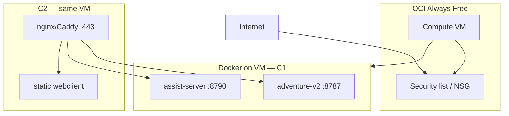

# Oracle Cloud — operator setup

Step-by-step guide for deploying Adventure on **Oracle Cloud Infrastructure (OCI) Always Free** tier. Target: a single VM running the [C1 container](./container.md) today; HTTPS + static webclient follow in [#8 C2](https://github.com/betsalel-williamson/adventure/issues/8).

Architecture context: [cloud deploy overview](../../architecture/cloud-deploy-mvp/overview.md) · [ADR0017](../../decisions/ADR0017-cloud-deploy-and-desktop-inference-bridge.md)

**Automated path (recommended):** [Infrastructure as code (OpenTofu + GitHub Actions)](./infrastructure-as-code.md) — [`infra/oci/`](../../../infra/oci/) provisions the VM; cloud-init installs Docker. **Validated on `us-phoenix-1`** with `VM.Standard.E2.1.Micro` and auto availability-domain selection (PHX-AD-2). Manual console steps below explain what the stack creates.

## Quick path (OpenTofu)

```bash
brew install opentofu
cd infra/oci
cp terraform.tfvars.example terraform.tfvars   # fill OCIDs + your IP/32 + SSH key
tofu init && tofu plan && tofu apply
tofu output ssh_command
```

See [After infra succeeds — deploy C1](./infrastructure-as-code.md#4-after-infra-succeeds--deploy-c1) for the container smoke test.

## What you deploy today vs later

| Phase | Issue | What runs | Public URL |
| --- | --- | --- | --- |
| **Now (C1)** | [#7](https://github.com/betsalel-williamson/adventure/issues/7) | adventure-v2 (8787) + assist-server (8790) in Docker | Health/API only — no web UI yet |
| **Next (C2)** | [#8](https://github.com/betsalel-williamson/adventure/issues/8) | C1 + reverse proxy (TLS) + static webclient | `https://your-domain/` — full product |
| **Integration (E1)** | [#14](https://github.com/betsalel-williamson/adventure/issues/14) | End-to-end smoke on this VM | Play + optional desktop pairing |

C1 proves the **hosted backend** (Fortran oracle + APIs). Plan OCI networking for **443** now even if you only open **8787/8790** for the first smoke test.



## Recommended OCI shape (Always Free)

| Choice | When to use | Notes |
| --- | --- | --- |
| **VM.Standard.E2.1.Micro** (x86) | **First deploy / Ampere unavailable** | Proven on `us-phoenix-1`; 1 GB RAM — OK for C1 smoke |
| **Ampere A1 Flex** (ARM) | When capacity exists | 2 OCPU / 12 GB — faster `docker build`; matches `linux/arm64` image |
| **OS** | Ubuntu 24.04 | Installed via OpenTofu image lookup + cloud-init Docker |
| **Orchestration** | Docker on VM | OKE is **not** Always Free |
| **AD selection** | `auto_select_availability_domain = true` | Free-tier shapes exist in **one** AD per region — not all three |

Always Free limits change — confirm quotas under **Governance → Limits, Quotas and Usage → Compute** (switch ADs to see Micro vs A1).

## 1. Account and compartment

1. Sign in to [Oracle Cloud Console](https://cloud.oracle.com/).
2. Note your **Home Region** (cannot change later). Pick a region close to players if creating a new account.
3. Create a dedicated **compartment** for Adventure (e.g. `adventure-mvp`) under the root compartment — keeps networking and compute isolated.
4. (Optional) Create an **IAM user** for CLI/API with limited policy instead of using the tenancy admin for day-to-day work.

Minimal policy for a deploy user (adjust compartment OCID):

```text
Allow group adventure-operators to manage virtual-network-family in compartment adventure-mvp
Allow group adventure-operators to manage instance-family in compartment adventure-mvp
Allow group adventure-operators to read repos in compartment adventure-mvp
```

## 2. Networking (VCN)

1. **Networking → Virtual cloud networks → Create VCN**.
2. Use **VCN Wizard: Create VCN with Internet Connectivity** (simplest for MVP).
3. Ensure the public subnet has:
   - **Internet Gateway** attached to the VCN
   - **Route table** rule: `0.0.0.0/0` → Internet Gateway
   - **Public IP** enabled on the compute instance (step 4)

Record:

| Value | Example | Use |
| --- | --- | --- |
| VCN name | `adventure-vcn` | — |
| Public subnet | `public-subnet-adventure` | Place VM here |
| Compartment | `adventure-mvp` | All resources |

## 3. Security list / ingress rules

Edit the **security list** for the public subnet (or attach a **Network Security Group** to the instance).

### Phase 1 — C1 backend smoke (temporary)

| Source | Protocol | Port | Purpose |
| --- | --- | ---: | --- |
| Your IP `/32` | TCP | **22** | SSH admin |
| Your IP `/32` | TCP | **8787** | v2 `/health`, API smoke |
| Your IP `/32` | TCP | **8790** | assist `/assist/health` |

Restrict **8787/8790** to your IP during bring-up. Do **not** leave them open to `0.0.0.0/0` in production unless you accept a public API without TLS.

### Phase 2 — C2 production (target)

| Source | Protocol | Port | Purpose |
| --- | --- | ---: | --- |
| `0.0.0.0/0` | TCP | **443** | HTTPS webclient + proxied APIs |
| Your IP `/32` | TCP | **22** | SSH (or remove after hardening) |

After C2, **close 8787/8790** on the public security list — only the reverse proxy on 443 should be internet-facing.

**Egress:** default “allow all outbound” is fine (Ollama relay, package installs, Let's Encrypt).

## 4. Compute instance

1. **Compute → Instances → Create instance**.
2. **Name:** `adventure-mvp-1`
3. **Compartment / VCN:** values from step 2
4. **Image:** Ubuntu 24.04 (aarch64 for Ampere, x86_64 for E2.Micro)
5. **Shape:** Ampere A1 Flex — start with **2 OCPU, 12 GB** (within free pool) or E2.1.Micro for x86
6. **Networking:** public subnet, **Assign a public IPv4 address**
7. **SSH keys:** paste your public key (required for SSH access)
8. Create the instance; copy the **public IP** when status is **Running**

Connect:

```bash
ssh ubuntu@<PUBLIC_IP>   # Ubuntu images use user `ubuntu`
```

## 5. Install Docker on the VM

On the instance (Ubuntu):

```bash
sudo apt-get update
sudo apt-get install -y ca-certificates curl git
sudo install -m 0755 -d /etc/apt/keyrings
curl -fsSL https://download.docker.com/linux/ubuntu/gpg | sudo gpg --dearmor -o /etc/apt/keyrings/docker.gpg
sudo chmod a+r /etc/apt/keyrings/docker.gpg

echo "deb [arch=$(dpkg --print-architecture) signed-by=/etc/apt/keyrings/docker.gpg] \
  https://download.docker.com/linux/ubuntu $(. /etc/os-release && echo "$VERSION_CODENAME") stable" \
  | sudo tee /etc/apt/sources.list.d/docker.list > /dev/null

sudo apt-get update
sudo apt-get install -y docker-ce docker-ce-cli containerd.io docker-compose-plugin
sudo usermod -aG docker "$USER"
```

Log out and back in so `docker` runs without `sudo`.

Verify:

```bash
docker run --rm hello-world
```

## 6. Deploy the C1 container

Two paths: **build on VM** (simplest) or **pull from OCIR** (repeatable).

### Option A — Build on VM (recommended first time)

```bash
git clone https://github.com/betsalel-williamson/adventure.git
cd adventure
git checkout feature/adventure-llm   # or your release tag after C1 merges

docker build -t adventure-cloud:local .
docker run -d --name adventure \
  --restart unless-stopped \
  -p 8787:8787 -p 8790:8790 \
  adventure-cloud:local
```

Build time: several minutes (Fortran compile + `npm ci`).

### Option B — Push to OCIR, pull on VM

1. **Developer → Container Registry → Create repository** (e.g. `adventure-cloud`), set **Public** or use auth token.
2. Login from your laptop (region code in URL, e.g. `phx`):

```bash
docker login phx.ocir.io
# Username: <tenancy-namespace>/<oci-username>
# Password: auth token from OCI user profile
```

1. Tag and push (after local `docker build`):

```bash
docker tag adventure-cloud:local phx.ocir.io/<namespace>/adventure-cloud:latest
docker push phx.ocir.io/<namespace>/adventure-cloud:latest
```

1. On the VM:

```bash
docker login phx.ocir.io
docker pull phx.ocir.io/<namespace>/adventure-cloud:latest
docker run -d --name adventure \
  --restart unless-stopped \
  -p 8787:8787 -p 8790:8790 \
  phx.ocir.io/<namespace>/adventure-cloud:latest
```

## 7. Verify deployment

From your laptop (security list must allow your IP):

```bash
curl -sf "http://<PUBLIC_IP>:8787/health" | jq .
curl -sf "http://<PUBLIC_IP>:8790/assist/health" | jq .
```

Expected v2 body includes `"oracleMode": "process"` and `"processOracleScript": "adventure"`.

On the VM:

```bash
docker logs adventure
./scripts/cloud-deploy/container-smoke.sh http://127.0.0.1:8787 http://127.0.0.1:8790
```

## 8. Production environment variables

C1 runs with defaults from the [container guide](./container.md). Set these before C2 when the webclient shares an origin:

| Variable | When | Example |
| --- | --- | --- |
| `ADV_V2_CORS_ORIGINS` | C2+ — web UI on HTTPS | `https://play.example.com` |
| `ADV_V2_SESSION_IDLE_TTL_MS` | Optional | `600000` (10 min) |
| `ADV_V2_INSECURE_HTTP` | **Never** on public OCI | unset — cookies need `Secure` behind TLS |

Do **not** set `ADV_V2_DISABLE_AUTO_FORTRAN_ORACLE=1` — the image builds the real Fortran oracle.

Pass env to Docker:

```bash
docker run -d --name adventure \
  --restart unless-stopped \
  -p 8787:8787 -p 8790:8790 \
  -e ADV_V2_CORS_ORIGINS=https://play.example.com \
  adventure-cloud:local
```

Full session and pairing rules: [security and session](../../architecture/cloud-deploy-mvp/security-and-session.md).

## 9. Persistence and upgrades

| Topic | MVP guidance |
| --- | --- |
| **Run state** | In-memory on v2 process — instance restart clears active runs (acceptable for MVP) |
| **Logs** | `docker logs adventure`; optionally configure OCI Logging later |
| **Upgrades** | `docker pull` or rebuild → `docker stop adventure && docker rm adventure` → `docker run ...` with new tag |
| **Backups** | Not required for MVP; `adventure.dat` is in the image |

## 10. Next steps toward the full product

1. **Deploy C1 on OCI** — OpenTofu infra + container smoke ([IaC guide](./infrastructure-as-code.md)).
2. **Implement C2** ([#8](https://github.com/betsalel-williamson/adventure/issues/8)) — nginx or Caddy on **443**, static webclient, proxy paths `/api/game`, `/api/assist`, `/inference`.
3. **DNS** — A record pointing to the instance public IP (or reserved IP).
4. **TLS** — Let's Encrypt via Caddy or certbot on the proxy container.
5. **I4 / I8** — inference relay + pairing for desktop Ollama.
6. **E1 smoke** ([#14](https://github.com/betsalel-williamson/adventure/issues/14)) — play through the public HTTPS URL.

Until C2 lands, developers can test APIs with `curl` or a local web shell pointed at `http://<PUBLIC_IP>:8787` (dev only — not a production player experience).

## Troubleshooting

| Symptom | Check |
| --- | --- |
| `Out of host capacity` (A1) | Use `VM.Standard.E2.1.Micro` in tfvars; see [IaC troubleshooting](./infrastructure-as-code.md#always-free-caveats) |
| E2.Micro **404** on launch | Wrong AD — use `auto_select_availability_domain = true` in [`infra/oci/`](../../../infra/oci/) |
| SSH timeout | Security list **22** + `admin_cidr` matches current IP (`tofu apply` after IP change) |
| `curl` to 8787 times out | Security list **8787/8790**; `docker ps` on VM |
| `oracleMode: synthetic` | Rebuild image; `docker exec adventure ls -la /app/adventure` |
| assist health fails | `docker logs adventure` |
| Out of memory during build | Use **oci-deploy** (CI builds on GitHub runners); or one-time bootstrap script with `ADVENTURE_ALLOW_LOCAL_DEPLOY=1` |

## Related

- [Container image (C1)](./container.md)
- [Infrastructure as code (OpenTofu)](./infrastructure-as-code.md)
- [MVP scope](../../architecture/cloud-deploy-mvp/mvp-scope.md)
- [Security and session](../../architecture/cloud-deploy-mvp/security-and-session.md)
