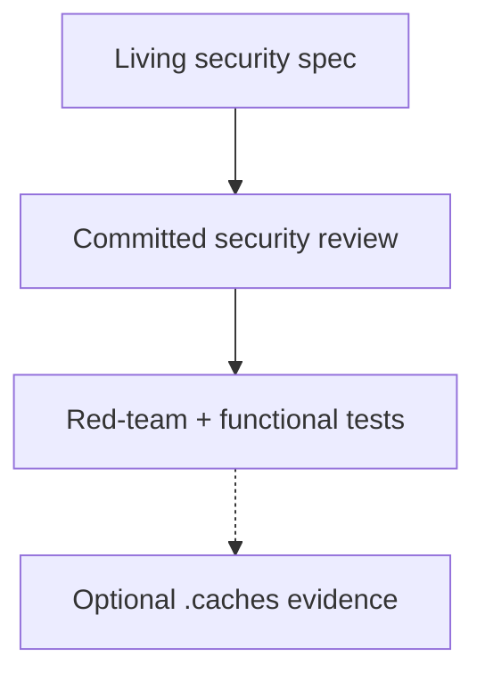
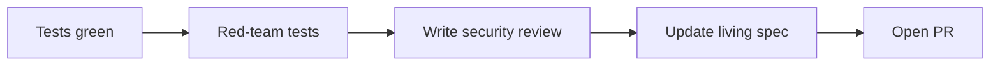

# Security review workflow

How to record **point-in-time security analysis** alongside functional QA. Reviews are **committed** artifacts; raw test captures stay in `.caches/` (gitignored) like [QA verification reports](qa-verification-report.md).

## Four layers



| Layer | Where | Committed? | Purpose |
| --- | --- | --- | --- |
| **Living spec** | e.g. [security-and-session.md](../architecture/cloud-deploy-mvp/security-and-session.md) | Yes | Current controls, operator env vars, summary table |
| **Review record** | [security-reviews/](../architecture/cloud-deploy-mvp/security-reviews/) | Yes | Before/after analysis, feasible vs not, accepted risks |
| **Executable proof** | `adventure-v2/tests/session-auth*.test.ts` | Yes | Regression + red-team attacks |
| **Raw evidence** | `.caches/qa-reports/` | No | Verbose vitest/live output (optional) |

**Rule:** Tests prove it still works. The **review** explains why we stopped worrying (or didn't). The **spec** says what to operate today.

## When to write a review

Required before merge when the change touches:

- Session, auth, pairing, device tokens, or WSS
- New or changed public HTTP surface with auth implications
- Crypto, secrets, or cookie policy

Skip for internal refactors that do not change the threat model.

## Workflow (with TDD + QA)

Fit into [TDD + GitHub workflow](tdd-and-github-workflow.md) after **Green**, alongside QA verification:

1. **Implement** — functional tests for issue acceptance criteria.
2. **Red-team** — map OWASP Session Management / Authentication / CSRF items; add `*.redteam.test.ts` attempts.
3. **Fix** — only **feasible** attack classes (document infeasible ones in the review).
4. **Write committed review** — `docs/architecture/cloud-deploy-mvp/security-reviews/YYYY-MM-DD-<work-key>.md` using [template](../architecture/cloud-deploy-mvp/security-reviews/README.md#new-review-template).
5. **Update living spec** — summary table + new controls; link to the review (do not duplicate full narrative in the spec).
6. **PR** — link review in **Test plan** or **Docs**; paste executive findings table if helpful.



## File naming

```text
docs/architecture/cloud-deploy-mvp/security-reviews/
├── README.md                        # index + template
└── YYYY-MM-DD-<work-key>.md         # e.g. 2026-06-21-s1-session-auth.md
```

Cloud-deploy work uses `docs/architecture/cloud-deploy-mvp/security-reviews/`. Other programs may add parallel directories under their architecture shard when auth surfaces appear (e.g. adventure-v2 run scoping).

## Review contents (required sections)

1. **Metadata** — date, issue, PR, branch, reviewer
2. **Threat model** — assets, actors, trust boundaries, out of scope
3. **Method** — OWASP checklists referenced, test files
4. **Findings** — attack | feasible? | hole before | fix after | proof
5. **Accepted risks** — explicit deferrals with rationale
6. **Follow-ups** — linked issues or checklist items

## Feasible vs not — documentation language

| Verdict | Meaning in review |
| --- | --- |
| **Yes** | Attack class practical in our threat model → **must fix** or accept with explicit rationale |
| **No** | Attempt fails or probability negligible → document why; no code change required |
| **Theoretical** | Known hardening gap without demonstrated exploit → cheap fixes OK; not blocking |
| **Mitigated** | Control already present (e.g. HttpOnly) → cite test or spec |

Do not label HTTP **501** (inference stub) as security success — it means auth passed, relay not implemented (see [QA verification report](qa-verification-report.md#http-status-semantics-in-reports)).

## Re-review triggers

Add a **new dated review** (do not rewrite old ones) when:

- Auth model or public routes change
- Persistence / clustering changes the threat model
- A follow-up issue closes an accepted risk

Update the **living spec** to reflect current controls after each review.

## Example

First review in this format: [2026-06-21 S1 session auth](../architecture/cloud-deploy-mvp/security-reviews/2026-06-21-s1-session-auth.md).

## Related

- [QA verification report](qa-verification-report.md)
- [TDD + GitHub workflow](tdd-and-github-workflow.md)
- [security-and-session.md](../architecture/cloud-deploy-mvp/security-and-session.md)
- [adventure-v2 security and ops](../architecture/adventure-v2/security-and-ops.md)
