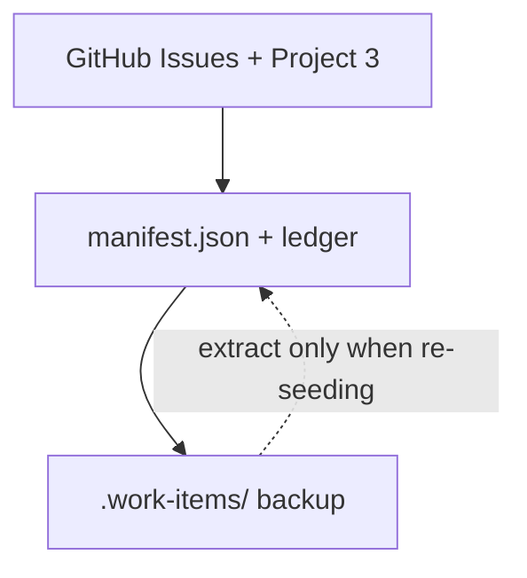
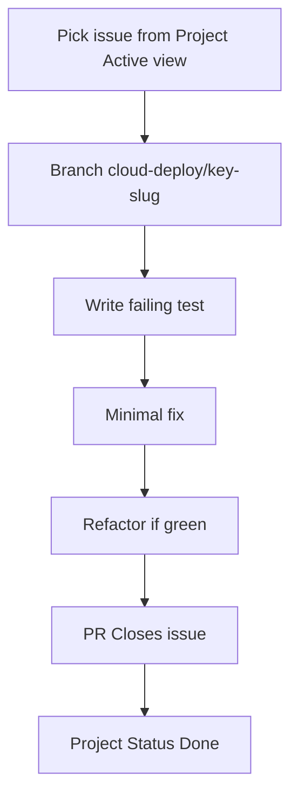

# TDD + GitHub workflow

How **Red → Green → Refactor** ([process-03-development](../../.cursor/rules/process-03-development.mdc)) connects to GitHub Issues, project #3, and branch discipline for cloud deploy MVP work.

## Source-of-truth hierarchy



| Priority | Where to edit | When |
| --- | --- | --- |
| 1 | GitHub issue body + Project fields | Normal TDD branches |
| 2 | [`manifest.json`](../../scripts/work-registry/manifest.json) | Status/deferred before sync completes |
| 3 | [`.work-items/`](../../.work-items/) | GraphQL quota exhausted, or long-form design only |

See [work registry — GraphQL fallback](work-registry/index.md#graphql-quota-fallback) when sync exits **42**.

## Workflow (one issue, one branch, TDD)

1. **Pick work** — Filter [project #3](https://github.com/users/betsalel-williamson/projects/3): Program = Cloud deploy MVP, Status = Todo. Confirm dependencies are closed (`gh issue view`, [work graph](../architecture/cloud-deploy-mvp/work-graph.md)). Use the [issue triage Active view](work-registry/issue-triage.md#mvp-filter-active-view).
2. **Load scope** — Set `WORK_ITEM=#N`; read issue body + linked architecture shard (`gh issue view <N>`).
3. **Branch** — `cloud-deploy/<work-key>-<slug>` from updated **`feature/adventure-llm`** ([branch policy](branch-policy.md))
4. **Red** — Failing test(s) for acceptance criteria (package-level Vitest/integration per area).
5. **Green** — Minimal implementation.
6. **Refactor** — Only with tests green; separate structural vs behavioral commits.
7. **PR** — Open against **`feature/adventure-llm`**; fill [`.github/pull_request_template.md`](../../.github/pull_request_template.md) (GitHub pre-populates it).
8. **Board** — Project Status **In progress** → **Done** on merge; run targeted tests from issue test strategy.



## Branch and PR conventions

```text
cloud-deploy/<work-key>-<short-slug>
```

Examples: `cloud-deploy/i1-inference-openapi`, `cloud-deploy/s1-session-auth`.

**PR body:** use [`.github/pull_request_template.md`](../../.github/pull_request_template.md) — do not duplicate the template in docs. GitHub fills it when you open a PR; agents should read that file for the canonical sections (Summary, Work item, Test plan, Docs).

Set **`WORK_ITEM=#N`** in agent prompts — see [agent work-item tracking](agent-work-item-tracking.md).

## Project Status updates

| When | Action |
| --- | --- |
| Start work | Assign yourself; **Status → In progress** |
| Blocked | Comment with blocked-by issue; **Status → Blocked** |
| PR open | Link PR in issue comment |
| Merged + verified | Close issue; **Status → Done** |

Sync from CLI when the board drifts:

```bash
./scripts/work-registry/sync-github-project.sh --resume
```

## Execution order (foundation first)

Parallel foundations after [R0](work-registry/issue-triage.md#r0-project-review) closes:

1. **#5 I1**, **#6 S1**, **#7 C1** — parallel OK with separate branches
2. **#8 C2** — deploy shell
3. **#9 I4**, **#10 I5** — relay + desktop
4. **#11 I6**, **#12 I7**, **#13 I8** — integration
5. **#14 E1** — smoke

Do not start an issue until **Blocked by** issues are closed (or waived in a comment on epic #3).

## GraphQL quota fallback

When `./scripts/work-registry/sync-github-project.sh` exits **42** or GraphQL quota is exhausted:

1. **Do not block TDD** — Pick work from manifest + [issue-triage.md](work-registry/issue-triage.md).
2. **Cache scope offline** — `gh issue view #N > .caches/work-items/issue-N.md` (gitignored) if needed.
3. **Record intent locally** — Update manifest `status` / `projectStatus`.
4. **Defer board sync** — Re-run sync with `--resume --auto-wait` when quota resets.

Never create new trackable epic/story files under `.work-items/` for cloud-deploy work.

## Related

- [Branch policy](../branch-policy.md)
- [Issue triage catalog](work-registry/issue-triage.md)
- [GitHub Project management](work-registry/github-project.md)
- [Cloud deploy GitHub Project](cloud-deploy-mvp/github-project.md)
- [Agent work-item tracking](agent-work-item-tracking.md)
- [Work registry index](work-registry/index.md)
