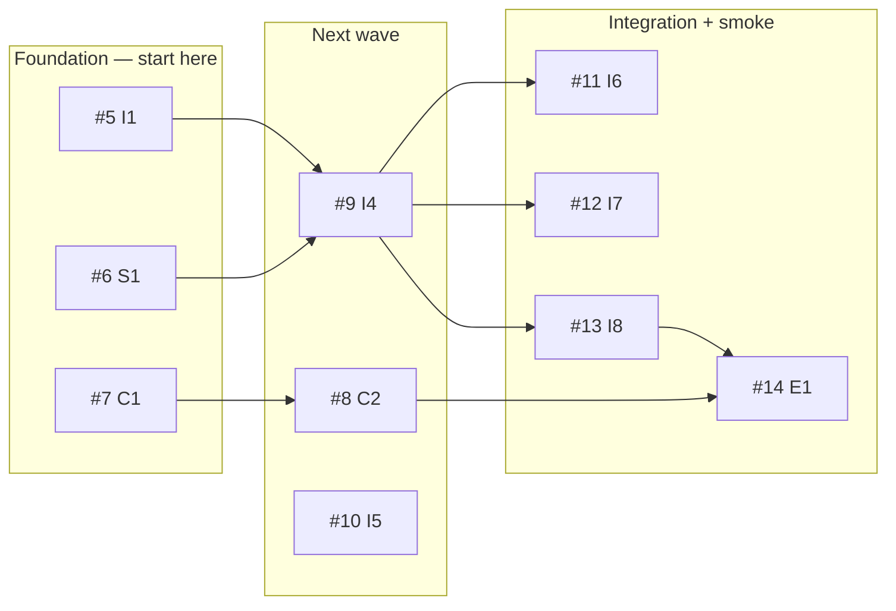

# Issue triage catalog

Living classification of open GitHub Issues against [ADR0017](../../decisions/ADR0017-cloud-deploy-and-desktop-inference-bridge.md)'s four-layer model and the [cloud deploy MVP work graph](../../architecture/cloud-deploy-mvp/work-graph.md).

**Board:** [Adventure project #3](https://github.com/users/betsalel-williamson/projects/3) · **Manifest:** [`scripts/work-registry/manifest.json`](../../../scripts/work-registry/manifest.json)

## MVP filter (Active view)

On project #3, filter:

- **Program** = Cloud deploy MVP
- **Status** ≠ Done

That view is the execution path for hosted-backend work. Everything else on the board is deferred, archive, or post-MVP unless explicitly promoted.

## Summary by bucket

| Bucket | Count | Action |
| --- | ---: | --- |
| **Active** — MVP execution | 11 open | Pick from foundation (#5–#7) after [R0](#r0-project-review) closes |
| **In progress** | 0–1 | One foundation issue at a time per owner |
| **Done / archive** | 22 closed | Reference only |
| **Deferred** | ~20 open | `deferred` label; do not branch |
| **Stale / superseded** | 12 closed | Closed with replacement links |

## Active — MVP execution path

Maps to [layers-and-boundaries.md](../../architecture/cloud-deploy-mvp/layers-and-boundaries.md) and the work graph.

| Issue | Key | Layer(s) | Status | Blocked by | Notes |
| --- | --- | --- | --- | --- | --- |
| [#3](https://github.com/betsalel-williamson/adventure/issues/3) | EPIC | all | Active | — | Parent; open until #14 done |
| [#5](https://github.com/betsalel-williamson/adventure/issues/5) | I1 | Inference | **Ready** | — | Unified OpenAPI + shared types |
| [#6](https://github.com/betsalel-williamson/adventure/issues/6) | S1 | Execution + session | **Ready** | — | Session auth + pairing foundation |
| [#7](https://github.com/betsalel-williamson/adventure/issues/7) | C1 | Execution | **Ready** | — | Container: v2 + Fortran + assist |
| [#8](https://github.com/betsalel-williamson/adventure/issues/8) | C2 | Execution | Blocked | #7 | Static webclient + reverse proxy |
| [#9](https://github.com/betsalel-williamson/adventure/issues/9) | I4 | Inference | Blocked | #5, #6 | Server relay + WSS registry |
| [#10](https://github.com/betsalel-williamson/adventure/issues/10) | I5 | Inference | Blocked | #5, #6 | Desktop Ollama agent |
| [#11](https://github.com/betsalel-williamson/adventure/issues/11) | I6 | Inference | Blocked | #9 | Hosted LLM path |
| [#12](https://github.com/betsalel-williamson/adventure/issues/12) | I7 | Orchestration + Inference | Blocked | #9 | Assist navigator via relay |
| [#13](https://github.com/betsalel-williamson/adventure/issues/13) | I8 | Execution + Inference | Blocked | #6, #9, #10 | Pairing UX |
| [#14](https://github.com/betsalel-williamson/adventure/issues/14) | E1 | Integration | Blocked | #8, #9, #13 | MVP acceptance ([mvp-scope](../../architecture/cloud-deploy-mvp/mvp-scope.md)) |

## In progress

Track the single active foundation or implementation issue here when work starts.

| Issue | Key | Owner | Started |
| --- | --- | --- | --- |
| [#5](https://github.com/betsalel-williamson/adventure/issues/5) | I1 | — | R0 triage pass |

Update project **Status → In progress** when picking up work. Only one foundation issue (#5, #6, #7) should be **In progress** per owner unless explicitly parallelized on the epic.

## Done / archive (reference)

| Range | Program | Examples |
| --- | --- | --- |
| #4 | cloud-deploy D0 | ADR0017 + architecture shards |
| #21–#23 | adventure-v3 | US-1-2, US-2-1, US-3-1 |
| #28 | webclient Phase 0 | Foundation |
| #35 | nl-deprecation Phase A | Intent in docs |
| #47–#52 | adventure-v2 U0–U5 | Maintenance slice complete |
| #55–#62 | adventure-nl | Archive steps |

## Deferred — valid, not MVP now

Open issues with **`deferred`** label and manifest `"status": "deferred"`. Do not pick for MVP branches.

### adventure-v3 (#16–#17)

| Issue | Key | Layer | Rationale |
| --- | --- | --- | --- |
| [#16](https://github.com/betsalel-williamson/adventure/issues/16) | E2 | Trust / clarity | Post-MVP; honest labeling remains valid |
| [#17](https://github.com/betsalel-williamson/adventure/issues/17) | E3 | Orchestration | NL autoplay post-MVP ([layers-and-boundaries](../../architecture/cloud-deploy-mvp/layers-and-boundaries.md)) |

### adventure-webclient (#33–#34)

| Issue | Key | Rationale |
| --- | --- | --- |
| [#33](https://github.com/betsalel-williamson/adventure/issues/33) | Phase-5 | NL panels — out of [mvp-scope](../../architecture/cloud-deploy-mvp/mvp-scope.md) |
| [#34](https://github.com/betsalel-williamson/adventure/issues/34) | Phase-6 | AG2 wiring — post-MVP |

### nl-backend-nl-deprecation (#36–#39)

Follows inference relay + session auth; not blocking first cloud ship.

| Issue | Key |
| --- | --- |
| [#36](https://github.com/betsalel-williamson/adventure/issues/36) | Phase-B |
| [#37](https://github.com/betsalel-williamson/adventure/issues/37) | Phase-C |
| [#38](https://github.com/betsalel-williamson/adventure/issues/38) | Phase-D |
| [#39](https://github.com/betsalel-williamson/adventure/issues/39) | Phase-E |

### agent-project-authoring (#40–#46)

Research/authoring track; no cloud wiring in MVP.

### adventure-v2 (#53–#54)

| Issue | Key | Rationale |
| --- | --- | --- |
| [#53](https://github.com/betsalel-williamson/adventure/issues/53) | U6 | Overlaps cloud inference contract — revisit after #12/#14 |
| [#54](https://github.com/betsalel-williamson/adventure/issues/54) | U7 | Map viz overlaps assist map — revisit after #12/#14 |

## Stale / superseded (closed)

Closed with comments linking replacement cloud-deploy issues.

| Issue | Why stale | Superseded by |
| --- | --- | --- |
| #15 E1, #20 US-1-1 | CRT/play exists in langgraph; cloud path is deploy not redesign | [#8](https://github.com/betsalel-williamson/adventure/issues/8) C2, [#14](https://github.com/betsalel-williamson/adventure/issues/14) E1 |
| #18 E4, #25–#27 US-4-* | Session/posture UX deferred; MVP covers via S1 + I8 | [#6](https://github.com/betsalel-williamson/adventure/issues/6) S1, [#13](https://github.com/betsalel-williamson/adventure/issues/13) I8 |
| #19 E5, #24 US-5-1 | Map assist belongs in assist-server + relay | [#12](https://github.com/betsalel-williamson/adventure/issues/12) I7 |
| #29–#32 webclient Phases 1–4 | Panel migration superseded by packaging langgraph web for cloud | [#8](https://github.com/betsalel-williamson/adventure/issues/8) C2 |

## R0: Project review

Meta-issue: [R0: Project review — layered model + MVP issue triage](https://github.com/betsalel-williamson/adventure/issues/68) (created during workflow refresh).

Blocks starting #5–#7 implementation branches until this catalog and `.work-items/` cleanup land on `main`.

## Per-program manifest mapping

| Program ID | GitHub label | Issue range | Manifest epic |
| --- | --- | --- | --- |
| `cloud-deploy-mvp` | `cloud-deploy-mvp` | #3–#14 | EPIC |
| `adventure-v3` | `program:adventure-v3` | #15–#27 | V3-EPIC |
| `adventure-webclient` | `program:adventure-webclient` | #28–#34 | WEB-EPIC |
| `nl-backend-nl-deprecation` | `program:nl-backend-nl-deprecation` | #35–#39 | NL-DEP-EPIC |
| `agent-project-authoring` | `program:agent-project-authoring` | #40–#46 | AP-EPIC |
| `adventure-v2` | `program:adventure-v2` | #47–#54 | V2-EPIC |
| `adventure-nl` | `program:adventure-nl` | #55–#62 | NL-ARCH-EPIC |

## Maintenance

When closing, deferring, or re-opening issues:

1. Update this catalog (bucket table + program section).
2. Hand-edit [`manifest.json`](../../../scripts/work-registry/manifest.json) `status` / `projectStatus` (manifest is canonical — do not re-derive from `.work-items/`).
3. Re-run `./scripts/work-registry/audit-project.sh` and sync if board fields drift.

## Related

- [TDD + GitHub workflow](../tdd-and-github-workflow.md)
- [Work registry index](index.md)
- [GitHub Project management](github-project.md)
- [Agent work-item tracking](../agent-work-item-tracking.md)
